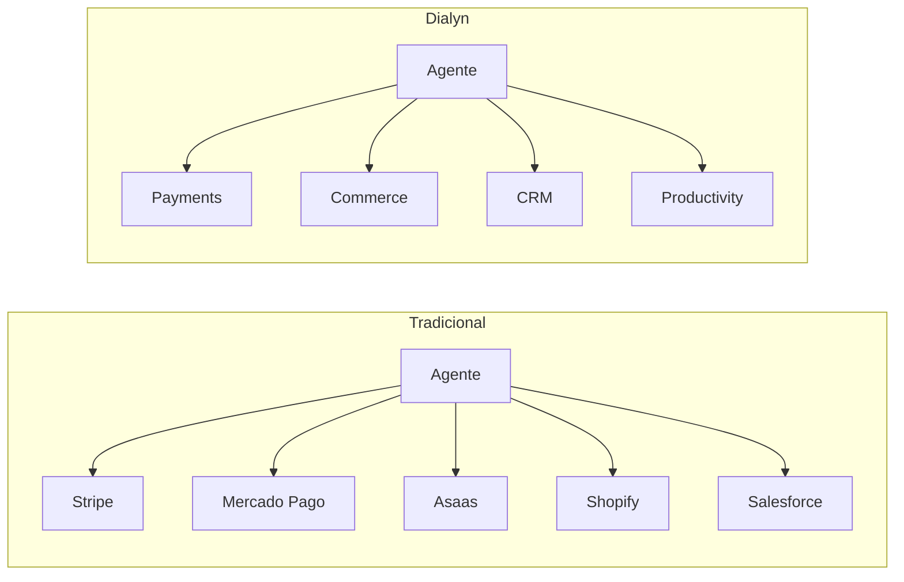
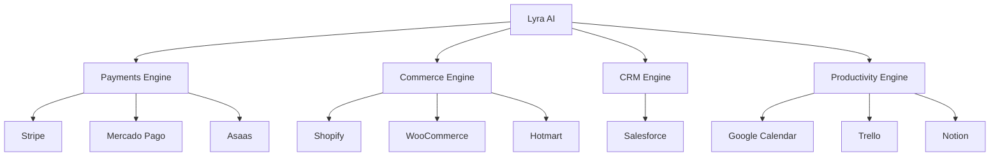
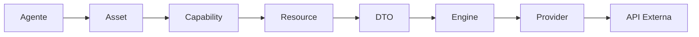
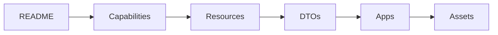

<p align="center">

# Dialyn - Architecture Business AI Apps

### Um protocolo universal para integração de Agentes Inteligentes com sistemas empresariais.

Arquitetura baseada em **Capabilities**, **Resources**, **DTOs**, **Assets** e **Providers**, permitindo que agentes de IA interajam com qualquer sistema através de contratos universais.

</p>

---

<p align="center">


</p>

---

## O que é a Dialyn?

A **Dialyn** é um protocolo de integração desenvolvido para permitir que Agentes Inteligentes interajam com sistemas empresariais de forma padronizada.

> Um agente aprende apenas **como realizar uma operação** — nunca **como uma API específica funciona**.

---

## Filosofia

A maioria das plataformas força o agente a conhecer APIs. A Dialyn faz o contrário.

| Abordagem tradicional | Dialyn |
|----------------------|--------|
| Agente conhece Stripe, Mercado Pago, Asaas, Shopify, Salesforce | Agente conhece Payments, Commerce, CRM, Productivity |
| Trocar de plataforma exige mudar o agente | Trocar de Provider não altera o agente |
| APIs são o centro da arquitetura | **Capabilities** são o centro |



> As APIs tornam-se apenas implementações dessas Capabilities.

---

## Lyra AI

No centro da arquitetura encontra-se o **Lyra AI**, o modelo proprietário de orquestração da Dialyn.

| Responsabilidade | Descrição |
|-----------------|-----------|
| 🧠 Planejamento | Define a sequência de ações |
| 🔄 Raciocínio | Toma decisões com base no contexto |
| 💾 Memória | Mantém estado entre interações |
| ⚙️ Workflows | Executa fluxos multi-etapa |
| 🎯 Seleção de Assets | Escolhe a ação correta para cada intenção |
| 🔗 Orquestração | Coordena Engines e Providers |

> O Lyra desacopla completamente a inteligência da implementação das APIs.

---

## Ecossistema

A Dialyn é composta por Engines especializados, cada um responsável por um domínio.



> Cada Engine traduz contratos universais para APIs específicas.

---

## Arquitetura

Toda operação segue exatamente o mesmo fluxo.



> Cada camada possui apenas uma responsabilidade.

---

## Conceitos Fundamentais

### Capabilities

Representam domínios de negócio. Definem **o que** um agente pode fazer.

| Capability | Providers |
|-----------|-----------|
| **Payments** | Stripe, Mercado Pago, Asaas |
| **Commerce** | Shopify, WooCommerce, Hotmart |
| **CRM** | Salesforce |
| **Productivity** | Google Calendar, Trello, Notion |

---

### Resources

Cada Capability é composta por Resources — as entidades universais do sistema.

| Capability | Resources |
|-----------|-----------|
| **Payments** | Payment, Invoice, Refund, Customer |
| **Commerce** | Product, Order, Customer, Inventory, Category |
| **CRM** | Lead, Contact, Company, Deal |
| **Productivity** | Calendar, Event, Task, Board, Card, Database, Page, Block |

---

### DTOs

Os DTOs representam o contrato universal entre agentes e Engines. Todos os Providers convertem seus modelos internos para DTOs padronizados da Dialyn.

> Trocar qualquer integração não altera os agentes.

---

### Assets

Assets representam ações reutilizáveis executadas pelos agentes — como Criar Pagamento, Buscar Cliente, Agendar Reunião, Criar Lead ou Consultar Produto.

> Os Assets nunca conhecem APIs.

---

### Engines

Os Engines executam as operações das Capabilities, traduzindo DTOs universais para Providers específicos.

| Engine | Capability |
|--------|-----------|
| Payments Engine | Payments |
| Commerce Engine | Commerce |
| CRM Engine | CRM |
| Productivity Engine | Productivity |

---

### Providers

Providers são implementações concretas das Capabilities.

| Capability | Provider | Status |
|-----------|----------|:------:|
| Payments |  | ✅ |
| Payments |  | ✅ |
| Payments |  | ✅ |
| Commerce |  | ✅ |
| Commerce |  | ✅ |
| Commerce |  | ✅ |
| CRM |  | ✅ |
| Productivity |  | ✅ |
| Productivity |  | ✅ |
| Productivity |  | ✅ |

---

## Estrutura do Repositório

```
docs/
├── architecture/       Visão geral da arquitetura
├── capabilities/       Domínios de negócio
│   ├── payments/
│   ├── commerce/
│   ├── crm/
│   └── productivity/
├── apps/               Providers suportados
│   ├── asaas/
│   ├── stripe/
│   ├── mercado-pago/
│   ├── shopify/
│   ├── woocommerce/
│   ├── hotmart/
│   ├── salesforce/
│   ├── google-calendar/
│   ├── trello/
│   └── notion/
└── README.md
```

---

## Documentação

| Documento | Descrição |
|------------|-----------|
| Architecture | Visão geral da arquitetura |
| Capabilities | Domínios de negócio |
| Resources | Entidades universais |
| DTOs | Contratos de comunicação |
| Apps | Providers suportados |
| Assets | Ações reutilizáveis |

---

## Objetivo

Este repositório documenta toda a arquitetura pública da Dialyn.

| Já documentado | Próximos módulos |
|---------------|-----------------|
| Capabilities | Workflows |
| Resources | Modelagem de Dados |
| DTOs | SDK |
| Engines | APIs |
| Providers | Desenvolvimento de novos Providers |
| Assets | |

---

## Princípios

| # | Princípio | Descrição |
|---|-----------|-----------|
| 1 | 🔗 **Desacoplamento** | Agentes nunca conhecem APIs |
| 2 | 🔄 **Substituibilidade** | Providers podem ser trocados sem impacto |
| 3 | 📖 **Contratos** | Toda comunicação ocorre através de DTOs |
| 4 | 🏗️ **Independência** | Resources são independentes da implementação |
| 5 | 🎯 **Domínio** | Capabilities representam domínios de negócio |
| 6 | 🧩 **Isolamento** | Engines isolam toda complexidade das integrações |

---

## Benefícios

| # | Benefício |
|---|-----------|
| 1 | 🚀 **Agilidade** na integração de novos sistemas |
| 2 | 🔄 **Troca de Provider** sem alterar agentes |
| 3 | 🧠 **Agentes mais inteligentes** focados em domínio, não em APIs |
| 4 | 📉 **Redução da complexidade** com contratos universais |
| 5 | 🏗️ **Arquitetura padronizada** para qualquer integração |

---

## Comece por aqui

Se esta é sua primeira visita, recomendamos a seguinte ordem de leitura:



> Ao final dessa sequência você compreenderá toda a arquitetura de integração da Dialyn.

---

<p align="center">

**Dialyn** • Universal Integration Protocol for Intelligent Agents

</p>
