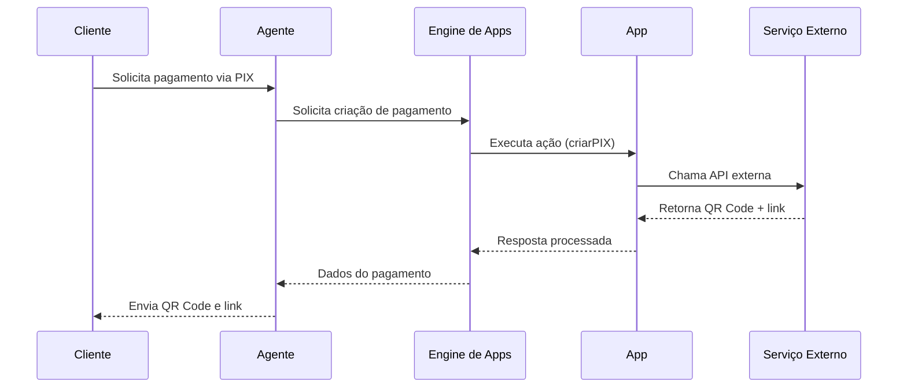

# Apps

## Introdução

Os **Apps** são a camada responsável por conectar os agentes da Dialyn com serviços externos.

Enquanto um **agente** é responsável por compreender o usuário, decidir o que fazer e conduzir uma conversa, um **App** é responsável por executar ações reais em sistemas externos.

Na prática, um App funciona como um motor de execução capaz de transformar uma intenção do agente em uma operação concreta, como:

| Ação | Descrição |
|------|-----------|
| 💰 Gerar um PIX | Pagamento instantâneo |
| 📄 Criar um boleto | Geração de cobrança bancária |
| 📅 Agendar uma reunião | Criação de evento em calendário |
| 👤 Cadastrar um lead em CRM | Registro de prospect |
| ✅ Criar uma tarefa | Gerenciamento de atividades |
| 🔍 Consultar informações | Busca de dados externos |
| 📊 Emitir um relatório | Geração de documento |
| 📎 Enviar documentos | Compartilhamento de arquivos |

Essa separação permite que um mesmo agente utilize diferentes serviços sem precisar conhecer detalhes técnicos de cada integração.

---

## O que é um App?

Um **App** representa uma integração instalada dentro da conta de um usuário.

Cada App encapsula toda a lógica necessária para comunicação com um serviço externo, incluindo:

| Componente | Descrição |
|------------|-----------|
| 🔐 Autenticação | Gerencia credenciais e tokens de acesso |
| ✅ Permissões | Define quais ações o App pode executar |
| 🌐 Endpoints | Mapeia as rotas da API externa |
| ✔️ Validações | Verifica parâmetros antes da execução |
| ⚠️ Tratamento de erros | Lida com falhas de forma padronizada |
| ⚡ Execução das ações | Orquestra chamadas ao serviço externo |

### Exemplos de Apps

| App | Categoria |
|-----|-----------|
| [Mercado Pago](assets/mercado-pago/README.md) | Pagamentos |
| [Stripe](assets/stripe/README.md) | Pagamentos |
| [Asaas](assets/asaas/README.md) | Pagamentos |
| [Google Calendar](assets/google-calendar/README.md) | Agenda |
| [Trello](assets/trello/README.md) | Produtividade |
| [Salesforce](assets/sales-force/README.md) | CRM |
| [Hotmart](assets/hotmart/README.md) | Infoprodutos |
| [Shopify](assets/shopify/README.md) | E-commerce |
| [WooCommerce](assets/woocommerce/README.md) | E-commerce |
| [Notion](assets/notion/README.md) | Documentação |
| [Typeform](assets/type-form/README.md) | Formulários |

No futuro, **qualquer serviço** poderá ser disponibilizado como um App dentro da plataforma.

---

## Como um agente utiliza um App?

O agente **nunca** realiza integrações diretamente.

Quando identifica que determinada ação precisa ser executada, ele solicita ao **Engine de Apps** que execute uma operação utilizando um App disponível em sua conta.

### Exemplo: Pagamento via PIX

### Exemplo: Agendar reunião

| Passo | Descrição |
|-------|-----------|
| 1 | Cliente deseja agendar uma reunião |
| 2 | Agente solicita ao App Google Calendar a criação do evento |
| 3 | Evento é criado no Google Calendar |
| 4 | Agente confirma o agendamento ao cliente |

Todo esse processo ocorre de forma **transparente** para o agente.

---

## Disponibilidade de Apps

Um agente somente pode utilizar Apps que estejam disponíveis dentro da conta do usuário.

| Regra | Descrição |
|-------|-----------|
| ❌ Instalar um App não o torna automaticamente acessível | Cada agente precisa ser vinculado |
| 🔒 Administrador define acesso | Pode selecionar quais agentes usam cada App |
| 🌍 Modo Global | App disponível para **todos** os agentes da conta |

Essa abordagem oferece **maior controle e segurança** sobre as integrações utilizadas.

---

## Compartilhamento entre agentes

Os Apps podem funcionar em **dois modos**:

| Modo | Descrição | Exemplos |
|------|-----------|----------|
| 🌍 **Global** | Qualquer agente da conta pode utilizá-lo | Google Calendar, Stripe, Mercado Pago |
| 🔗 **Vinculado** | Disponível apenas para agentes selecionados | Suporte, Financeiro, Comercial, RH |

---

## Permissões

Cada App define um conjunto de **permissões** que representam as ações que ele é capaz de executar.

### Mercado Pago

| Permissão | Descrição |
|-----------|-----------|
| `criarPIX` | Gera cobrança PIX |
| `criarBoleto` | Emite boleto bancário |
| `criarPagamentoCartao` | Processa pagamento por cartão |
| `consultarPagamento` | Busca status de pagamento |
| `cancelarPagamento` | Estorna ou cancela transação |

### Google Calendar

| Permissão | Descrição |
|-----------|-----------|
| `listarAgendas` | Lista calendários disponíveis |
| `criarEvento` | Agenda novo compromisso |
| `atualizarEvento` | Edita compromisso existente |
| `removerEvento` | Exclui compromisso |

### Salesforce

| Permissão | Descrição |
|-----------|-----------|
| `criarLead` | Cadastra novo lead |
| `atualizarLead` | Edita lead existente |
| `consultarCliente` | Busca dados de cliente |
| `listarOportunidades` | Lista oportunidades comerciais |

### Notion

| Permissão | Descrição |
|-----------|-----------|
| `criarPagina` | Cria nova página |
| `atualizarPagina` | Edita página existente |
| `consultarBancoDados` | Consulta dados em banco de dados |

As permissões disponíveis dependem **exclusivamente do App instalado**.

---

## Autenticação

Cada App possui seu próprio mecanismo de autenticação. Os métodos suportados incluem:

| Método | Descrição |
|--------|-----------|
| `API Key` | Chave de acesso simples |
| `JWT` | JSON Web Token |
| `OAuth 2.0` | Protocolo de autorização padrão |
| `Access Token` | Token de acesso temporário |
| `Refresh Token` | Token para renovar acesso |
| `Client Secret` | Segredo do cliente OAuth |
| `Webhooks` | Callbacks para eventos |

> 🔒 As credenciais são armazenadas pela plataforma e utilizadas durante a execução das ações. **O agente nunca possui acesso direto às credenciais.**

---

## Integrações Financeiras

Todas as operações financeiras da Dialyn são orquestradas pelo **Engine da BisPay**.

| App | Tipo |
|-----|------|
| Mercado Pago | Pagamentos |
| Stripe | Pagamentos |
| Asaas | Pagamentos |

Utilizam a infraestrutura da BisPay como camada intermediária de execução, padronizando:

| Operação | Descrição |
|----------|-----------|
| Pagamentos | Processamento de transações |
| PIX | Cobranças instantâneas |
| Boletos | Geração e gestão |
| Cartões | Pagamentos com cartão de crédito/débito |
| Webhooks | Notificações de eventos |
| Estornos | Cancelamento de transações |
| Consultas | Verificação de status |

Independentemente do provedor financeiro utilizado pelo cliente.

---

## Fluxo de Execução

> O agente apenas **solicita** uma ação. Toda a comunicação externa ocorre através do **Engine de Apps**.

---

## Documentação por App

Cada App possui sua própria documentação contendo autenticação, permissões, ações disponíveis, exemplos, parâmetros, respostas e erros possíveis.

| App | Documentação |
|-----|-------------|
| Mercado Pago | [`/docs/apps/assets/mercado-pago/README.md`](./assets/mercado-pago/README.md) |
| Google Calendar | [`/docs/apps/assets/google-calendar/README.md`](./assets/google-calendar/README.md) |
| Stripe | [`/docs/apps/assets/stripe/README.md`](./assets/stripe/README.md) |
| Trello | [`/docs/apps/assets/trello/README.md`](./assets/trello/README.md) |
| Notion | [`/docs/apps/assets/notion/README.md`](./assets/notion/README.md) |
| Asaas | [`/docs/apps/assets/asaas/README.md`](./assets/asaas/README.md) |
| Salesforce | [`/docs/apps/assets/sales-force/README.md`](./assets/sales-force/README.md) |
| Hotmart | [`/docs/apps/assets/hotmart/README.md`](./assets/hotmart/README.md) |
| Shopify | [`/docs/apps/assets/shopify/README.md`](./assets/shopify/README.md) |
| Typeform | [`/docs/apps/assets/type-form/README.md`](./assets/type-form/README.md) |

---

## Arquitetura

| Arquitetura | Descrição |
|-------------|-----------|
| Agente | Decide o que fazer |
| Engine de Apps | Executa as ações |
| App | Responsável pela integração |

🔗 [Arquitetura](./architeture/README.md)

## Filosofia

> **Agentes decidem; Apps executam.**

Os Apps foram projetados para **desacoplar** a inteligência do agente da execução das integrações.

- O agente deve preocupar-se apenas em **decidir o que fazer**.
- Já o App é responsável por **executar como fazer**.

Essa separação torna a arquitetura mais **modular**, facilita a adição de novas integrações e permite que qualquer serviço externo seja incorporado à Dialyn sem alterar a lógica dos agentes.

> 💡 Essa seção documenta um princípio arquitetural importante: *Agentes decidem; Apps executam*. A frase resume o conceito e serve como guia para futuras implementações da plataforma.
