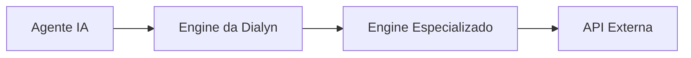
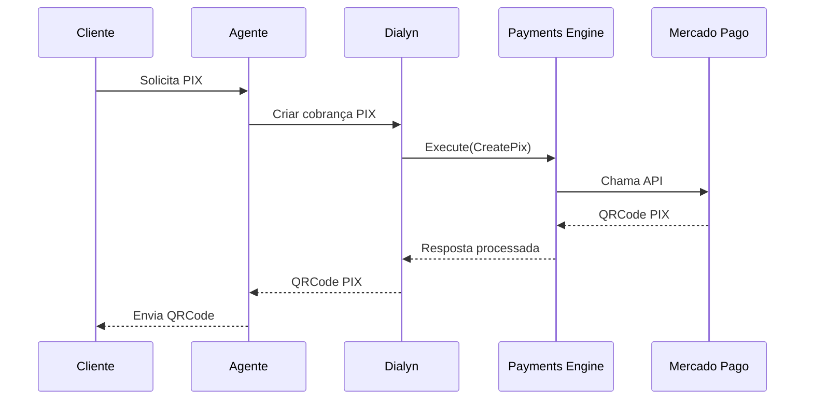
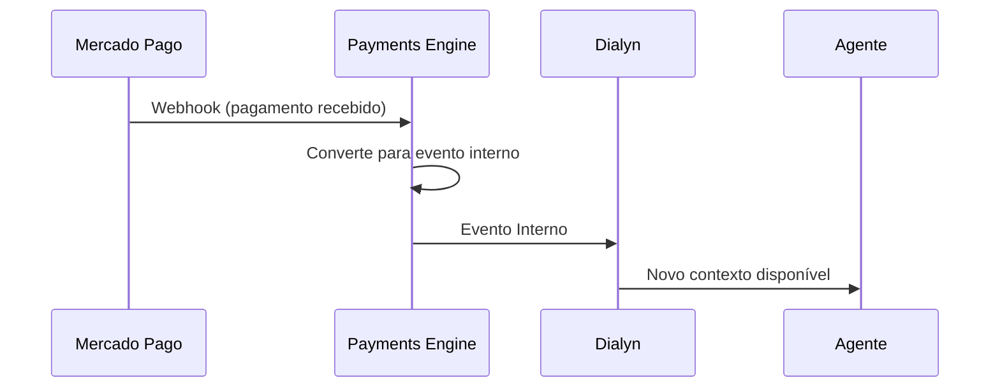
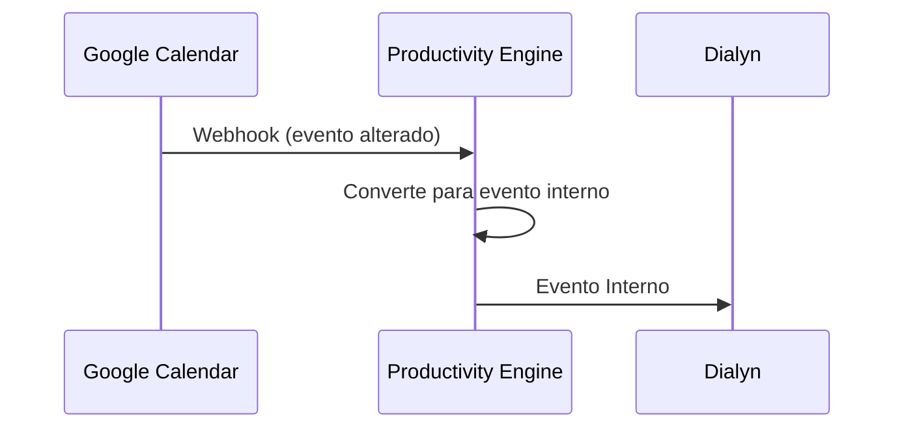
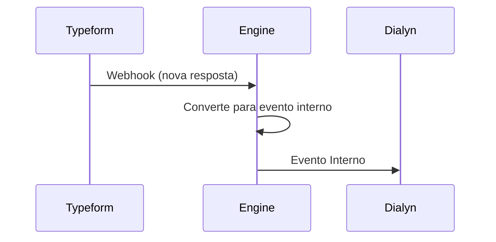
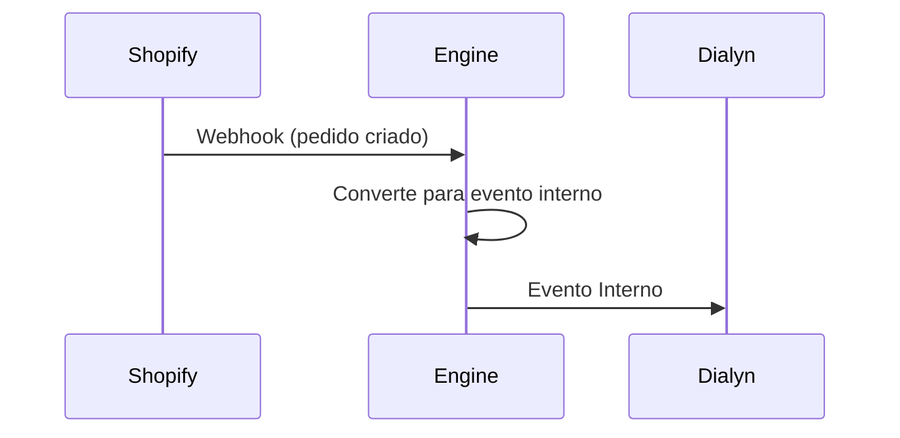
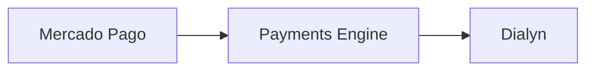
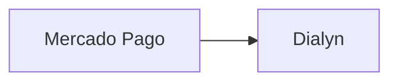

# Arquitetura de Comunicação

> Dialyn, Engines e aplicações de terceiros.

---

## Objetivo

Este documento define a **arquitetura** utilizada para comunicação entre a Dialyn, seus Engines e aplicações de terceiros.

O objetivo é **desacoplar completamente a IA das APIs externas**, permitindo que novos provedores sejam adicionados sem alterar o comportamento dos agentes.

---

## Filosofia da Arquitetura

A Dialyn **nunca** conversa diretamente com APIs externas. Ela se comunica exclusivamente com **Engines especializados**, responsáveis por conhecer as regras de negócio, autenticação e particularidades de cada provedor.

> O agente **nunca** sabe qual provedor está sendo utilizado. Ele apenas solicita uma ação.

**Exemplo:** O agente solicita `Criar cobrança PIX` — o Engine responsável decide qual provedor utilizar de acordo com a configuração da conta.

---

## Organização dos Engines

Os Engines são divididos por **domínio de negócio**.

| Engine | Responsabilidade | Apps |
|--------|-----------------|------|
| 💳 **Payments Engine** | Integrações financeiras | Stripe, Mercado Pago, Asaas |
| 📅 **Productivity Engine** | Integrações de produtividade | Google Calendar, Trello, Notion |
| 👥 **CRM Engine** | Integrações de CRM | Salesforce, HubSpot |
| 🛒 **Ecommerce Engine** | Integrações de e-commerce | Shopify, WooCommerce, Hotmart |

> Novos Engines poderão ser adicionados futuramente **sem necessidade de alterar a arquitetura** da Dialyn.

---

## Modelo de Comunicação

A comunicação ocorre em **diferentes camadas**.

### Dialyn → Engine

| Tecnologia | Motivos |
|------------|---------|
| **gRPC** | Baixa latência, comunicação tipada, contratos bem definidos, suporte a streaming, excelente desempenho entre microsserviços, escalabilidade |

> A Dialyn atua apenas como **orquestradora**.

### Engine → APIs Externas

| Tecnologia | Descrição |
|------------|-----------|
| **REST API** | Padrão utilizado pela maioria dos provedores |

**Provedores que utilizam REST:** Google Calendar, Stripe, Mercado Pago, Asaas, Shopify, Salesforce, Notion, Hotmart, Trello, Typeform.

---

## Comunicação Síncrona

A comunicação **síncrona** será utilizada sempre que o usuário precisar de uma resposta imediata.

| Exemplos de uso | Descrição |
|-----------------|-----------|
| 💰 Criar PIX | Pagamento instantâneo |
| 📄 Gerar boleto | Cobrança bancária |
| 🔗 Criar Link de Pagamento | Link de cobrança |
| 📅 Consultar agenda | Verificar disponibilidade |
| ➕ Criar evento no Google Calendar | Agendamento |
| 🃏 Criar cartão no Trello | Nova tarefa |
| 👤 Criar Lead no Salesforce | Novo prospect |

---

## Comunicação Assíncrona

A comunicação **assíncrona** ocorre quando um sistema externo notifica a Dialyn sobre uma alteração. O fluxo é iniciado pelo próprio provedor.

### Mercado Pago

### Google Calendar

### Typeform

### Shopify

---

## Política de Webhooks

| Prioridade | Mecanismo | Quando usar |
|------------|-----------|-------------|
| ✅ **Preferencial** | Webhooks | Quando o provedor oferecer suporte |
| ❌ **Exceção** | Polling | Apenas quando Webhooks não estiverem disponíveis |

> Esta regra aplica-se a **todos os Engines** da plataforma.

---

## Recebimento de Webhooks

Os Webhooks **nunca** deverão ser recebidos diretamente pela Dialyn. Sempre deverão passar pelo **Engine responsável**.

### ✅ Correto

### ❌ Incorreto

> A Dialyn **não** deve conhecer detalhes de nenhum provedor externo. Essa responsabilidade pertence **exclusivamente ao Engine**.

---

## Padronização de Eventos

Cada provedor possui sua própria nomenclatura para eventos. Os Engines deverão **converter** todos esses eventos para um padrão interno.

| Provedor | Evento Original | Evento Interno |
|----------|-----------------|----------------|
| Mercado Pago | `payment.updated` | `PaymentReceived` |
| Stripe | `invoice.payment_succeeded` | `PaymentReceived` |
| Asaas | `PAYMENT_RECEIVED` | `PaymentReceived` |
| Google Calendar | `calendar.updated` | `CalendarUpdated` |
| Shopify | `order.created` | `OrderCreated` |

> Os agentes sempre trabalharão **apenas com os eventos internos** da Dialyn.

---

## Contrato entre Dialyn e Engines

Todo Engine deverá implementar **obrigatoriamente** as seguintes operações:

| Método | Objetivo |
|--------|----------|
| `Connect()` | Conectar uma conta |
| `Disconnect()` | Remover uma conexão |
| `Execute()` | Executar uma ação |
| `HandleWebhook()` | Processar eventos externos |
| `Query()` | Consultar informações do App  |

> Este contrato deverá permanecer **igual para todos os Engines**. Consulte a documentação de [capabilities](https://github.com/guicarvalho274/dialyn/master/docs/apps/architeture/capabilities/README.md) para entender melhor.

---

## Execução de Ações

Cada Engine será responsável por disponibilizar suas próprias **Actions**.

| Engine | Exemplo de Action |
|--------|-------------------|
| 📅 Google Calendar | `Execute(CreateEvent)` |
| 💳 Stripe | `Execute(CreatePix)` |
| 📝 Notion | `Execute(CreatePage)` |
| 👥 Salesforce | `Execute(CreateLead)` |

> Embora as ações sejam diferentes, o **contrato permanece exatamente o mesmo**.

---

## Resumo da Arquitetura

| Comunicação | Tecnologia | Objetivo |
|-------------|------------|----------|
| 🧠 Agente → Dialyn | Comunicação interna | Orquestração da IA |
| 🔗 Dialyn → Engines | **gRPC** | Comunicação rápida e tipada |
| 🌐 Engines → APIs Externas | **REST API** | Integração com provedores |
| 🔔 APIs Externas → Engines | **Webhooks** | Eventos em tempo real |
| 📡 Engines → Dialyn | **Eventos Internos** | Padronização dos provedores |
| ⏱️ Polling | **Exceção** | Apenas quando Webhooks não existirem |

---

## Benefícios da Arquitetura

| # | Benefício |
|---|-----------|
| 1 | 🧠 A IA **nunca** conhece APIs externas |
| 2 | 🏗️ Cada domínio possui seu próprio **Engine especializado** |
| 3 | ➕ Novos provedores podem ser adicionados **sem alterar os agentes** |
| 4 | 🔄 Eventos são **padronizados** independentemente do provedor |
| 5 | 📋 Toda comunicação segue **contratos únicos e bem definidos** |
| 6 | 📈 A arquitetura é **escalável** e preparada para microsserviços |

Consulta a documentação de ciclos de um app [app-life-cycle](app-lifecycle.md)
