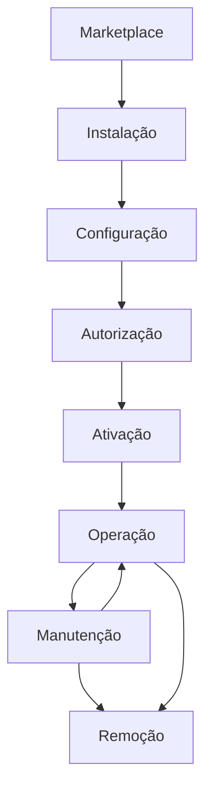
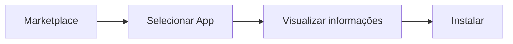
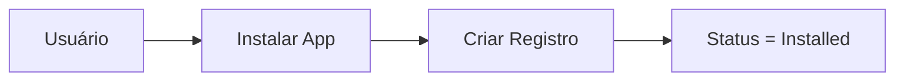
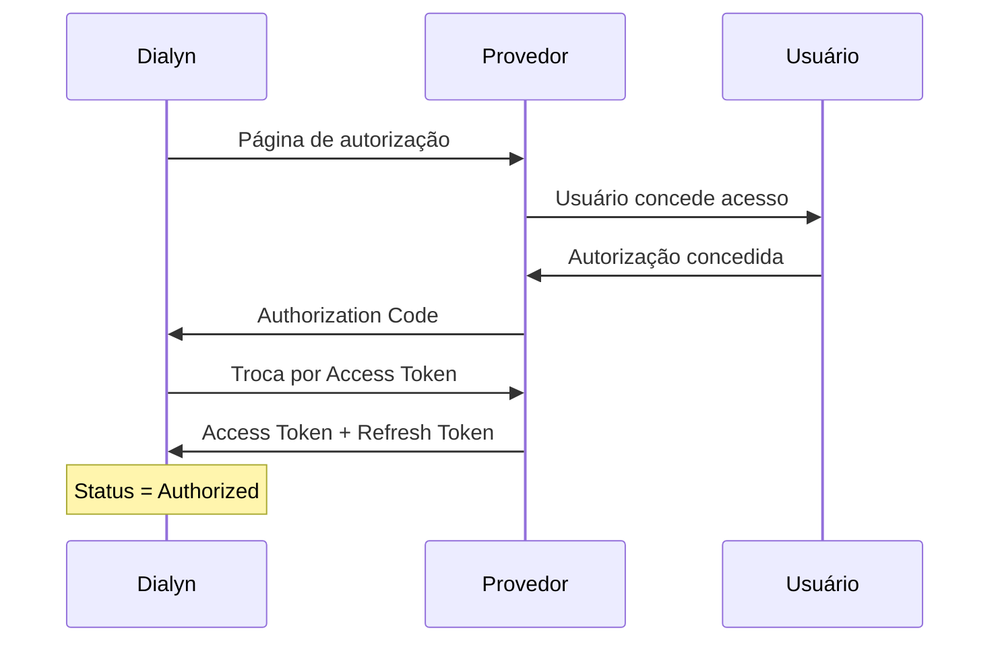
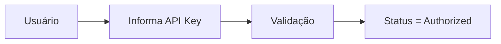
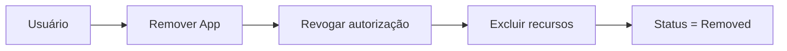
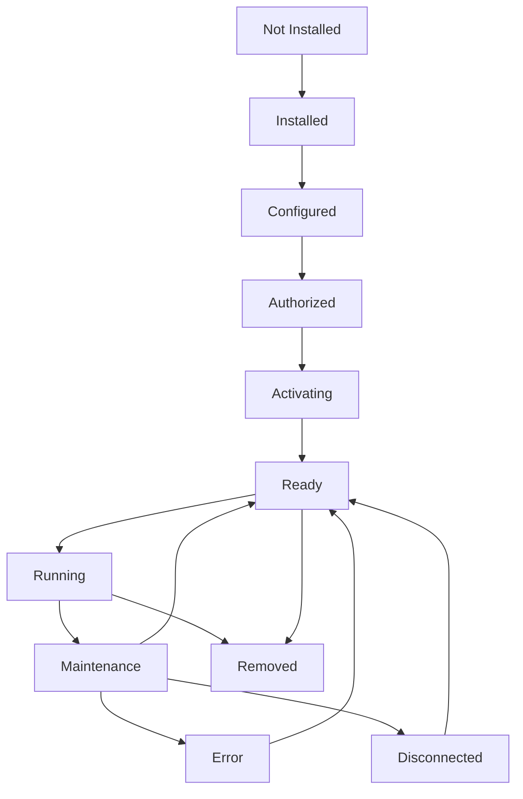

# Lifecycle e State Machine dos Apps

> Define o ciclo de vida completo de um App dentro da Arquitetura da Dialyn.

---

## Objetivo

Este documento define o ciclo de vida oficial de qualquer App integrado à plataforma Dialyn.

Independentemente do provedor (Google Calendar, Stripe, Mercado Pago, Shopify, Notion, Salesforce, entre outros), todos os Apps deverão seguir **exatamente o mesmo fluxo de estados**.

> O objetivo dessa padronização é garantir **previsibilidade**, **desacoplamento** entre componentes e uma arquitetura **escalável**, onde novos provedores possam ser adicionados sem alterar o comportamento da plataforma.

---

## Visão Geral

Todo App passa pelos mesmos estágios desde sua descoberta até sua remoção da plataforma.

Cada etapa possui **responsabilidades bem definidas** e representa um estado da integração.

---

## 1. Descoberta (Discovery)

A fase de **Descoberta** representa o momento em que o App ainda não faz parte da conta do usuário. O objetivo é permitir que o usuário conheça o App antes de adicioná-lo à plataforma.

> Nesta fase **nenhuma informação é persistida**.

### Informações disponíveis

| Informação | Descrição |
|------------|-----------|
| 📛 Nome | Identificação do App |
| 📝 Descrição | O que o App faz |
| 🏷️ Categoria | Domínio de negócio |
| 👤 Desenvolvedor | Responsável pelo App |
| 🔖 Versão | Número da versão |
| 📖 Documentação | Links e referências |
| 🔒 Permissões necessárias | Scopes exigidos |
| ⚡ Recursos disponíveis | Funcionalidades oferecidas |
| 🖼️ Capturas de tela | Imagens ilustrativas (quando houver) |

### Fluxo

---

## 2. Instalação (Installation)

A **instalação** representa o momento em que o usuário adiciona o App à sua conta.

> Nesta etapa **ainda não existe autenticação** nem comunicação com o provedor externo. A Dialyn apenas registra que aquele App passou a fazer parte da conta.

### Responsabilidades

| # | Ação |
|---|------|
| 1 | Criar o registro do App |
| 2 | Definir o `Provider` |
| 3 | Criar configurações padrão |
| 4 | Inicializar configurações internas |
| 5 | Definir o estado como `Installed` |

### Fluxo

---

## 3. Configuração (Configuration)

Após instalado, o App precisa ser **configurado**. Esta etapa reúne todas as configurações funcionais que **não envolvem autenticação**.

Cada integração poderá possuir **parâmetros específicos**.

| App | Parâmetros de Configuração |
|-----|---------------------------|
| 💳 Stripe | Ambiente (Sandbox ou Produção) |
| 💰 Mercado Pago | Ambiente |
| 📅 Google Calendar | Timezone, Calendário padrão |
| 🛒 Shopify | Loja padrão |
| 📝 Notion | Workspace padrão |
| 👥 Salesforce | Organização padrão |

> Ao finalizar esta etapa, o App estará pronto para ser **autorizado**.

---

## 4. Autorização (Authorization)

Nesta etapa ocorre a **autenticação** entre a Dialyn e o provedor. O método utilizado depende da tecnologia disponibilizada por cada plataforma.

| Método | Descrição |
|--------|-----------|
| 🔐 OAuth 2.0 | Autorização via terceiros |
| 🔑 API Key | Chave de acesso direta |
| 🪪 JWT | JSON Web Token |
| 🎫 Access Token | Token temporário |
| 🔄 Refresh Token | Renovação de acesso |

### Fluxo OAuth

### Fluxo API Key

> Ao término desta etapa a comunicação com a API já é possível, porém o App **ainda não está pronto** para utilização.

---

## 5. Ativação (Activation)

A autorização apenas concede acesso à API. Antes de disponibilizar o App para os agentes, a Dialyn deverá executar uma série de procedimentos automáticos.

Esta etapa garante que o App esteja **completamente operacional**.

| # | Procedimento |
|---|--------------|
| 1 | ✅ Validar permissões concedidas |
| 2 | 🔔 Registrar Webhooks |
| 3 | 🔄 Sincronizar recursos iniciais |
| 4 | 🔍 Buscar produtos / calendários / workspaces / organizações |
| 5 | 📡 Criar assinaturas de eventos |
| 6 | 🔐 Validar credenciais |
| 7 | 🌐 Verificar disponibilidade da API |

> Ao término: `Status = Ready`

> ⚠️ **Apenas Apps em estado `Ready`** poderão ser utilizados pelos agentes.

---

## 6. Operação (Runtime)

Representa o estado **operacional** do App. Nesta fase todas as funcionalidades ficam disponíveis. É o estado em que o App permanecerá durante praticamente toda sua vida útil.

### Operações disponíveis

| Operação | Objetivo | Exemplos |
|----------|----------|----------|
| 🔍 **Query()** | Consultar informações do provedor | Listar produtos, consultar pedidos, buscar clientes, consultar estoque, buscar eventos, consultar leads |
| ⚡ **Execute()** | Executar ações | Criar PIX, criar evento, atualizar estoque, criar Lead, criar Pedido, atualizar página |
| 🔔 **HandleWebhook()** | Processar eventos recebidos | Pagamento recebido, pedido criado, evento atualizado, nova resposta do Typeform |

### Atividades contínuas

- 🔄 Sincronizações automáticas
- ⚡ Processamento de eventos
- 🔗 Comunicação entre Engines
- 📊 Atualização de estados internos

---

## 7. Manutenção (Maintenance)

A manutenção representa todas as atividades necessárias para manter a integração funcionando ao longo do tempo. Grande parte dessas operações deverá ocorrer **automaticamente**.

| Categoria | Atividades |
|-----------|------------|
| 🔐 **Credenciais** | Renovar `Access Token`, Renovar `Refresh Token`, Atualizar `API Keys` |
| 🏗️ **Infraestrutura** | Recriar Webhooks, Atualizar assinaturas, Validar certificados |
| 📡 **API** | Adequação a novas versões, Atualização de endpoints, Alteração de permissões |
| 🛡️ **Resiliência** | Retry automático, Tratamento de Rate Limit, Reconexão automática, Monitoramento de disponibilidade |

> Esta etapa poderá ocorrer **inúmeras vezes** durante a vida útil do App.

---

## 8. Remoção (Removal)

Representa o **encerramento definitivo** da integração. Todo vínculo entre o usuário e o provedor deverá ser removido.

| # | Responsabilidade |
|---|------------------|
| 1 | 🚫 Revogar autenticação |
| 2 | 🗑️ Excluir Tokens |
| 3 | 🔌 Remover Webhooks |
| 4 | ❌ Encerrar assinaturas |
| 5 | ⚙️ Remover configurações |
| 6 | 📝 Remover registros internos |
| 7 | 🧹 Invalidar cache |
| 8 | 🔄 Alterar estado para `Removed` |

### Fluxo

---

## Máquina de Estados (State Machine)

Todos os Apps deverão seguir **exatamente a mesma máquina de estados**.

---

## Descrição dos Estados

| Estado | Descrição |
|--------|-----------|
| 🔲 `Not Installed` | O App ainda não pertence à conta do usuário |
| 📥 `Installed` | O App foi adicionado à conta |
| ⚙️ `Configured` | Configurações iniciais concluídas |
| 🔐 `Authorized` | Credenciais válidas e autenticação realizada |
| 🔄 `Activating` | Sincronizações e validações iniciais em execução |
| ✅ `Ready` | O App está pronto para utilização |
| ▶️ `Running` | O App está sendo utilizado normalmente pelos agentes |
| 🔧 `Maintenance` | Atualizações e rotinas de manutenção em execução |
| ❌ `Error` | Alguma falha impede a utilização do App |
| 🔌 `Disconnected` | A autorização foi perdida ou revogada |
| 🗑️ `Removed` | O App foi removido definitivamente da plataforma |

---

## Regras da Arquitetura

| # | Regra |
|---|-------|
| 1 | 🔲 Todo App inicia em **`Not Installed`** |
| 2 | ✅ Apenas Apps em estado **`Ready`** poderão ser utilizados pelos agentes |
| 3 | ⛔ Nenhum App poderá executar ações antes da fase de **Ativação** |
| 4 | 🔔 Todo Webhook deverá ser registrado durante a **Ativação** |
| 5 | 🔗 Toda comunicação com provedores externos deverá ocorrer exclusivamente através do **Engine responsável** |
| 6 | 🔌 Erros de autenticação deverão mover o App para **`Disconnected`** |
| 7 | ⚠️ Erros temporários deverão mover o App para **`Maintenance`** ou **`Error`**, conforme sua criticidade |
| 8 | 🗑️ A remoção deverá **eliminar completamente** qualquer vínculo entre a Dialyn e o provedor |

---

## Benefícios da Arquitetura

| # | Benefício |
|---|-----------|
| 1 | 📊 **Previsibilidade** para todas as integrações |
| 2 | 🔗 **Desacoplamento** entre a Dialyn e provedores externos |
| 3 | ➕ **Facilidade** para adicionar novos Apps |
| 4 | 📈 **Simplificação** do monitoramento da plataforma |
| 5 | 🔒 **Maior segurança** durante autenticação e remoção |
| 6 | 🏗️ **Padronização** do comportamento dos Engines |
| 7 | 🚀 **Escalabilidade** para centenas de integrações futuras |

Consulte todos os DTOs relacionados ao App [dtos](./dtos/README.md)
