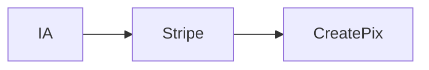
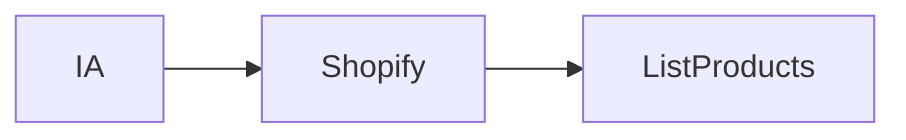
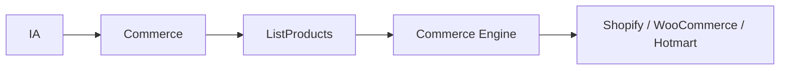
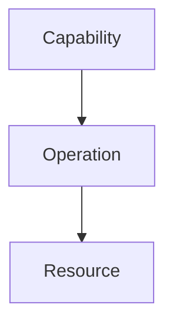
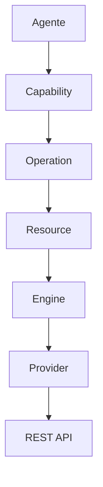
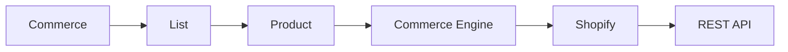
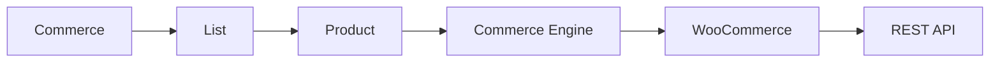
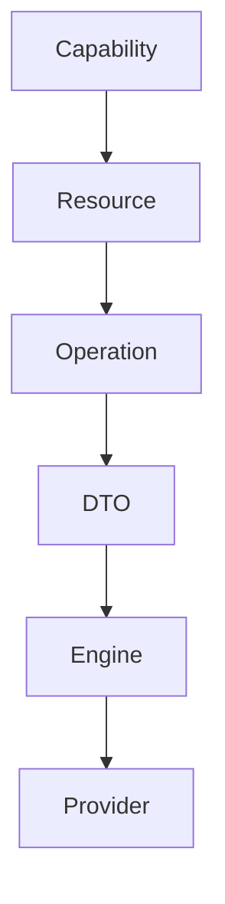

# Capabilities e Arquitetura das Actions

> Define a linguagem universal utilizada pela Dialyn para executar ações em qualquer integração.

---

## Objetivo

Este documento define a arquitetura das **Capabilities** da Dialyn.

Uma **Capability** representa uma capacidade funcional disponibilizada pela plataforma, **independentemente do provedor** utilizado.

> Os agentes **nunca** executam ações específicas de um fornecedor (Stripe, Google Calendar, Shopify, Salesforce...). Eles executam **ações padronizadas da própria Dialyn**. Os Engines são responsáveis por traduzir essas ações para a API correspondente.

Essa abordagem torna toda a arquitetura **desacoplada de provedores específicos** e permite adicionar novas integrações sem alterar o comportamento da IA.

---

## Filosofia

A IA **nunca** deve conhecer APIs externas.

### ❌ Incorreto



A IA passou a conhecer **Stripe** — isso é um acoplamento indesejado.

### ✅ Correto


O **Payments Engine** decidirá qual provedor executar. Para o agente, ambas as opções abaixo representam **exatamente a mesma operação**:

| Opção | Fluxo |
|-------|-------|
| **A** | Payments → Payments Engine → **Mercado Pago** |
| **B** | Payments → Payments Engine → **Stripe** |

### Outro exemplo

A IA nunca solicita:



Ela solicita:



O **Commerce Engine** identifica qual integração está configurada e converte a operação para o provedor compatível.

---

## Capabilities

As **Capabilities** representam grandes domínios de negócio da plataforma. Cada domínio agrupa recursos semelhantes.

| Capability | Objetivo |
|------------|----------|
| 💳 **Payments** | Operações financeiras |
| 🛒 **Commerce** | Comércio eletrônico |
| 👥 **CRM** | Gestão de relacionamento |
| 📅 **Calendar** | Agenda e eventos |
| 📋 **Productivity** | Produtividade |
| 📝 **Documents** | Documentos |
| 💬 **Messaging** | Comunicação |
| 📁 **Storage** | Arquivos |

> Novas Capabilities poderão ser adicionadas **sem alterar a arquitetura existente**.

---

## Arquitetura das Actions

Toda **Action** é composta por **três elementos**:



Essa estrutura reduz drasticamente a quantidade de Actions necessárias e cria uma **linguagem única** para toda a plataforma.

### Exemplos

| Domínio | Capability | Operation | Resource |
|---------|------------|-----------|----------|
| 💰 Pagamento | `Payments` | `Create` | `Payment` |
| 📦 Produtos | `Commerce` | `List` | `Product` |
| 📅 Calendário | `Calendar` | `Update` | `Event` |
| 👤 CRM | `CRM` | `Search` | `Lead` |
| 📝 Notion | `Documents` | `Create` | `Page` |

---

## Estrutura de uma Action

Toda Action deverá ser composta pelos seguintes elementos:

| Elemento | Descrição |
|----------|-----------|
| 🏗️ **Capability** | Domínio de negócio |
| ⚡ **Operation** | Ação a ser executada |
| 🎯 **Resource** | Entidade alvo |
| 📦 **Payload** | Dados da requisição |

### Exemplo: Criar pagamento

```json
{
    "capability": "payments",
    "operation": "create",
    "resource": "payment",
    "payload": {
        "amount": 150.00,
        "currency": "BRL"
    }
}
```

### Exemplo: Listar produtos

```json
{
    "capability": "commerce",
    "operation": "list",
    "resource": "product",
    "payload": {
        "category": "electronics"
    }
}
```

---

## Operações Universais

As operações representam **comportamentos comuns a qualquer domínio**. Elas são independentes do provedor.

### 🔍 Query

Responsável por **consultas**.

| Operação | Descrição |
|----------|-----------|
| `List` | Listar recursos |
| `Get` | Obter recurso específico |
| `Search` | Pesquisar recursos |
| `Count` | Contar recursos |
| `Exists` | Verificar existência |

### ✏️ Mutation

Responsável por **alterações de estado**.

| Operação | Descrição |
|----------|-----------|
| `Create` | Criar recurso |
| `Update` | Atualizar recurso |
| `Delete` | Excluir recurso |
| `Archive` | Arquivar recurso |
| `Restore` | Restaurar recurso |
| `Cancel` | Cancelar recurso |

### 📎 Files

**Manipulação de arquivos**.

| Operação | Descrição |
|----------|-----------|
| `Upload` | Enviar arquivo |
| `Download` | Baixar arquivo |
| `Export` | Exportar dados |
| `Import` | Importar dados |

### 🔔 Events

Operações relacionadas a **eventos**.

| Operação | Descrição |
|----------|-----------|
| `Subscribe` | Assinar evento |
| `Unsubscribe` | Cancelar assinatura |
| `HandleWebhook` | Processar webhook |
| `RetryWebhook` | Repetir webhook |

### 🔐 Authentication

**Gerenciamento de autenticação**.

| Operação | Descrição |
|----------|-----------|
| `Connect` | Conectar conta |
| `Disconnect` | Desconectar conta |
| `Refresh` | Renovar token |

### 📊 Metadata

Informações sobre a **integração**.

| Operação | Descrição |
|----------|-----------|
| `HealthCheck` | Verificar saúde |
| `GetCapabilities` | Listar capacidades |
| `GetConfiguration` | Obter configuração |

---

## Recursos

Os **recursos** representam entidades pertencentes a cada Capability.

| Capability | Recursos |
|------------|----------|
| 💳 **Payments** | `Payment`, `Customer`, `Invoice`, `Refund` |
| 🛒 **Commerce** | `Product`, `Order`, `Inventory`, `Customer` |
| 👥 **CRM** | `Lead`, `Deal`, `Company`, `Contact` |
| 📅 **Calendar** | `Calendar`, `Event` |
| 📝 **Documents** | `Page`, `Database`, `Block` |

> Novos recursos poderão ser adicionados conforme novas integrações forem sendo implementadas.

---

## Tradução para Providers

A Dialyn **nunca** executa chamadas diretamente em provedores. Todo processo ocorre através dos **Engines**.



### Exemplo: Listar produtos na Shopify



### Exemplo: Listar produtos no WooCommerce



> A operação executada pelo agente permanece **exatamente a mesma** — apenas o provedor de destino muda.

---

## Benefícios

| # | Benefício |
|---|-----------|
| 1 | 🔗 **Desacoplamento** completo entre IA e provedores |
| 2 | 🌐 **Linguagem única** para todas as integrações |
| 3 | 🔄 **Reutilização** das mesmas operações entre diferentes Apps |
| 4 | 📉 **Redução significativa** da quantidade de Actions |
| 5 | ➕ **Facilidade** para adicionar novos provedores |
| 6 | 🏗️ **Padronização** da comunicação entre Engines |
| 7 | 🗄️ **Simplificação** da modelagem de banco de dados |
| 8 | 📦 **Facilidade** para criação de DTOs universais |

---

## Próximos Passos

Após a definição das Capabilities, o próximo passo consiste na criação dos **DTOs universais**.

Os DTOs deverão representar cada **Resource** da plataforma, permitindo que qualquer Engine converta estruturas específicas de provedores externos para um modelo padronizado utilizado pela Dialyn. Acesse [DTOS](./operations) para continuar.

### Hierarquia


