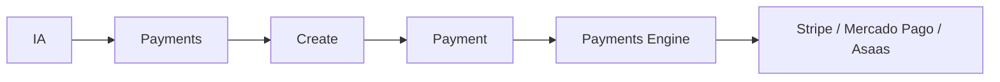
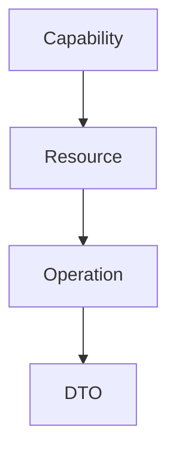
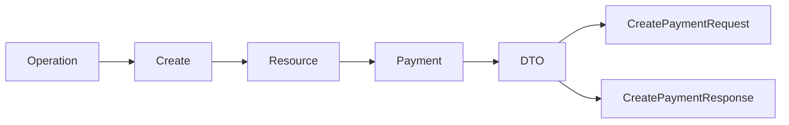
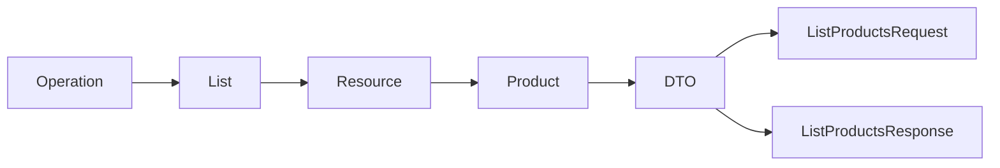

# Operações Universais

> Define as operações universais utilizadas pela Arquitetura de Apps da Dialyn.

---

## Objetivo

A Arquitetura de Apps da Dialyn foi construída sobre um princípio simples:

> **A IA nunca conhece APIs externas.**

Ela conhece apenas uma **linguagem universal** composta por **Capabilities**, **Resources** e **Operations**.

Os Engines são responsáveis por traduzir essas operações para qualquer provedor compatível. Essa abordagem permite que novas integrações sejam adicionadas **sem alterar o comportamento da IA**.

---

## Filosofia

As operações da Dialyn **não pertencem aos Providers** — elas pertencem às **Capabilities**.

### ❌ Incorreto

### ✅ Correto

O **Payments Engine** será responsável por decidir qual provedor executará a operação.

Da mesma forma:

---

## Arquitetura

Toda operação da Dialyn é composta por **quatro elementos**:

### Exemplo: Criar pagamento

---

## Categorias de Operações

As operações universais foram divididas em **oito grandes grupos**:

| # | Categoria | Objetivo |
|---|-----------|----------|
| 1 | 🔍 **Read** | Consultar informações |
| 2 | ➕ **Create** | Criar recursos |
| 3 | ✏️ **Update** | Atualizar recursos |
| 4 | 🗑️ **Delete** | Remover ou finalizar recursos |
| 5 | 📎 **Files** | Manipular arquivos |
| 6 | 🔔 **Events** | Processar eventos |
| 7 | 🔐 **Authentication** | Gerenciar autenticação |
| 8 | 📊 **Metadata** | Consultar informações do App |

---

## 1. Read Operations

Responsável por operações de **consulta**. Essas operações **nunca alteram** informações.

| Operação | Objetivo |
|----------|----------|
| `List` | Listar recursos |
| `Get` | Obter um recurso específico |
| `Search` | Pesquisar recursos |
| `Count` | Contabilizar registros |
| `Exists` | Verificar existência |

### Exemplos

| Operação | Descrição |
|----------|-----------|
| `List Products` | Listar produtos |
| `List Orders` | Listar pedidos |
| `List Events` | Listar eventos |
| `List Leads` | Listar leads |
| `Get Product` | Obter produto |
| `Get Customer` | Obter cliente |
| `Search Lead` | Pesquisar lead |
| `Search Order` | Pesquisar pedido |
| `Exists Customer` | Verificar cliente |
| `Count Products` | Contar produtos |

### DTOs

| Request | Response |
|---------|----------|
| `ListProductsRequest` | `ListProductsResponse` |
| `GetProductRequest` | `GetProductResponse` |
| `SearchLeadRequest` | `SearchLeadResponse` |

---

## 2. Create Operations

Responsável pela **criação** de novos recursos.

| Operação | Objetivo |
|----------|----------|
| `Create` | Criar recurso |
| `Clone` | Duplicar recurso |
| `Import` | Criar através de importação |

### Exemplos

| Operação | Descrição |
|----------|-----------|
| `Create Payment` | Criar pagamento |
| `Create Product` | Criar produto |
| `Create Event` | Criar evento |
| `Create Lead` | Criar lead |
| `Create Card` | Criar cartão |
| `Create Page` | Criar página |

### DTOs

| Request | Response |
|---------|----------|
| `CreatePaymentRequest` | `CreatePaymentResponse` |
| `CreateLeadRequest` | `CreateLeadResponse` |
| `CreateEventRequest` | `CreateEventResponse` |

---

## 3. Update Operations

Responsável por **alterações** de recursos existentes.

| Operação | Objetivo |
|----------|----------|
| `Update` | Atualização completa |
| `Patch` | Atualização parcial |
| `Rename` | Renomear |
| `Move` | Mover |
| `Merge` | Mesclar |

### Exemplos

| Operação | Descrição |
|----------|-----------|
| `Update Product` | Atualizar produto |
| `Update Lead` | Atualizar lead |
| `Move Card` | Mover card |
| `Rename Calendar` | Renomear calendário |
| `Merge Contact` | Mesclar contato |

### DTOs

| Request | Response |
|---------|----------|
| `UpdateProductRequest` | `UpdateProductResponse` |
| `PatchLeadRequest` | — |
| `MoveCardRequest` | — |
| `MergeContactRequest` | — |

---

## 4. Delete Operations

Responsável por **remoção** ou **encerramento** de recursos.

| Operação | Objetivo |
|----------|----------|
| `Delete` | Excluir |
| `Archive` | Arquivar |
| `Restore` | Restaurar |
| `Cancel` | Cancelar |
| `Close` | Encerrar |

### Exemplos

| Operação | Descrição |
|----------|-----------|
| `Delete Event` | Excluir evento |
| `Archive Card` | Arquivar card |
| `Restore Product` | Restaurar produto |
| `Cancel Payment` | Cancelar pagamento |
| `Close Deal` | Encerrar negócio |

### DTOs

| Request |
|---------|
| `DeleteEventRequest` |
| `ArchiveCardRequest` |
| `CancelPaymentRequest` |
| `RestoreProductRequest` |

---

## 5. File Operations

Responsável pela **manipulação de arquivos**.

| Operação | Objetivo |
|----------|----------|
| `Upload` | Enviar arquivo |
| `Download` | Baixar arquivo |
| `Export` | Exportar |
| `Import` | Importar |
| `Preview` | Visualizar |

### Exemplos

| Operação | Descrição |
|----------|-----------|
| `Upload Attachment` | Enviar anexo |
| `Download Invoice` | Baixar fatura |
| `Export Customers` | Exportar clientes |
| `Import Products` | Importar produtos |

### DTOs

| Request |
|---------|
| `UploadAttachmentRequest` |
| `DownloadInvoiceRequest` |
| `ExportCustomersRequest` |
| `ImportProductsRequest` |

---

## 6. Event Operations

Responsável pelo **processamento de eventos**.

| Operação | Objetivo |
|----------|----------|
| `Subscribe` | Registrar eventos |
| `Unsubscribe` | Cancelar inscrição |
| `HandleWebhook` | Processar Webhook |
| `RetryWebhook` | Reprocessar Webhook |
| `Acknowledge` | Confirmar processamento |

### Exemplos

| Operação | Descrição |
|----------|-----------|
| `Subscribe Calendar` | Assinar calendário |
| `Unsubscribe Event` | Cancelar evento |
| `Handle PaymentWebhook` | Processar webhook de pagamento |
| `Retry PaymentWebhook` | Reprocessar webhook |
| `Acknowledge OrderWebhook` | Confirmar webhook |

### DTOs

| Request |
|---------|
| `SubscribeRequest` |
| `HandleWebhookRequest` |
| `RetryWebhookRequest` |

---

## 7. Authentication Operations

Responsável pelo **gerenciamento da autenticação**.

| Operação | Objetivo |
|----------|----------|
| `Connect` | Conectar |
| `Disconnect` | Desconectar |
| `Refresh` | Renovar credenciais |
| `Validate` | Validar autenticação |
| `Reconnect` | Reconectar |

### Exemplos

| Operação | Descrição |
|----------|-----------|
| `Connect` | Conectar conta |
| `Disconnect` | Desconectar conta |
| `Refresh` | Renovar token |
| `Validate` | Validar credenciais |
| `Reconnect` | Reconectar |

### DTOs

| Request | Response |
|---------|----------|
| `ConnectRequest` | `ConnectResponse` |
| `RefreshTokenRequest` | — |
| `ReconnectRequest` | — |

---

## 8. Metadata Operations

Responsável por **informações da integração**.

| Operação | Objetivo |
|----------|----------|
| `HealthCheck` | Verificar disponibilidade |
| `Capabilities` | Consultar capacidades |
| `Configuration` | Obter configuração |
| `Version` | Consultar versão |
| `Permissions` | Consultar permissões |

### Exemplos

| Operação | Descrição |
|----------|-----------|
| `HealthCheck` | Verificar saúde do App |
| `Capabilities` | Listar capacidades |
| `Configuration` | Obter configuração |
| `Version` | Consultar versão |
| `Permissions` | Consultar permissões |

### DTOs

| Response |
|----------|
| `HealthCheckResponse` |
| `CapabilitiesResponse` |
| `ConfigurationResponse` |
| `PermissionsResponse` |

---

## Core Operations

As **Core Operations** representam o conjunto **mínimo** de operações que qualquer Resource deverá implementar.

| Operação | Categoria |
|----------|-----------|
| `List` | Read |
| `Get` | Read |
| `Create` | Create |
| `Update` | Update |
| `Delete` | Delete |

> Essas operações garantem que **todos os Resources** possuam uma interface consistente.

---

## Extended Operations

Operações **opcionais** implementadas apenas quando fizerem sentido para determinado Resource.

| Operação | Categoria |
|----------|-----------|
| `Search` | Read |
| `Count` | Read |
| `Exists` | Read |
| `Archive` | Delete |
| `Restore` | Delete |
| `Cancel` | Delete |
| `Clone` | Create |
| `Move` | Update |
| `Merge` | Update |
| `Upload` | Files |
| `Export` | Files |
| `Import` | Files / Create |
| `Preview` | Files |
| `Subscribe` | Events |

---

## Exemplos por Resource

### Payment

| Tipo | Operações |
|------|-----------|
| ✅ **Core** | `Create`, `Get`, `List`, `Update` |
| 🔧 **Extended** | `Cancel`, `Refund`, `Search` |

### Event

| Tipo | Operações |
|------|-----------|
| ✅ **Core** | `Create`, `Get`, `List`, `Update`, `Delete` |

### Lead

| Tipo | Operações |
|------|-----------|
| ✅ **Core** | `Create`, `Get`, `List`, `Update` |
| 🔧 **Extended** | `Search`, `Merge`, `Archive` |

### Product

| Tipo | Operações |
|------|-----------|
| ✅ **Core** | `Create`, `Get`, `List`, `Update`, `Delete` |
| 🔧 **Extended** | `Import`, `Export`, `Archive` |

---

## Relação entre Operation e DTO

Cada Operation poderá possuir um ou mais DTOs específicos.

### Exemplo: Create Payment

### Exemplo: List Products

> Essa estrutura permite **reutilizar** as mesmas operações para qualquer Resource da plataforma.

---

## Benefícios

| # | Benefício |
|---|-----------|
| 1 | 🌐 **Linguagem universal** para todos os Engines |
| 2 | 🔗 **Desacoplamento** entre a IA e APIs externas |
| 3 | 🔄 **Reutilização** de operações entre diferentes Resources |
| 4 | 📦 **Padronização** dos DTOs |
| 5 | 📉 **Redução da complexidade** da arquitetura |
| 6 | ➕ **Facilidade** para adicionar novos provedores |
| 7 | 🗄️ **Simplificação** da modelagem do banco de dados |
| 8 | 📊 **Maior previsibilidade** para desenvolvimento de novos Apps |

---

## Próximo Passo

Com as **Capabilities**, **Resources** e **Operations** definidos, o próximo passo da arquitetura consiste em especificar os **DTOs universais** de cada Resource.

Os DTOs representarão o **contrato de dados** da Dialyn, permitindo que qualquer Engine converta modelos específicos de provedores externos para uma estrutura padronizada utilizada por toda a plataforma. Acesse [DTOS](../dtos/README.md) para continuar.