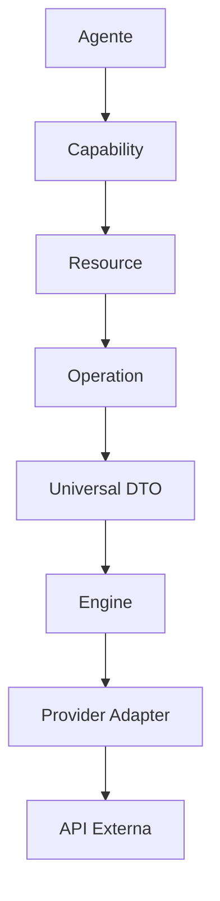
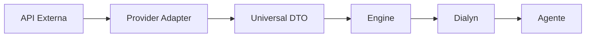
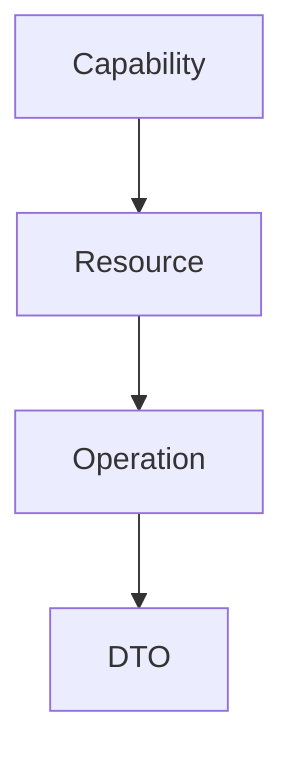
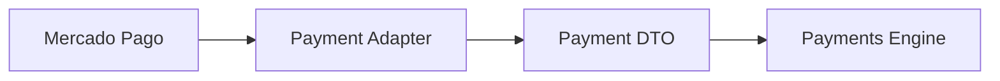
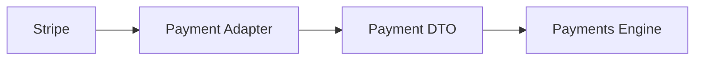

# Universal DTOs

> Define o modelo canônico de dados utilizado pela Arquitetura de Apps da Dialyn.

---

## Objetivo

Este documento define o conceito de **Universal DTOs (Data Transfer Objects)** utilizados pela Dialyn.

Os DTOs representam o **contrato oficial de comunicação** entre a IA, os Engines e os Apps. Seu principal objetivo é desacoplar completamente a plataforma das estruturas de dados utilizadas pelos provedores externos.

> Independentemente do provedor utilizado (Stripe, Mercado Pago, Google Calendar, Shopify, Salesforce, Notion...), toda informação deverá ser convertida para um **DTO da Dialyn** antes de ser utilizada pelo restante da plataforma.

---

## Filosofia

Cada provedor possui sua própria estrutura de dados. Por exemplo, um pagamento criado no Stripe possui um formato diferente de um pagamento criado no Mercado Pago — mesmo representando o mesmo conceito de negócio.

| Provedor | Campo | Valor |
|----------|-------|-------|
| 💳 Stripe | `amount` | `15000` (centavos) |
| 💰 Mercado Pago | `transaction_amount` | `150.00` |
| ✅ **Dialyn** | **`amount`** | **`150.00`** |

> A Dialyn **nunca** deverá trabalhar diretamente com essas estruturas. Toda informação recebida deverá ser convertida para um **modelo universal**, e toda informação enviada para um provedor deverá **partir desse mesmo modelo**.

---

## Fluxo da Arquitetura

Todo fluxo de comunicação deverá seguir o mesmo padrão.

### Envio (Dialyn → Provedor)



### Retorno (Provedor → Dialyn)



> Em **nenhum momento** a IA deverá conhecer estruturas específicas de um provedor.

---

## Arquitetura dos DTOs

Todos os DTOs deverão ser organizados seguindo a mesma hierarquia da arquitetura de Apps.



### Exemplos

| Capability | Resource | Operation | DTO |
|------------|----------|-----------|-----|
| 💳 Payments | `Payment` | `Create` | `CreatePaymentRequest` |
| 🛒 Commerce | `Product` | `List` | `ListProductsResponse` |

> Essa organização garante **consistência** entre documentação, código e modelagem da plataforma.

---

## Estrutura dos DTOs

Cada Resource possuirá seu próprio **conjunto de DTOs**.

### Payment

```
Payment
├── CreatePaymentRequest
├── CreatePaymentResponse
├── UpdatePaymentRequest
├── UpdatePaymentResponse
├── GetPaymentResponse
├── ListPaymentsResponse
└── CancelPaymentRequest
```

### Product

```
Product
├── CreateProductRequest
├── CreateProductResponse
├── UpdateProductRequest
├── UpdateProductResponse
├── GetProductResponse
└── ListProductsResponse
```

> Os DTOs **pertencem ao Resource**, e não ao Provider.

---

## Responsabilidade dos Engines

Todo Engine deverá **converter automaticamente** qualquer estrutura externa para um DTO da Dialyn.

### Exemplo: Mercado Pago



### Exemplo: Stripe



> Independentemente do provedor utilizado, o restante da plataforma sempre receberá **exatamente o mesmo modelo de dados**.

---

## Providers nunca são expostos

Os Engines são responsáveis por **ocultar completamente** a implementação de cada integração.

| Provedor | Campo original | Campo Dialyn |
|----------|----------------|--------------|
| 💰 Mercado Pago | `transaction_amount` | `Payment.amount` |
| 💳 Stripe | `amount` | `Payment.amount` |

> Embora os nomes sejam diferentes, ambos serão convertidos para o **mesmo atributo** da Dialyn. Esse princípio vale para **todos os Resources** da plataforma.

---

## Convenção de nomenclatura

Todos os DTOs deverão seguir **exatamente o mesmo padrão** de nomenclatura.

### Requests

| Padrão | Exemplo |
|--------|---------|
| `{Operation}{Resource}Request` | `CreatePaymentRequest` |
| | `UpdatePaymentRequest` |
| | `DeletePaymentRequest` |
| | `GetPaymentRequest` |
| | `ListPaymentsRequest` |

### Responses

| Padrão | Exemplo |
|--------|---------|
| `{Operation}{Resource}Response` | `CreatePaymentResponse` |
| | `UpdatePaymentResponse` |
| | `DeletePaymentResponse` |
| | `GetPaymentResponse` |
| | `ListPaymentsResponse` |

> Esse padrão deverá ser seguido por **todos os Resources** da plataforma.

---

## Organização da documentação

A documentação será organizada por **Capability** e **Resource**.

```
dtos/
├── payments/
│   ├── payment.md
│   ├── customer.md
│   ├── invoice.md
│   └── refund.md
├── commerce/
│   ├── product.md
│   ├── order.md
│   ├── inventory.md
│   └── customer.md
├── crm/
│   ├── lead.md
│   ├── deal.md
│   ├── company.md
│   └── contact.md
├── calendar/
│   ├── calendar.md
│   └── event.md
├── productivity/
└── documents/
```

Cada documento será responsável por definir:

| Item | Descrição |
|------|-----------|
| 📐 Modelo canônico do Resource | Estrutura de dados padronizada |
| ⚡ Operações suportadas | Quais ações podem ser executadas |
| 📤 DTOs Request | Objetos de requisição |
| 📥 DTOs Response | Objetos de resposta |
| ✅ Regras de validação | Restrições dos campos |
| 📋 Regras de negócio | Comportamentos esperados |
| 🔄 Conversão realizada pelos Engines | Mapeamento provider → Dialyn |

---

## Princípios da Arquitetura

| # | Princípio | Descrição |
|---|-----------|-----------|
| 1 | 🔗 **Independentes** | De qualquer provedor |
| 2 | 🔄 **Reutilizáveis** | Por diferentes Engines |
| 3 | 🧩 **Compatíveis** | Com todas as Operations do Resource |
| 4 | 🚫 **Desacoplados** | Das APIs externas |
| 5 | 🧊 **Imutáveis** | Durante a comunicação |
| 6 | 🔖 **Versionáveis** | Suporte a evolução |
| 7 | 📦 **Serializáveis** | Facilmente convertíveis |
| 8 | 📖 **Documentados** | De forma consistente |

---

## Benefícios

| # | Benefício |
|---|-----------|
| 1 | 🔗 **Desacoplamento** completo entre a Dialyn e provedores externos |
| 2 | 🏗️ **Padronização** da comunicação entre Engines |
| 3 | ➕ **Simplificação** da implementação de novas integrações |
| 4 | 🔄 **Reutilização** de modelos entre diferentes Apps |
| 5 | 📉 **Redução da complexidade** da plataforma |
| 6 | 📖 **Maior consistência** entre documentação e código |
| 7 | 🚀 **Facilidade** para evolução da arquitetura sem impacto na IA |

---

## Próximo Passo

Os próximos documentos especificarão os **DTOs de cada Resource** da plataforma. Cada Resource possuirá sua própria documentação contendo:

- Modelo canônico
- Propriedades
- Operações suportadas
- DTOs de Request
- DTOs de Response
- Validações
- Regras de negócio
- Exemplos de utilização

> Esses documentos representarão o **contrato oficial de dados** da Arquitetura de Apps da Dialyn. Consulte a documentação de Base para o DTOs [base](base.md).
