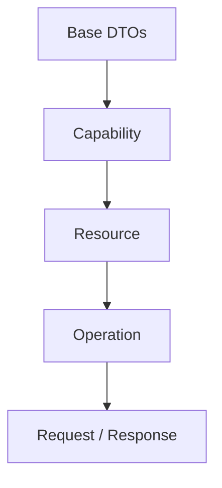

# Base DTOs

> Define os contratos fundamentais utilizados por todos os Universal DTOs da Arquitetura de Apps da Dialyn.

---

## Objetivo

Este documento estabelece os **contratos base** utilizados por **todos os Resources** da plataforma.

Independentemente da Capability (Payments, Commerce, CRM, Calendar, Documents ou qualquer outra), todos os DTOs deverão seguir as estruturas definidas neste documento.

> O objetivo é garantir **consistência**, **reutilização** e **padronização** em toda a arquitetura.

---

## Filosofia

Todos os Resources compartilham comportamentos comuns:

| Comportamento | Descrição |
|---------------|-----------|
| 🆔 Identificador | Possuem um ID único |
| 🔗 Provider | Pertencem a um provedor |
| 📅 Datas | Possuem criação e atualização |
| 📄 Respostas | Retornam respostas padronizadas |
| 📑 Paginação | Podem utilizar paginação |
| ⚠️ Erros | Podem retornar erros padronizados |

> Esses conceitos **não pertencem a um domínio específico** — eles pertencem à própria plataforma.

---

## BaseResource

Representa a estrutura **mínima** de qualquer Resource da Dialyn.

```typescript
BaseResource {
    id: string
    externalId: string
    provider: string
    createdAt: datetime
    updatedAt: datetime
    metadata: object
}
```

| Campo | Obrigatório | Descrição |
|-------|:-----------:|-----------|
| `id` | ✅ | Identificador interno da Dialyn |
| `externalId` | ❌ | Identificador do Provider |
| `provider` | ✅ | Nome do Provider responsável |
| `createdAt` | ✅ | Data de criação |
| `updatedAt` | ✅ | Última atualização |
| `metadata` | ❌ | Informações adicionais |

> Todos os Resources deverão **estender** este contrato.

---

## BaseRequest

Representa qualquer **requisição** enviada para um Engine.

```typescript
BaseRequest {
    accountId: string
    agentId: string
    requestId: string
    traceId: string
}
```

| Campo | Obrigatório | Descrição |
|-------|:-----------:|-----------|
| `accountId` | ✅ | Conta proprietária da integração |
| `agentId` | ❌ | Agente responsável pela solicitação |
| `requestId` | ✅ | Identificador único da requisição |
| `traceId` | ✅ | Identificador para rastreamento distribuído |

---

## BaseResponse

Representa qualquer **resposta** retornada pelos Engines.

```typescript
BaseResponse {
    success: boolean
    message: string
    errors: Error[]
    metadata: object
}
```

| Campo | Obrigatório | Descrição |
|-------|:-----------:|-----------|
| `success` | ✅ | Resultado da operação |
| `message` | ❌ | Mensagem informativa |
| `errors` | ❌ | Lista de erros padronizados |
| `metadata` | ❌ | Informações adicionais |

---

## PaginationRequest

Contrato utilizado por operações de **listagem**.

```typescript
PaginationRequest {
    page: integer
    limit: integer
}
```

---

## PaginationResponse

Informações de **paginação**.

```typescript
PaginationResponse {
    page: integer
    limit: integer
    total: integer
    pages: integer
}
```

---

## Filter

Representa **filtros genéricos** utilizados em consultas.

```typescript
Filter {
    field: string
    operator: string
    value: any
}
```

| Operador | Descrição |
|----------|-----------|
| `=` / `!=` | Igual / Diferente |
| `>` / `<` | Maior / Menor |
| `>=` / `<=` | Maior igual / Menor igual |
| `contains` | Contém |
| `startsWith` / `endsWith` | Começa / Termina com |
| `in` | Dentro de uma lista |
| `between` | Entre dois valores |

---

## Sort

Representa **ordenação**.

```typescript
Sort {
    field: string
    direction: ASC | DESC
}
```

---

## Error

Erro **padronizado** da plataforma.

```typescript
Error {
    code: string
    message: string
    details: object
}
```

> Todos os erros retornados por Providers deverão ser convertidos para este formato.

---

## ValidationError

Erro de **validação**.

```typescript
ValidationError {
    field: string
    message: string
}
```

---

## FileReference

Representa qualquer **arquivo** manipulado pela plataforma.

```typescript
FileReference {
    id: string
    name: string
    mimeType: string
    size: integer
    url: string
}
```

---

## Metadata

Representa dados **complementares**.

```typescript
Metadata {
    values: object
}
```

> Este objeto poderá conter informações específicas do Provider, desde que **não façam parte do contrato oficial** da Dialyn.

---

## Version

Representa a **versão** de um Resource.

```typescript
Version {
    major: integer
    minor: integer
    patch: integer
}
```

---

## Convenções

Todos os DTOs da plataforma deverão:

| # | Regra |
|---|-------|
| 1 | 📦 **Herdar** os contratos deste documento quando aplicável |
| 2 | 🔗 **Permanecer independentes** de qualquer Provider |
| 3 | 📋 **Ser serializáveis** |
| 4 | 🔖 **Ser versionáveis** |
| 5 | 🔄 **Manter compatibilidade retroativa** sempre que possível |

---

## Hierarquia

A estrutura arquitetural dos DTOs deverá seguir a seguinte organização:



### Exemplos

| Caminho | Exemplo |
|---------|---------|
| Base → Resource → Operation → DTO | `BaseResource` → `Payment` → `Create` → `CreatePaymentRequest` |
| Base → Operation → DTO | `BaseRequest` → `ListProductsRequest` |

---

## Benefícios

| # | Benefício |
|---|-----------|
| 1 | 🏗️ **Padronização** entre todas as Capabilities |
| 2 | 🔄 **Reutilização** de contratos comuns |
| 3 | 📉 **Redução de duplicação** |
| 4 | 🚀 **Facilidade** para evolução da plataforma |
| 5 | 📖 **Consistência** entre documentação e implementação |
| 6 | ⚡ **Simplificação** do desenvolvimento de novos Engines e Providers |

> Consulte a documentação de [convenções](convetions.md) para entender os padrões utilizados na arquitetura da Dialyn.
