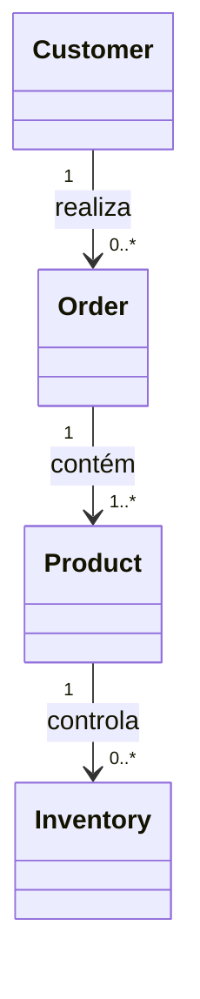
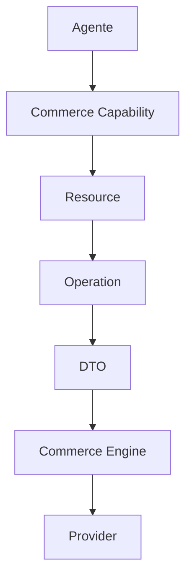
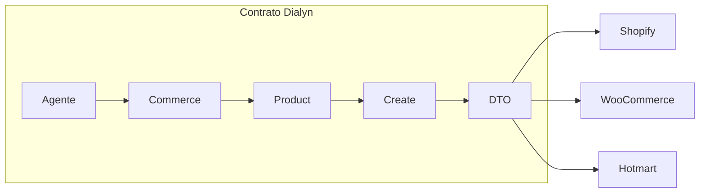

# Commerce

> Capability responsável por padronizar todas as integrações de **e-commerce** da Arquitetura de Apps da Dialyn.

---

## Objetivo

A Capability **Commerce** define um modelo canônico para representar operações de comércio eletrônico na Dialyn.

Seu objetivo é abstrair as diferenças entre os diversos Providers de e-commerce, permitindo que Agentes e Engines trabalhem com contratos universais, independentemente da plataforma utilizada.

Atualmente, esta Capability contempla integrações como:

- Shopify
- WooCommerce
- Hotmart

> Novos Providers poderão ser adicionados futuramente sem necessidade de alterar os contratos públicos da Dialyn.

---

## Filosofia

Cada plataforma de e-commerce possui sua própria API, nomenclatura e modelo de dados.

| Provider | Entidades |
|----------|-----------|
| 🛒 Shopify | `Product`, `Variant`, `Order` |
| 🏪 WooCommerce | `Product`, `Order`, `Customer` |
| 🎓 Hotmart | Produtos digitais, pedidos e compradores |
| ✅ **Dialyn** | **`Product`, `Order`, `Customer`, `Inventory`** |

> Apesar das diferenças, todos representam conceitos semelhantes. A Dialyn converte essas estruturas para um modelo canônico baseado em Resources.

---

## Estrutura da Capability

```
commerce/
├── README.md
├── glossary.md
├── common.md
├── relationships.md
├── product.md
├── order.md
├── customer.md
└── inventory.md
```

---

## Documentação

### Conceitos

| Documento | Objetivo |
|-----------|----------|
| [glossary.md](./glossary.md) | Glossário oficial da Capability Commerce |
| [common.md](./common.md) | Tipos compartilhados entre os Resources |
| [relationships.md](./relationships.md) | Relacionamentos entre os Resources |

### Resources

| Resource | Objetivo |
|----------|----------|
| [product.md](./product.md) | Representa produtos comercializados |
| [order.md](./order.md) | Representa pedidos realizados |
| [customer.md](./customer.md) | Representa compradores |
| [inventory.md](./inventory.md) | Representa informações de estoque |

---

## Modelo Conceitual

A Capability Commerce é composta pelos seguintes Resources.



---

## Arquitetura

A comunicação segue o padrão definido pela Arquitetura de Apps da Dialyn.



> Os Agentes nunca conhecem APIs externas. Toda comunicação ocorre através do Commerce Engine.

---

## Resources

Cada Resource representa uma entidade de negócio da Capability.

| Resource | Responsabilidade |
|----------|------------------|
| **Product** | Representa um produto físico ou digital |
| **Order** | Representa um pedido realizado por um cliente |
| **Customer** | Representa um comprador |
| **Inventory** | Representa o controle de estoque |

Cada Resource possui:
- Modelo canônico
- Operações suportadas
- DTOs
- Regras de validação
- Regras de negócio

---

## Operações

Todos os Resources utilizam as operações universais da Dialyn.

| Categoria | Operações |
|-----------|-----------|
| ⚡ **Core** | `List`, `Get`, `Create`, `Update`, `Delete` |
| 🔧 **Extended** | `Search`, `Count`, `Exists`, `Archive`, `Restore`, `Import`, `Export` |

> Operações adicionais podem existir dependendo do Resource.

---

## Independência dos Providers

Os contratos desta Capability nunca deverão depender de um Provider específico.



> O contrato permanece exatamente o mesmo. A responsabilidade pela conversão pertence exclusivamente ao Commerce Engine.

---

## Compatibilidade

A Capability Commerce foi projetada para suportar múltiplos Providers simultaneamente.

> Cada Engine deverá adaptar os contratos universais da Dialyn para os modelos específicos de cada plataforma.

---

## Evolução

Novos Resources poderão ser adicionados conforme a Capability evoluir.

| Resource | Descrição |
|----------|-----------|
| Collection | Agrupamento de produtos |
| Category | Categorização de produtos |
| Variant | Variações de produto (tamanho, cor) |
| Coupon | Cupons de desconto |
| Shipment | Informações de envio |
| Review | Avaliações de produtos |

> A inclusão de novos Resources não deverá impactar os contratos já existentes.

---

## Princípios

| # | Princípio | Descrição |
|---|-----------|-----------|
| 1 | 🔗 **Independência** | De qualquer plataforma de e-commerce |
| 2 | 🔄 **Reutilização** | Dos mesmos Resources entre diferentes fluxos |
| 3 | 🧩 **Extensibilidade** | Novos Resources sem quebrar contratos existentes |
| 4 | 🧊 **Imutabilidade** | Contratos públicos estáveis |
| 5 | 📖 **Documentação** | Consistente com a arquitetura |

---

## Benefícios

| # | Benefício |
|---|-----------|
| 1 | 🔗 **Desacoplamento** completo entre a Dialyn e plataformas de e-commerce |
| 2 | 🏗️ **Padronização** da comunicação entre Commerce Engines |
| 3 | ➕ **Simplificação** da integração de novas lojas |
| 4 | 📉 **Redução da complexidade** ao unificar o modelo de dados |
| 5 | 🚀 **Facilidade** para evolução sem impacto na IA |

---

## Próximos passos

A leitura recomendada da documentação segue a seguinte ordem:

1. [Glossary](./glossary.md)
2. [Common Types](./common.md)
3. [Relationships](./relationships.md)
4. Product
5. Order
6. Customer
7. Inventory
