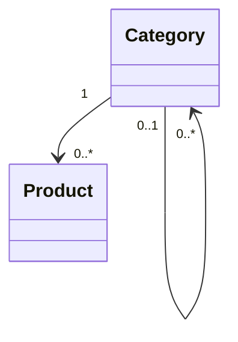

# Category

> Resource responsável por representar categorias de produtos na Capability **Commerce**.

---

## Objetivo

O Resource **Category** representa uma estrutura utilizada para organizar e classificar produtos.

Seu objetivo é padronizar a representação de categorias entre diferentes plataformas de e-commerce, permitindo que a Dialyn utilize um modelo canônico independente do Provider.

---

## Filosofia

Cada plataforma organiza produtos de maneira diferente.

| Provider | Conceito |
|----------|----------|
| 🛒 Shopify | `Collections` |
| 🏪 WooCommerce | `Categories` |
| 🏬 Magento | `Categories` |
| 📦 VTEX | `Categories` |
| ✅ **Dialyn** | **`Category`** |

> Apesar das diferenças de nomenclatura e implementação, todas representam agrupamentos de produtos. O Commerce Engine deverá converter esses conceitos para o Resource `Category`.

---

## Modelo Canônico

```typescript
Category {
    id: string
    externalId: string
    parent: CategoryReference
    name: string
    description: string
    slug: string
    active: boolean
    metadata: Metadata
}
```

---

## Campos

| Campo | Tipo | Obrigatório | Descrição |
|--------|------|:-----------:|-----------|
| id | string | ✔ | Identificador interno |
| externalId | string | | Identificador do Provider |
| parent | CategoryReference | | Categoria pai |
| name | string | ✔ | Nome da categoria |
| description | string | | Descrição |
| slug | string | | Identificador amigável |
| active | boolean | ✔ | Estado da categoria |
| metadata | Metadata | | Informações adicionais |

---

## Operações

### Core (obrigatórias)

| Operação | Objetivo |
|----------|----------|
| Create | Criar categoria |
| Get | Consultar categoria |
| List | Listar categorias |
| Update | Atualizar categoria |
| Delete | Remover categoria |

### Extended (opcionais)

| Operação | Objetivo |
|----------|----------|
| Search | Pesquisar categorias |
| Count | Contabilizar categorias |
| Exists | Verificar existência |
| Archive | Arquivar |
| Restore | Restaurar |

---

## DTOs

Este Resource define os seguintes contratos.

| DTO | Objetivo |
|------|----------|
| CreateCategoryRequest | Criar categoria |
| CreateCategoryResponse | Resultado da criação |
| GetCategoryRequest | Consultar categoria |
| GetCategoryResponse | Resultado da consulta |
| ListCategoriesRequest | Listagem paginada |
| ListCategoriesResponse | Lista de categorias |
| UpdateCategoryRequest | Atualizar categoria |
| UpdateCategoryResponse | Resultado da atualização |
| DeleteCategoryRequest | Remover categoria |
| DeleteCategoryResponse | Resultado da remoção |

> Os detalhes completos encontram-se na pasta **dtos**.

---

## Relacionamentos



Uma categoria poderá conter diversos produtos. Uma categoria também poderá possuir subcategorias.

---

## Regras de Negócio

| # | Regra |
|---|-------|
| 1 | Toda Category deverá possuir um nome |
| 2 | O slug deverá ser único quando suportado pelo Provider |
| 3 | Uma categoria poderá possuir uma categoria pai |
| 4 | Categorias poderão existir mesmo sem produtos associados |
| 5 | Informações específicas do Provider deverão ser preservadas em `Metadata` |

---

## Responsabilidade do Commerce Engine

| # | Responsabilidade |
|---|-----------------|
| 1 | Converter categorias do Provider para o modelo canônico |
| 2 | Preservar a hierarquia de categorias |
| 3 | Manter compatibilidade entre diferentes plataformas |
| 4 | Converter coleções, taxonomias ou categorias para este Resource |

---

## Princípios

| # | Princípio | Descrição |
|---|-----------|-----------|
| 1 | 🔗 **Independente** | De qualquer plataforma de e-commerce |
| 2 | 🔄 **Hierárquico** | Suporte a subcategorias |
| 3 | 🧩 **Flexível** | Categorias podem existir sem produtos |
| 4 | 📖 **Documentado** | De forma consistente com a arquitetura |
| 5 | 🚫 **Abstraído** | Normaliza collections, categorias e taxonomias |

---

## Benefícios

| # | Benefício |
|---|-----------|
| 1 | 🔗 **Desacoplamento** completo entre categorias Dialyn e plataformas |
| 2 | 🏗️ **Padronização** da organização de produtos |
| 3 | ➕ **Simplificação** da integração de novas lojas |
| 4 | 📉 **Redução da complexidade** ao unificar o modelo de categorias |
| 5 | 🚀 **Facilidade** para evolução sem impacto na IA |

---

## Compatibilidade

Este Resource foi projetado para suportar:

- Shopify (Collections)
- WooCommerce (Categories)
- Magento
- VTEX
- Nuvemshop

> Outros Providers deverão reutilizar este contrato sempre que possuírem um conceito equivalente.

---

## Particularidades

Nem todos os Providers utilizam exatamente o conceito de categoria.

| Provider | Característica |
|----------|----------------|
| 🛒 Shopify | Collections manuais e automáticas |
| 🏪 WooCommerce | Categorias hierárquicas |
| 📦 Outros | Taxonomias próprias |

> Essas diferenças deverão ser abstraídas pelo Commerce Engine.

---

## Veja também

| Documento | Objetivo |
|-----------|----------|
| [common.md](./common.md) | Tipos compartilhados |
| [glossary.md](./glossary.md) | Glossário |
| [relationships.md](./relationships.md) | Relacionamentos |
| [product.md](./product.md) | Produtos |
| [order.md](./order.md) | Pedidos |
| [customer.md](./customer.md) | Clientes |
| [inventory.md](./inventory.md) | Estoque |
