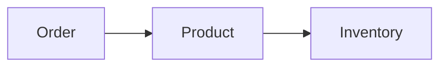

# Product

> Modelo canônico do Resource **Product** utilizado pela Capability **Commerce**.

---

## Objetivo

O Resource **Product** representa qualquer item comercializado por um sistema de e-commerce.

Independentemente do Provider utilizado, todo produto deverá ser convertido para este modelo canônico.

> O objetivo é permitir que Agentes, Engines e Apps trabalhem utilizando uma única linguagem de negócio.

---

## Filosofia

Cada plataforma possui sua própria estrutura.

| Provider | Entidade |
|----------|----------|
| 🛒 Shopify | `Product` |
| 🏪 WooCommerce | `Product` |
| 🎓 Hotmart | `Product` |
| ✅ **Dialyn** | **`Product`** |

> Apesar das diferenças de implementação, todos representam o mesmo conceito. A Dialyn abstrai essas diferenças através deste Resource.

---

## Modelo Canônico

```typescript
Product {
    id: string
    externalId: string
    sku: SKU
    name: string
    description: string
    type: ProductType
    status: ProductStatus
    price: Price
    images: Image[]
    inventory: InventoryReference
    metadata: Metadata
}
```

---

## Campos

| Campo | Obrigatório | Descrição |
|--------|:----------:|-----------|
| id | ✔ | Identificador interno |
| externalId | | Identificador do Provider |
| sku | ✔ | Código do produto |
| name | ✔ | Nome do produto |
| description | | Descrição |
| type | ✔ | Tipo do produto |
| status | ✔ | Estado atual |
| price | ✔ | Informações de preço |
| images | | Lista de imagens |
| inventory | | Referência ao estoque |
| metadata | | Informações adicionais |

---

## ProductType

```
PHYSICAL
DIGITAL
SERVICE
SUBSCRIPTION
```

---

## ProductStatus

```
DRAFT
ACTIVE
INACTIVE
ARCHIVED
```

---

## Operações

| Categoria | Operações |
|-----------|-----------|
| ⚡ **Core** | `Create`, `Get`, `List`, `Update`, `Delete` |
| 🔧 **Extended** | `Search`, `Count`, `Exists`, `Archive`, `Restore`, `Import`, `Export` |

---

## DTOs

```
Product
├── CreateProductRequest
├── CreateProductResponse
├── GetProductRequest
├── GetProductResponse
├── ListProductsRequest
├── ListProductsResponse
├── UpdateProductRequest
├── UpdateProductResponse
├── DeleteProductRequest
├── DeleteProductResponse
├── SearchProductsRequest
├── SearchProductsResponse
├── ExistsProductRequest
├── ExistsProductResponse
├── CountProductsRequest
├── CountProductsResponse
├── ArchiveProductRequest
├── ArchiveProductResponse
├── RestoreProductRequest
└── RestoreProductResponse
```

### CreateProductRequest

```typescript
CreateProductRequest {
    sku: SKU
    name: string
    description: string
    type: ProductType
    price: Price
}
```

### CreateProductResponse

```typescript
CreateProductResponse {
    product: Product
}
```

### GetProductRequest

```typescript
GetProductRequest {
    id: string
}
```

### GetProductResponse

```typescript
GetProductResponse {
    product: Product
}
```

### ListProductsRequest

```typescript
ListProductsRequest {
    page: integer
    limit: integer
}
```

### ListProductsResponse

```typescript
ListProductsResponse {
    items: Product[]
    pagination: Pagination
}
```

### UpdateProductRequest

```typescript
UpdateProductRequest {
    id: string
    name: string
    description: string
    price: Price
    status: ProductStatus
}
```

### UpdateProductResponse

```typescript
UpdateProductResponse {
    product: Product
}
```

### DeleteProductRequest

```typescript
DeleteProductRequest {
    id: string
}
```

### DeleteProductResponse

```typescript
DeleteProductResponse {
    success: boolean
}
```

### SearchProductsRequest

```typescript
SearchProductsRequest {
    query: string
    page: integer
    limit: integer
}
```

### SearchProductsResponse

```typescript
SearchProductsResponse {
    items: Product[]
    pagination: Pagination
}
```

### ExistsProductRequest

```typescript
ExistsProductRequest {
    id: string
}
```

### ExistsProductResponse

```typescript
ExistsProductResponse {
    exists: boolean
}
```

### CountProductsRequest

```typescript
CountProductsRequest {
}
```

### CountProductsResponse

```typescript
CountProductsResponse {
    total: integer
}
```

### ArchiveProductRequest

```typescript
ArchiveProductRequest {
    id: string
}
```

### ArchiveProductResponse

```typescript
ArchiveProductResponse {
    product: Product
}
```

### RestoreProductRequest

```typescript
RestoreProductRequest {
    id: string
}
```

### RestoreProductResponse

```typescript
RestoreProductResponse {
    product: Product
}
```

---

## Regras de Validação

| # | Regra |
|---|-------|
| 1 | Todo Product deverá possuir um identificador único |
| 2 | O nome do produto é obrigatório |
| 3 | O SKU deverá ser único dentro do Provider quando suportado |
| 4 | O tipo deverá pertencer ao enum `ProductType` |
| 5 | O status deverá pertencer ao enum `ProductStatus` |
| 6 | O preço deverá utilizar o tipo compartilhado `Price` |

---

## Regras de Negócio

| # | Regra |
|---|-------|
| 1 | Um Product poderá existir sem estoque (ex.: produtos digitais) |
| 2 | Um Product poderá estar presente em diversos Orders |
| 3 | Um Product poderá possuir uma ou mais imagens |
| 4 | O Resource representa um conceito de negócio, não um modelo específico de um Provider |

---

## Responsabilidade dos Engines

| # | Responsabilidade |
|---|-----------------|
| 1 | Converter produtos do Provider para o modelo `Product` |
| 2 | Normalizar preços |
| 3 | Converter estados para `ProductStatus` |
| 4 | Preservar o SKU quando disponível |
| 5 | Mapear imagens e referências de estoque |
| 6 | Manter compatibilidade com os contratos universais da Dialyn |

---

## Princípios

| # | Princípio | Descrição |
|---|-----------|-----------|
| 1 | 🔗 **Independente** | De qualquer plataforma de e-commerce |
| 2 | 🔄 **Rastreável** | Identificação única por SKU |
| 3 | 🧩 **Flexível** | Suporte a produtos físicos, digitais, serviços e assinaturas |
| 4 | 📖 **Documentado** | De forma consistente com a arquitetura |
| 5 | 🚫 **Abstraído** | A IA nunca precisa conhecer detalhes específicos de providers |

---

## Benefícios

| # | Benefício |
|---|-----------|
| 1 | 🔗 **Desacoplamento** completo entre produtos Dialyn e plataformas |
| 2 | 🏗️ **Padronização** da representação de produtos |
| 3 | ➕ **Simplificação** da integração de novas lojas |
| 4 | 📉 **Redução da complexidade** ao unificar o modelo de produto |
| 5 | 🚀 **Facilidade** para evolução sem impacto na IA |

---

## Relação com outros Resources

O Resource **Product** se relaciona diretamente com:

- **Inventory** — controle de disponibilidade
- **Order** — pedidos que contêm o produto



> Todos os relacionamentos deverão seguir o modelo definido em `relationships.md`.

---

## Veja também

- [README](./README.md)
- [Common Types](./common.md)
- [Glossary](./glossary.md)
- [Relationships](./relationships.md)
- [Order](./order.md)
- [Inventory](./inventory.md)
- [Customer](./customer.md)
