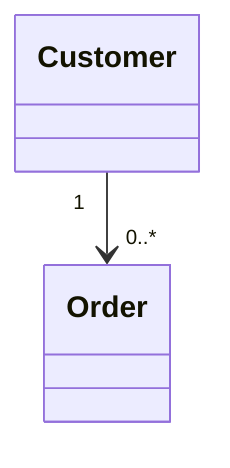

# Customer

> Resource responsável por representar compradores na Capability **Commerce**.

---

## Objetivo

O Resource **Customer** representa um comprador dentro do domínio de comércio eletrônico.

Seu objetivo é padronizar a representação de clientes entre diferentes plataformas de e-commerce, permitindo que a Dialyn utilize um único modelo de dados independentemente do Provider.

> Este Resource representa apenas informações comerciais relacionadas à compra de produtos.

---

## Filosofia

Cada plataforma possui sua própria representação de clientes.

| Provider | Entidade |
|----------|----------|
| 🛒 Shopify | `Customer` |
| 🏪 WooCommerce | `Customer` |
| 🎓 Hotmart | `Buyer` |
| ✅ **Dialyn** | **`Customer`** |

> Apesar das diferenças de nomenclatura, todos representam um comprador. O Commerce Engine é responsável por converter esses modelos para o contrato definido pela Dialyn.

---

## Modelo Canônico

```typescript
Customer {
    id: string
    externalId: string
    firstName: string
    lastName: string
    email: string
    phone: string
    address: Address
    metadata: Metadata
}
```

---

## Campos

| Campo | Tipo | Obrigatório | Descrição |
|--------|------|:-----------:|-----------|
| id | string | ✔ | Identificador interno |
| externalId | string | | Identificador do Provider |
| firstName | string | ✔ | Primeiro nome |
| lastName | string | | Sobrenome |
| email | string | | E-mail |
| phone | string | | Telefone |
| address | Address | | Endereço principal |
| metadata | Metadata | | Informações adicionais |

---

## Operações

### Core (obrigatórias)

| Operação | Objetivo |
|----------|----------|
| Create | Criar cliente |
| Get | Consultar cliente |
| List | Listar clientes |
| Update | Atualizar cliente |
| Delete | Remover cliente |

### Extended (opcionais)

| Operação | Objetivo |
|----------|----------|
| Search | Pesquisar clientes |
| Count | Contabilizar clientes |
| Exists | Verificar existência |
| Archive | Arquivar |
| Restore | Restaurar |
| Export | Exportar clientes |
| Import | Importar clientes |

---

## DTOs

Este Resource define os seguintes contratos.

| DTO | Objetivo |
|------|----------|
| CreateCustomerRequest | Criar cliente |
| CreateCustomerResponse | Resultado da criação |
| GetCustomerRequest | Consultar cliente |
| GetCustomerResponse | Resultado da consulta |
| ListCustomersRequest | Listagem paginada |
| ListCustomersResponse | Lista de clientes |
| UpdateCustomerRequest | Atualizar cliente |
| UpdateCustomerResponse | Resultado da atualização |
| DeleteCustomerRequest | Remover cliente |
| DeleteCustomerResponse | Resultado da remoção |

> Os detalhes completos encontram-se na pasta **dtos**.

---

## Relacionamentos



Um Customer poderá realizar diversos pedidos ao longo do tempo.

---

## Regras de Negócio

| # | Regra |
|---|-------|
| 1 | Todo Customer deverá possuir um identificador único |
| 2 | O e-mail poderá ser utilizado como identificador externo quando suportado pelo Provider |
| 3 | O endereço deverá utilizar o tipo compartilhado `Address` |
| 4 | Informações específicas do Provider deverão ser preservadas em `Metadata` |
| 5 | Este Resource representa apenas o domínio Commerce |

---

## Responsabilidade do Commerce Engine

| # | Responsabilidade |
|---|-----------------|
| 1 | Converter clientes do Provider para o modelo canônico |
| 2 | Converter o modelo canônico para o formato do Provider |
| 3 | Preservar identificadores externos |
| 4 | Reutilizar os tipos compartilhados definidos em `common.md` |
| 5 | Manter compatibilidade entre diferentes plataformas |

---

## Princípios

| # | Princípio | Descrição |
|---|-----------|-----------|
| 1 | 🔗 **Independente** | De qualquer plataforma de e-commerce |
| 2 | 🔄 **Reutilizável** | Tipos compartilhados entre recursos |
| 3 | 🧩 **Focado** | Representa apenas o domínio Commerce |
| 4 | 📖 **Documentado** | De forma consistente com a arquitetura |
| 5 | 🚫 **Isolado** | Não se confunde com Customer de Payments ou CRM |

---

## Benefícios

| # | Benefício |
|---|-----------|
| 1 | 🔗 **Desacoplamento** completo entre clientes Dialyn e plataformas |
| 2 | 🏗️ **Padronização** da representação de compradores |
| 3 | ➕ **Simplificação** da integração de novas lojas |
| 4 | 📉 **Redução da complexidade** ao unificar o modelo de cliente |
| 5 | 🚀 **Facilidade** para evolução sem impacto na IA |

---

## Compatibilidade

Este Resource foi projetado para suportar:

- Shopify
- WooCommerce
- Hotmart

> Novos Providers deverão reutilizar este contrato.

---

## Diferença para outras Capabilities

O Customer da Capability Commerce representa exclusivamente um comprador. Ele não deve ser confundido com:

| Capability | Resource | Responsabilidade |
|------------|----------|------------------|
| **Commerce** | `Customer` | Comprador de produtos |
| **Payments** | `Customer` | Cliente financeiro responsável pelo pagamento |
| **CRM** | `Contact` / `Lead` | Relacionamento comercial |

> Cada Capability possui seu próprio modelo canônico.

---

## Veja também

| Documento | Objetivo |
|-----------|----------|
| [common.md](./common.md) | Tipos compartilhados |
| [glossary.md](./glossary.md) | Glossário |
| [relationships.md](./relationships.md) | Relacionamentos |
| [product.md](./product.md) | Produtos |
| [order.md](./order.md) | Pedidos |
| [inventory.md](./inventory.md) | Estoque |
