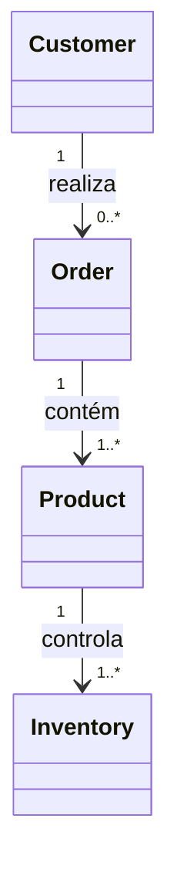

# Glossary

> Glossário oficial de termos utilizados pela Capability **Commerce** da Arquitetura de Apps da Dialyn.

---

## Objetivo

Este documento reúne os principais conceitos utilizados pela Capability **Commerce**.

Seu objetivo é padronizar a terminologia utilizada entre a Dialyn, seus Engines e os diversos Providers de e-commerce.

Sempre que possível, a Dialyn utiliza uma linguagem de negócio independente da nomenclatura adotada por plataformas externas.

---

## Filosofia

Cada Provider possui sua própria estrutura.

| Provider | Entidades |
|----------|-----------|
| 🛒 Shopify | `Product`, `Variant`, `Order`, `Customer`, `Collection` |
| 🏪 WooCommerce | `Product`, `Order`, `Customer`, `Category` |
| 🎓 Hotmart | `Product`, `Purchase`, `Buyer` |
| ✅ **Dialyn** | **`Product`, `Order`, `Customer`, `Inventory`** |

> Apesar das diferenças, todos representam conceitos semelhantes. A responsabilidade dos Commerce Engines é converter esses modelos para os Resources canônicos definidos pela Dialyn.

---

## Product

Representa um item comercializado.

Um Product pode ser:
- físico
- digital
- assinatura
- serviço

> Todo produto da Capability Commerce deverá ser representado por este Resource.

---

## Order

Representa um pedido realizado por um cliente.

Um Order agrupa um ou mais produtos e descreve o processo comercial da venda.

> Um pedido poderá existir em diferentes estados até sua conclusão.

---

## Customer

Representa o comprador de um pedido.

Este Resource representa apenas clientes do domínio de comércio. Ele não deve ser confundido com:
- Customer da Capability Payments
- Contact da Capability CRM
- Usuário da plataforma Dialyn

> Cada Capability possui seu próprio modelo de domínio.

---

## Inventory

Representa a disponibilidade de um produto.

Dependendo do Provider, um produto poderá possuir um ou vários estoques.

> Produtos digitais poderão não possuir estoque.

---

## Order Item

Representa um item pertencente a um pedido.

Cada Order Item relaciona um Product com informações específicas daquela venda.

Exemplos:
- quantidade
- preço unitário
- preço total
- descontos

> Este conceito normalmente existe internamente dentro do Resource Order.

---

## SKU

(Stock Keeping Unit)

Código utilizado para identificar um produto ou variação.

Cada Provider poderá utilizar sua própria estratégia para geração de SKUs.

> A Dialyn trata esse valor apenas como um identificador comercial.

---

## Price

Representa o preço comercial de um produto.

Dependendo do Provider, poderá conter:
- preço de venda
- preço promocional
- custo
- preço de comparação

---

## Money

Representa um valor monetário. Sempre composto por valor e moeda.

---

## Currency

Código internacional da moeda. Segue o padrão **ISO-4217**.

```
BRL
USD
EUR
GBP
```

---

## Metadata

Objeto utilizado para armazenar informações adicionais.

> Seu conteúdo **não é interpretado** pela Dialyn. Os Engines poderão utilizá-lo para preservar dados específicos dos Providers.

---

## External ID

Identificador utilizado pelo Provider.

```
gid://shopify/Product/123456
12345
987654321
```

> Nunca deverá substituir o identificador interno da Dialyn.

---

## Internal ID

Identificador único gerado pela Dialyn.

> Todos os relacionamentos internos deverão utilizar este identificador.

---

## Status

### Product Status

```
DRAFT
ACTIVE
INACTIVE
ARCHIVED
```

### Order Status

```
PENDING
PROCESSING
PAID
SHIPPED
DELIVERED
CANCELED
REFUNDED
```

### Inventory Status

```
IN_STOCK
LOW_STOCK
OUT_OF_STOCK
BACKORDER
```

### Product Type

```
PHYSICAL
DIGITAL
SERVICE
SUBSCRIPTION
```

> Os Commerce Engines deverão converter os estados específicos dos Providers para estes modelos canônicos.

---

## Engine

Camada responsável por traduzir os Universal DTOs da Dialyn para a API específica de um Provider.

```
Dialyn
  ↓
Commerce Engine
  ↓
Shopify
```

---

## Provider

Sistema externo integrado à Capability Commerce.

Exemplos:
- Shopify
- WooCommerce
- Hotmart

> Os Providers **nunca** são acessados diretamente pelos Agentes. Toda comunicação ocorre através do Commerce Engine.

---

## Adapter

Componente responsável por converter os modelos do Provider para os modelos canônicos da Dialyn. Cada Provider possui seu próprio Adapter.

```
ShopifyAdapter
WooCommerceAdapter
HotmartAdapter
```

---

## Universal DTO

Contrato de dados independente de qualquer Provider.

> Todos os Commerce Engines deverão receber e retornar Universal DTOs.

---

## Resource

Entidade de negócio pertencente à Capability Commerce.

Os principais Resources são:
- Product
- Order
- Customer
- Inventory

> Cada Resource possui seus próprios DTOs, operações e regras de negócio.

---

## Operation

Representa uma ação realizada sobre um Resource.

```
Create
Get
List
Update
Delete
Search
```

As operações seguem os contratos universais definidos pela Arquitetura de Apps da Dialyn.

---

## DTO

(Data Transfer Object)

Objeto utilizado para transportar dados entre a Dialyn, os Commerce Engines e os Providers.

> Todos os DTOs deverão seguir os contratos canônicos da plataforma.

---

## Modelo Conceitual



---

## Princípios

| # | Princípio | Descrição |
|---|-----------|-----------|
| 1 | 🔗 **Independência** | Terminologia desacoplada de qualquer plataforma |
| 2 | 🔄 **Padronização** | Linguagem única entre Engines e componentes |
| 3 | 🧩 **Clareza** | Evita ambiguidades entre naming de diferentes providers |
| 4 | 📖 **Documentado** | Definições consistentes em toda a arquitetura |
| 5 | 🚫 **Isolamento** | A IA nunca precisa conhecer termos específicos de providers |

---

## Benefícios

| # | Benefício |
|---|-----------|
| 1 | 🔗 **Desacoplamento** entre a terminologia da Dialyn e dos provedores |
| 2 | 🏗️ **Padronização** da comunicação entre todos os componentes |
| 3 | ➕ **Simplificação** da integração de novas lojas |
| 4 | 📉 **Redução de ambiguidades** na implementação dos Engines |
| 5 | 🚀 **Facilidade** para evolução da plataforma sem impacto na IA |

---

## Resumo

| Conceito | Definição |
|----------|-----------|
| **Product** | Item comercializado |
| **Order** | Pedido realizado por um cliente |
| **Customer** | Comprador do domínio Commerce |
| **Inventory** | Controle de disponibilidade de produtos |
| **SKU** | Identificador comercial do produto |
| **Price** | Informações de precificação |
| **Money** | Valor monetário padronizado |
| **Currency** | Moeda utilizada na operação |
| **Engine** | Traduz contratos da Dialyn para APIs externas |
| **Provider** | Plataforma externa integrada |
| **Adapter** | Conversor entre Provider e modelo canônico |
| **Universal DTO** | Contrato independente de Provider |
| **Resource** | Entidade de negócio da Capability |
| **Operation** | Ação executada sobre um Resource |
| **DTO** | Objeto de transferência de dados |

---

## Veja também

- [README](./README.md)
- [Common Types](./common.md)
- [Relationships](./relationships.md)
- [Product](./product.md)
- [Order](./order.md)
- [Customer](./customer.md)
- [Inventory](./inventory.md)
