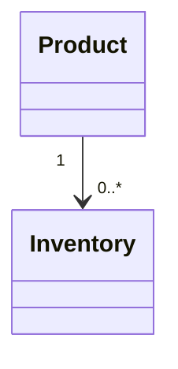

# Inventory

> Resource responsável por representar o estoque de produtos na Capability **Commerce**.

---

## Objetivo

O Resource **Inventory** representa a disponibilidade de um ou mais produtos em um determinado local de armazenamento.

Seu objetivo é padronizar a forma como informações de estoque são representadas pela Dialyn, independentemente do Provider utilizado.

> Todo Commerce Engine deverá converter os modelos de estoque do Provider para este Resource.

---

## Filosofia

Cada plataforma implementa estoque de maneira diferente.

| Provider | Abordagem |
|----------|-----------|
| 🛒 Shopify | Inventory Levels |
| 🏪 WooCommerce | Estoque diretamente no produto |
| 🎓 Hotmart | Normalmente não possui controle de estoque |
| ✅ **Dialyn** | **Resource `Inventory` canônico** |

> Apesar dessas diferenças, a Dialyn representa estoque através deste Resource.

---

## Modelo Canônico

```typescript
Inventory {
    id: string
    externalId: string
    product: ProductReference
    location: string
    quantity: integer
    reserved: integer
    available: integer
    status: InventoryStatus
    updatedAt: datetime
    metadata: Metadata
}
```

---

## Campos

| Campo | Tipo | Obrigatório | Descrição |
|--------|------|:-----------:|-----------|
| id | string | ✔ | Identificador interno |
| externalId | string | | Identificador do Provider |
| product | ProductReference | ✔ | Produto relacionado |
| location | string | | Local do estoque |
| quantity | integer | ✔ | Quantidade total |
| reserved | integer | | Quantidade reservada |
| available | integer | ✔ | Quantidade disponível |
| status | InventoryStatus | ✔ | Situação do estoque |
| updatedAt | datetime | ✔ | Última atualização |
| metadata | Metadata | | Informações adicionais |

---

## InventoryStatus

```
IN_STOCK
LOW_STOCK
OUT_OF_STOCK
BACKORDER
```

---

## Operações

### Core (obrigatórias)

| Operação | Objetivo |
|----------|----------|
| Get | Consultar estoque |
| List | Listar estoques |
| Update | Atualizar estoque |

### Extended (opcionais)

| Operação | Objetivo |
|----------|----------|
| Search | Pesquisar estoques |
| Count | Contabilizar registros |
| Exists | Verificar existência |
| Create | Criar estoque |
| Delete | Remover estoque |
| Import | Importar estoque |
| Export | Exportar estoque |

---

## DTOs

Este Resource define os seguintes contratos.

| DTO | Objetivo |
|------|----------|
| GetInventoryRequest | Consultar estoque |
| GetInventoryResponse | Resultado da consulta |
| ListInventoriesRequest | Listagem paginada |
| ListInventoriesResponse | Lista de estoques |
| UpdateInventoryRequest | Atualizar estoque |
| UpdateInventoryResponse | Resultado da atualização |

> Os detalhes completos encontram-se na pasta **dtos**.

---

## Relacionamentos



Um Product poderá possuir nenhum, um ou diversos registros de estoque.

---

## Regras de Negócio

| # | Regra |
|---|-------|
| 1 | Todo Inventory deverá estar associado a um Product |
| 2 | Produtos digitais poderão não possuir Inventory |
| 3 | A quantidade disponível nunca deverá ser superior à quantidade total |
| 4 | A quantidade reservada representa itens indisponíveis temporariamente |
| 5 | Informações específicas do Provider deverão ser armazenadas em `Metadata` |

---

## Responsabilidade do Commerce Engine

| # | Responsabilidade |
|---|-----------------|
| 1 | Converter estoques do Provider para o modelo canônico |
| 2 | Calcular a quantidade disponível quando necessário |
| 3 | Preservar identificadores externos |
| 4 | Normalizar estados do estoque |
| 5 | Manter compatibilidade entre diferentes plataformas |

---

## Princípios

| # | Princípio | Descrição |
|---|-----------|-----------|
| 1 | 🔗 **Independente** | De qualquer plataforma de e-commerce |
| 2 | 🔄 **Rastreável** | Associação direta com Product |
| 3 | 🧩 **Flexível** | Suporte a múltiplos estoques por produto |
| 4 | 📖 **Documentado** | De forma consistente com a arquitetura |
| 5 | 🚫 **Abstraído** | Normaliza diferentes modelos de estoque |

---

## Benefícios

| # | Benefício |
|---|-----------|
| 1 | 🔗 **Desacoplamento** completo entre estoque Dialyn e plataformas |
| 2 | 🏗️ **Padronização** do controle de disponibilidade |
| 3 | ➕ **Simplificação** da integração de novas lojas |
| 4 | 📉 **Redução da complexidade** ao unificar o modelo de estoque |
| 5 | 🚀 **Facilidade** para evolução sem impacto na IA |

---

## Compatibilidade

Este Resource foi projetado para suportar:

- Shopify
- WooCommerce
- Hotmart (quando aplicável)

> Novos Providers deverão reutilizar este contrato.

---

## Particularidades

Nem todos os Providers implementam estoque da mesma forma.

| Provider | Característica |
|----------|----------------|
| 🛒 Shopify | Múltiplos estoques por produto |
| 🏪 WooCommerce | Único estoque por produto |
| 🎓 Hotmart | Geralmente não controla estoque para produtos digitais |

> Essas diferenças deverão ser abstraídas pelo Commerce Engine.

---

## Veja também

| Documento | Objetivo |
|-----------|----------|
| [common.md](./common.md) | Tipos compartilhados |
| [glossary.md](./glossary.md) | Glossário |
| [relationships.md](./relationships.md) | Relacionamentos |
| [product.md](./product.md) | Produtos |
| [order.md](./order.md) | Pedidos |
| [customer.md](./customer.md) | Clientes |
