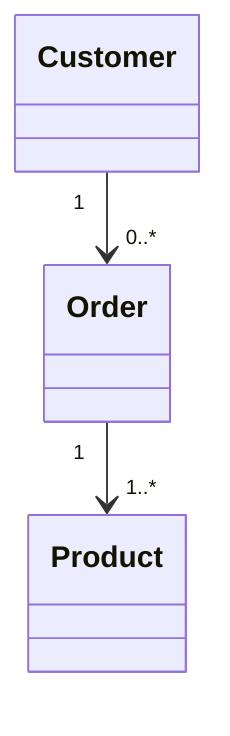

# Order

> Resource responsável por representar pedidos na Capability **Commerce**.

---

## Objetivo

O Resource **Order** representa um pedido realizado por um cliente.

Ele descreve uma transação comercial contendo um ou mais produtos, seus respectivos valores, informações do comprador e o estado atual do pedido.

> Independentemente do Provider utilizado, todos os pedidos deverão ser convertidos para este modelo canônico.

---

## Filosofia

Cada plataforma possui sua própria representação de pedidos.

| Provider | Entidade |
|----------|----------|
| 🛒 Shopify | `Order` |
| 🏪 WooCommerce | `Order` |
| 🎓 Hotmart | `Purchase` |
| ✅ **Dialyn** | **`Order`** |

> Apesar das diferenças de nomenclatura e implementação, todos representam o mesmo conceito de negócio. O Commerce Engine é responsável por converter essas estruturas para o modelo definido pela Dialyn.

---

## Modelo Canônico

```typescript
Order {
    id: string
    externalId: string
    number: string
    status: OrderStatus
    customer: CustomerReference
    items: OrderItem[]
    subtotal: Money
    discount: Money
    shipping: Money
    taxes: Money
    total: Money
    currency: Currency
    createdAt: datetime
    updatedAt: datetime
    metadata: Metadata
}
```

---

## Campos

| Campo | Tipo | Obrigatório | Descrição |
|--------|------|:-----------:|-----------|
| id | string | ✔ | Identificador interno |
| externalId | string | | Identificador do Provider |
| number | string | | Número do pedido |
| status | OrderStatus | ✔ | Estado atual |
| customer | CustomerReference | ✔ | Cliente responsável |
| items | OrderItem[] | ✔ | Produtos do pedido |
| subtotal | Money | ✔ | Soma dos produtos |
| discount | Money | | Descontos aplicados |
| shipping | Money | | Valor do frete |
| taxes | Money | | Impostos |
| total | Money | ✔ | Valor final |
| currency | Currency | ✔ | Moeda utilizada |
| createdAt | datetime | ✔ | Data de criação |
| updatedAt | datetime | | Última atualização |
| metadata | Metadata | | Dados adicionais |

---

## Operações

### Core (obrigatórias)

| Operação | Objetivo |
|----------|----------|
| Create | Criar pedido |
| Get | Consultar pedido |
| List | Listar pedidos |
| Update | Atualizar pedido |
| Delete | Remover pedido (quando suportado) |

### Extended (opcionais)

| Operação | Objetivo |
|----------|----------|
| Search | Pesquisar pedidos |
| Count | Contabilizar pedidos |
| Exists | Verificar existência |
| Cancel | Cancelar pedido |
| Archive | Arquivar |
| Restore | Restaurar |
| Export | Exportar pedidos |

---

## DTOs

Este Resource define os seguintes contratos.

| DTO | Objetivo |
|------|----------|
| CreateOrderRequest | Criar pedido |
| CreateOrderResponse | Resultado da criação |
| GetOrderRequest | Consultar pedido |
| GetOrderResponse | Retorno da consulta |
| ListOrdersRequest | Listagem paginada |
| ListOrdersResponse | Lista de pedidos |
| UpdateOrderRequest | Atualizar pedido |
| UpdateOrderResponse | Resultado da atualização |
| DeleteOrderRequest | Remover pedido |
| DeleteOrderResponse | Resultado da remoção |

> Os detalhes de cada DTO encontram-se na pasta **dtos**.

---

## Relacionamentos



---

## Regras de Negócio

| # | Regra |
|---|-------|
| 1 | Todo Order deverá possuir um identificador único |
| 2 | Todo Order deverá possuir pelo menos um `OrderItem` |
| 3 | Todo Order deverá possuir um Customer |
| 4 | O total deverá representar a soma final do pedido |
| 5 | Os valores monetários deverão utilizar `Money` |
| 6 | O Resource não deverá conter informações específicas de um Provider |

---

## Responsabilidade do Commerce Engine

| # | Responsabilidade |
|---|-----------------|
| 1 | Converter pedidos do Provider para o modelo canônico |
| 2 | Converter o modelo canônico para o formato do Provider |
| 3 | Normalizar estados do pedido |
| 4 | Preservar identificadores externos |
| 5 | Calcular ou mapear corretamente os valores monetários |
| 6 | Preservar dados específicos através de `Metadata` |

---

## Princípios

| # | Princípio | Descrição |
|---|-----------|-----------|
| 1 | 🔗 **Independente** | De qualquer plataforma de e-commerce |
| 2 | 🔄 **Rastreável** | Associação clara entre pedido, cliente e produtos |
| 3 | 🧩 **Completo** | Contém todas as informações financeiras da transação |
| 4 | 🧊 **Imutável** | Pedidos concluídos não devem ser alterados |
| 5 | 📖 **Documentado** | De forma consistente com a arquitetura |

---

## Benefícios

| # | Benefício |
|---|-----------|
| 1 | 🔗 **Desacoplamento** completo entre pedidos Dialyn e plataformas |
| 2 | 🏗️ **Padronização** do ciclo de vida de pedidos |
| 3 | ➕ **Simplificação** da integração de novas lojas |
| 4 | 📉 **Redução da complexidade** ao unificar o modelo de pedido |
| 5 | 🚀 **Facilidade** para evolução sem impacto na IA |

---

## Compatibilidade

Este Resource foi projetado para suportar:

- Shopify
- WooCommerce
- Hotmart

> Novos Providers deverão reutilizar este contrato.

---

## Veja também

| Documento | Objetivo |
|-----------|----------|
| [common.md](./common.md) | Tipos compartilhados |
| [glossary.md](./glossary.md) | Glossário |
| [relationships.md](./relationships.md) | Relacionamentos |
| [product.md](./product.md) | Produtos |
| [customer.md](./customer.md) | Clientes |
| [inventory.md](./inventory.md) | Estoque |
