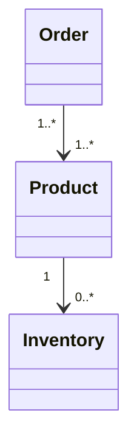

# Product

> Resource responsável por representar produtos comercializados na Capability **Commerce**.

---

## Objetivo

O Resource **Product** define o modelo canônico utilizado pela Dialyn para representar qualquer item comercializado.

Um Product é independente do Provider e representa apenas o conceito de negócio.

> Toda plataforma integrada deverá converter seus modelos internos para este Resource.

---

## Filosofia

Cada plataforma representa produtos de forma diferente.

| Provider | Entidade |
|----------|----------|
| 🛒 Shopify | `Product` |
| 🏪 WooCommerce | `Product` |
| 🎓 Hotmart | `Product` |
| ✅ **Dialyn** | **`Product`** |

> Apesar das diferenças estruturais, todos representam um produto. O Commerce Engine é responsável por traduzir esses modelos para o contrato definido pela Dialyn.

---

## Modelo Canônico

```typescript
Product {
    id: string
    externalId: string
    sku: SKU
    name: string
    description: string
    type: ProductType
    status: ProductStatus
    price: Price
    images: Image[]
    metadata: Metadata
}
```

---

## Campos

| Campo | Tipo | Obrigatório | Descrição |
|--------|------|:-----------:|-----------|
| id | string | ✔ | Identificador interno da Dialyn |
| externalId | string | | Identificador do Provider |
| sku | SKU | ✔ | Código comercial do produto |
| name | string | ✔ | Nome do produto |
| description | string | | Descrição do produto |
| type | ProductType | ✔ | Tipo do produto |
| status | ProductStatus | ✔ | Estado atual |
| price | Price | ✔ | Estrutura de preços |
| images | Image[] | | Lista de imagens |
| metadata | Metadata | | Dados adicionais |

---

## Operações

### Core (obrigatórias)

| Operação | Objetivo |
|----------|----------|
| Create | Criar produto |
| Get | Consultar produto |
| List | Listar produtos |
| Update | Atualizar produto |
| Delete | Remover produto |

### Extended (opcionais)

| Operação | Objetivo |
|----------|----------|
| Search | Pesquisar produtos |
| Count | Contabilizar produtos |
| Exists | Verificar existência |
| Archive | Arquivar produto |
| Restore | Restaurar produto |
| Import | Importar produtos |
| Export | Exportar produtos |

---

## DTOs

Este Resource define os seguintes contratos.

| DTO | Objetivo |
|------|----------|
| CreateProductRequest | Criar produto |
| CreateProductResponse | Retorno da criação |
| GetProductRequest | Consultar produto |
| GetProductResponse | Retorno da consulta |
| ListProductsRequest | Listagem paginada |
| ListProductsResponse | Produtos encontrados |
| UpdateProductRequest | Atualizar produto |
| UpdateProductResponse | Retorno da atualização |
| DeleteProductRequest | Remover produto |
| DeleteProductResponse | Resultado da remoção |

> As estruturas completas de cada DTO encontram-se na pasta **dtos**.

---

## Relacionamentos

Um Product poderá estar relacionado aos seguintes Resources.



---

## Regras de Negócio

| # | Regra |
|---|-------|
| 1 | Todo Product deverá possuir um identificador único |
| 2 | Todo Product deverá possuir um nome |
| 3 | O SKU deverá ser único quando suportado pelo Provider |
| 4 | O preço deverá utilizar o tipo compartilhado `Price` |
| 5 | O Resource não deverá conter informações específicas de um Provider |
| 6 | Produtos físicos e digitais utilizam o mesmo contrato |

---

## Responsabilidade do Commerce Engine

| # | Responsabilidade |
|---|-----------------|
| 1 | Converter Products do Provider para o modelo canônico |
| 2 | Converter o modelo canônico para o formato exigido pelo Provider |
| 3 | Preservar os identificadores externos |
| 4 | Normalizar status |
| 5 | Normalizar tipos de produto |
| 6 | Preservar informações não padronizadas através de `Metadata` |

---

## Princípios

| # | Princípio | Descrição |
|---|-----------|-----------|
| 1 | 🔗 **Independente** | De qualquer plataforma de e-commerce |
| 2 | 🔄 **Rastreável** | Identificação única por SKU |
| 3 | 🧩 **Flexível** | Suporte a produtos físicos, digitais, serviços e assinaturas |
| 4 | 📖 **Documentado** | De forma consistente com a arquitetura |
| 5 | 🚫 **Abstraído** | A IA nunca precisa conhecer detalhes específicos de providers |

---

## Benefícios

| # | Benefício |
|---|-----------|
| 1 | 🔗 **Desacoplamento** completo entre produtos Dialyn e plataformas |
| 2 | 🏗️ **Padronização** da representação de produtos |
| 3 | ➕ **Simplificação** da integração de novas lojas |
| 4 | 📉 **Redução da complexidade** ao unificar o modelo de produto |
| 5 | 🚀 **Facilidade** para evolução sem impacto na IA |

---

## Compatibilidade

Este Resource foi projetado para suportar provedores como:

- Shopify
- WooCommerce
- Hotmart

> Novos Providers deverão reutilizar este mesmo contrato.

---

## Veja também

| Documento | Objetivo |
|-----------|----------|
| [common.md](./common.md) | Tipos compartilhados |
| [glossary.md](./glossary.md) | Conceitos da Capability |
| [relationships.md](./relationships.md) | Relacionamentos |
| [order.md](./order.md) | Pedidos |
| [customer.md](./customer.md) | Clientes |
| [inventory.md](./inventory.md) | Estoque |
