# Relationships

> Relacionamentos entre os Resources da Capability **Commerce**.

---

## Objetivo

Este documento define como os Resources da Capability **Commerce** se relacionam dentro do modelo de domínio da Dialyn.

Os relacionamentos aqui descritos representam conceitos de negócio e não refletem necessariamente a implementação de um Provider específico.

> Cada Commerce Engine deverá adaptar os modelos de Shopify, WooCommerce, Hotmart ou qualquer outro Provider para este modelo canônico.

---

## Filosofia

Todos os Providers de e-commerce possuem estruturas semelhantes, porém com nomenclaturas diferentes.

| Provider | Entidades |
|----------|-----------|
| 🛒 Shopify | `Products`, `Orders`, `Customers` |
| 🏪 WooCommerce | `Products`, `Orders`, `Customers` |
| 🎓 Hotmart | `Products`, `Purchases`, `Buyers` |
| ✅ **Dialyn** | **`Product`, `Order`, `Customer`, `Inventory`** |

> Independentemente dessas diferenças, a Dialyn trabalha apenas com Resources canônicos.

---

## Modelo Conceitual

A relação entre os principais conceitos da Capability Commerce pode ser representada da seguinte forma.

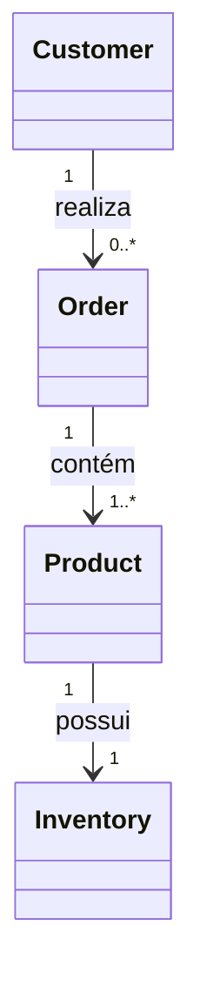

---

## Customer

Representa um comprador.

Um Customer pode realizar diversos pedidos ao longo do tempo.

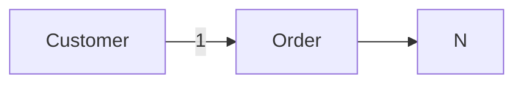

**Cardinalidade:** `1 : N` para Order.

---

## Order

Representa um pedido realizado por um Customer.

Um Order agrupa um ou mais Products. Também representa o momento em que uma venda foi efetivada.

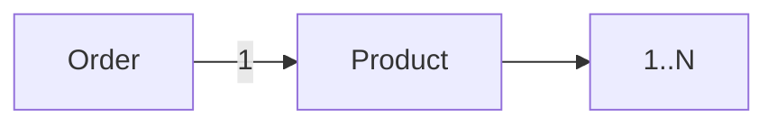

**Cardinalidade:** `1 : 1..N` para Product.

> Um pedido nunca deverá existir sem pelo menos um produto.

---

## Product

Representa um item comercializado.

Pode ser:
- físico
- digital
- assinatura
- serviço

Um Product poderá aparecer em diversos Orders.

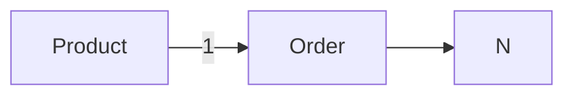

**Cardinalidade:** `1 : N` para Order.

> Na prática, a relação entre Orders e Products é do tipo **N:N**, implementada por uma entidade intermediária (Order Item). Como a Dialyn trabalha em nível conceitual, essa complexidade é abstraída.

---

## Inventory

Representa a disponibilidade de um Product.

Cada Product poderá possuir um ou mais registros de estoque dependendo das capacidades do Provider.

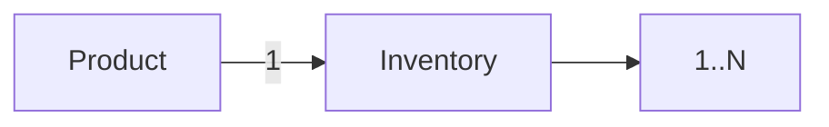

**Cardinalidade:** `1 : 1..N` para Inventory.

### Exemplos

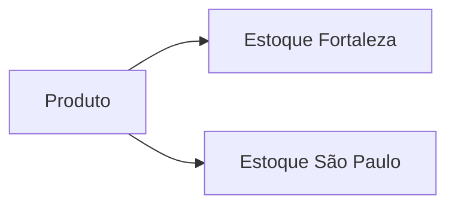

---

## Fluxo Comercial

O fluxo mais comum pode ser representado da seguinte forma.

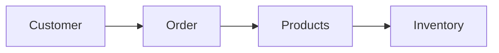

---

## Fluxos Alternativos

### Produto sem estoque

Produtos digitais normalmente não possuem controle de estoque.

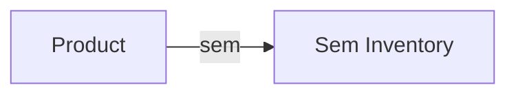

---

### Produto em múltiplos estoques

Um mesmo produto poderá existir em diferentes locais.

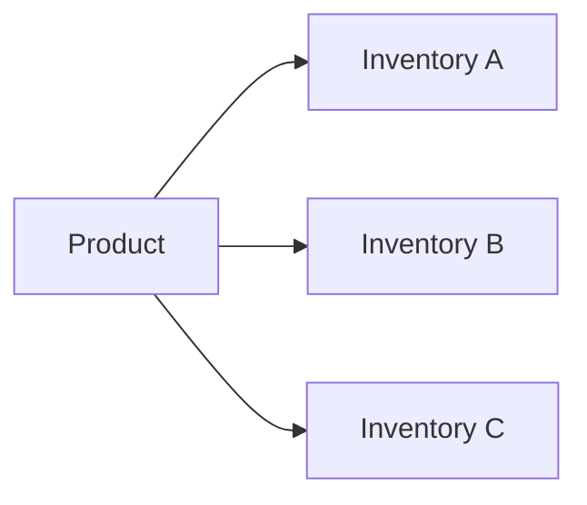

---

### Pedido com múltiplos produtos

Um pedido poderá conter diversos produtos.

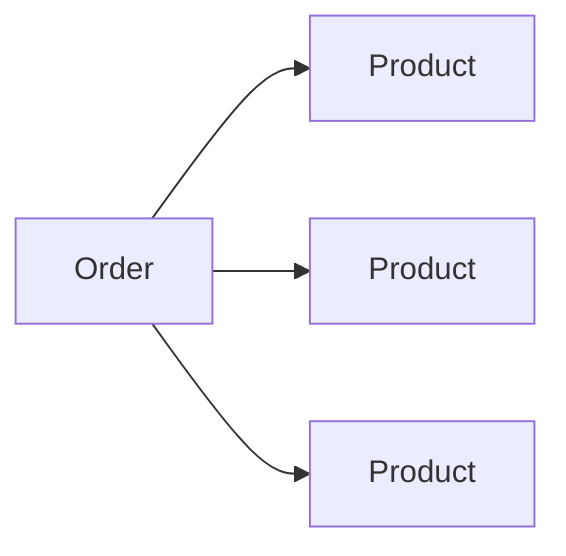

---

### Produto vendido em diversos pedidos

Um mesmo produto poderá aparecer em diversos pedidos diferentes.

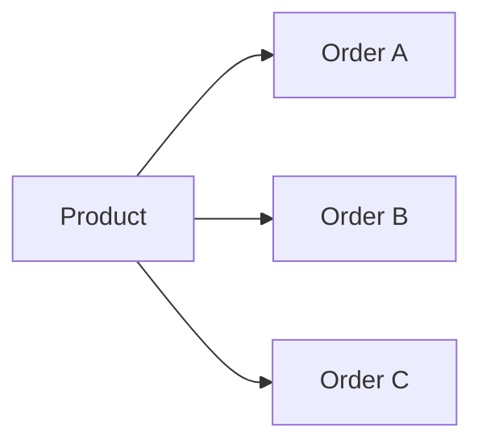

---

## Independência dos Providers

Esses relacionamentos representam apenas o domínio da Dialyn. Cada Provider implementa sua própria estrutura.

| Provider | Estrutura |
|----------|-----------|
| 🛒 Shopify | `Customer → Order → Line Items → Product` |
| 🏪 WooCommerce | `Customer → Order → Items → Product` |
| 🎓 Hotmart | `Buyer → Purchase → Product` |

> Todos deverão ser convertidos para os Resources definidos nesta Capability.

---

## Responsabilidade dos Engines

| # | Responsabilidade |
|---|-----------------|
| 1 | Converter os modelos do Provider para os Resources canônicos |
| 2 | Preservar as cardinalidades sempre que possível |
| 3 | Manter os relacionamentos entre Resources |
| 4 | Abstrair estruturas específicas dos Providers |
| 5 | Garantir consistência entre Products, Orders, Customers e Inventory |

---

## Princípios

| # | Princípio | Descrição |
|---|-----------|-----------|
| 1 | 🔗 **Independência** | De provedores externos |
| 2 | 🔗 **Baixo acoplamento** | Resources independentes entre si |
| 3 | 🧩 **Alta coesão** | Cada Resource com responsabilidade bem definida |
| 4 | 🔄 **Reutilização** | Dos Resources entre diferentes fluxos |
| 5 | 📖 **Consistência** | Dos contratos em toda a plataforma |
| 6 | 🚀 **Evolução** | Sem quebra de compatibilidade |

---

## Benefícios

| # | Benefício |
|---|-----------|
| 1 | 🔗 **Visão única** do domínio comercial para todos os Engines |
| 2 | 🏗️ **Padronização** dos relacionamentos entre Resources |
| 3 | ➕ **Simplificação** da integração de novas lojas |
| 4 | 📉 **Redução da complexidade** ao isolar o modelo de domínio |
| 5 | 🚀 **Facilidade** para evolução sem impacto na IA |

---

## Resumo

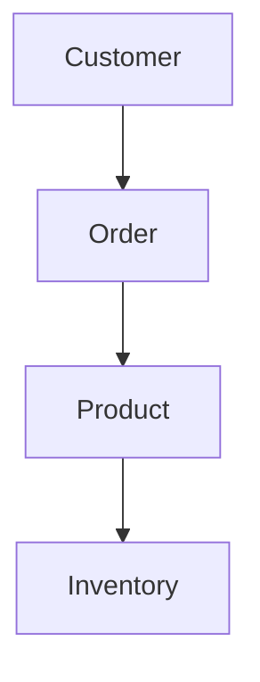

| Resource | Responsabilidade |
|----------|------------------|
| **Customer** | Representa o comprador |
| **Order** | Representa um pedido |
| **Product** | Representa um produto |
| **Inventory** | Representa o estoque do produto |

> Essa estrutura representa o modelo de domínio utilizado por todos os Commerce Engines da Dialyn.

---

## Veja também

- [README](./README.md)
- [Common Types](./common.md)
- [Glossary](./glossary.md)
- [Product](./product.md)
- [Order](./order.md)
- [Customer](./customer.md)
- [Inventory](./inventory.md)
