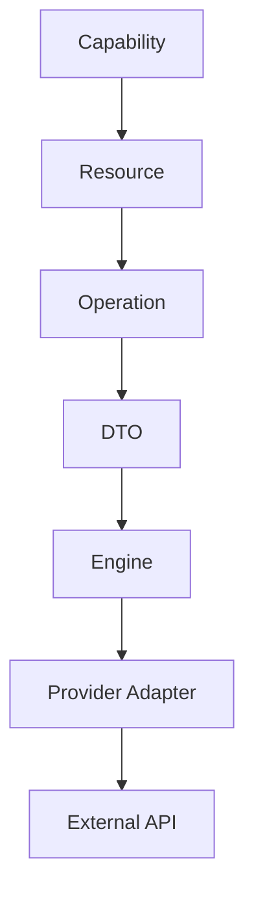

# Conventions

> Convenções oficiais utilizadas pela Arquitetura de Apps da Dialyn.

---

## Objetivo

Este documento define os **padrões obrigatórios** utilizados por todos os Universal DTOs, Engines, Adapters e Providers da Arquitetura de Apps da Dialyn.

> O objetivo é garantir **consistência**, **previsibilidade** e **interoperabilidade** entre todos os componentes da plataforma.

Todos os novos Resources, DTOs e Engines deverão seguir as convenções estabelecidas neste documento.

---

## Filosofia

A Dialyn deve possuir uma **única linguagem técnica**.

Independentemente do domínio (Payments, CRM, Commerce, Calendar, Documents...), todas as integrações deverão seguir **exatamente os mesmos padrões**.

> Essas convenções reduzem ambiguidades, simplificam o desenvolvimento e tornam a arquitetura **previsível**.

---

## Idioma

Toda a arquitetura deverá utilizar **inglês** como idioma oficial.

| Aplica-se a | Exemplo Correto | Exemplo Incorreto |
|-------------|----------------|-------------------|
| DTOs | `Payment` | `Pagamento` |
| Resources | `Customer` | `Cliente` |
| Campos | `createdAt` | `dataCriacao` |
| Enums | `PaymentStatus` | `StatusPagamento` |
| Operations | `CreatePayment` | `CriarPagamento` |

### Correto

```
Payment, Customer, Invoice, Order
createdAt, updatedAt, expiresAt
```

### Incorreto

```
Pagamento, Cliente, pedido
dataCriacao
```

---

## Convenção de nomes

### Classes

Utilizar **PascalCase**.

| Correto | Incorreto |
|---------|-----------|
| `Payment` | `payment` |
| `CreatePaymentRequest` | `createPaymentRequest` |
| `ListProductsResponse` | `listProductsResponse` |

### Propriedades

Utilizar **camelCase**.

| Correto | Incorreto |
|---------|-----------|
| `createdAt` | `CreatedAt` |
| `externalId` | `ExternalId` |
| `paymentMethod` | `PaymentMethod` |

### Enums

Sempre em **PascalCase**.

```
PaymentStatus, PaymentMethod, Currency, OrderStatus
```

### Valores de Enum

Sempre em **UPPER_SNAKE_CASE**.

| Correto | Incorreto |
|---------|-----------|
| `PENDING` | `Pending` |
| `CREDIT_CARD` | `CreditCard` |
| `APPROVED` | `approved` |

---

## Estrutura dos DTOs

Os DTOs deverão seguir o padrão: **`{Operation}{Resource}{Suffix}`**

| Correto | Incorreto |
|---------|-----------|
| `CreatePaymentRequest` | `PaymentDTO` |
| `ListOrdersResponse` | `DTOCreatePayment` |
| `UpdateProductRequest` | `ProductObject` |

```
CreatePaymentRequest    →  Create + Payment + Request
CreatePaymentResponse   →  Create + Payment + Response
UpdateProductRequest    →  Update + Product + Request
ListOrdersResponse      →  List + Orders + Response
```

---

## Organização da documentação

A documentação deverá ser organizada por **Capability**.

```
dtos/
├── payments/
├── commerce/
├── crm/
├── calendar/
├── documents/
└── common/
```

Cada Resource possuirá sua própria documentação:

```
payments/
├── payment.md
├── customer.md
├── invoice.md
└── refund.md
```

---

## Datas

Todas as datas deverão seguir o padrão **ISO 8601**.

| Correto | Incorreto |
|---------|-----------|
| `2026-07-15T18:30:00Z` | `15/07/2026` |
| | `07-15-2026` |

---

## Timezone

Sempre utilizar o padrão **IANA Time Zone Database**.

```
America/Sao_Paulo
Europe/London
UTC
```

---

## Moedas

Sempre utilizar o padrão **ISO-4217**.

| Correto | Incorreto |
|---------|-----------|
| `BRL` | `R$` |
| `USD` | `$` |
| `EUR` | `€` |

---

## Países

Sempre utilizar **ISO-3166-1 Alpha-2**.

```
BR, US, CA, AR, JP
```

---

## Idiomas

Sempre utilizar **ISO-639-1**.

```
pt, en, es, fr
```

---

## Identificadores

### IDs internos

Todos os Resources deverão possuir um identificador interno único da Dialyn.

| Formato | Exemplo |
|---------|---------|
| **UUID v7** | `0197d7ef-80c7-7d87-9d98-7b11f6ab31d2` |

### IDs externos

Cada Provider poderá possuir seu próprio identificador. Esse valor deverá ser armazenado em `externalId` — **jamais substituirá o ID interno**.

---

## Valores monetários

**Nunca** armazenar moeda junto ao valor.

| Correto | Incorreto |
|---------|-----------|
| `amount` + `currency` | `R$150` |
| | `USD 50` |

> Valores monetários deverão utilizar precisão decimal adequada ao domínio financeiro.

---

## Paginação

Todas as operações de listagem deverão utilizar o mesmo padrão.

| Request | Response |
|---------|----------|
| `page` | `page` |
| `limit` | `limit` |
| | `total` |
| | `pages` |

---

## Ordenação

Todos os Resources deverão utilizar a mesma estrutura.

```
Sort { field: string, direction: ASC | DESC }
```

---

## Filtros

Filtros deverão seguir um modelo padronizado.

```
Filter { field: string, operator: string, value: any }
```

| Operadores suportados |
|-----------------------|
| `=`, `!=`, `>`, `<`, `>=`, `<=` |
| `contains`, `startsWith`, `endsWith` |
| `between`, `in` |

---

## Metadata

Todo Resource poderá conter `metadata`. Este campo deverá armazenar **apenas informações complementares**.

> ⚠️ Nenhuma regra de negócio poderá depender exclusivamente do conteúdo de `metadata`.

---

## Versionamento

| Situação | Ação |
|----------|------|
| 🔄 Alterações incompatíveis | Gerar nova versão do contrato |
| ➕ Novos campos | Adicionar mantendo compatibilidade retroativa |
| 🚫 Campos existentes | **Nunca** alterar seu significado |

---

## Provider Independence

Nenhum DTO poderá conter:

| Proibido | Motivo |
|----------|--------|
| ❌ Nomes específicos de APIs | Viola o desacoplamento |
| ❌ URLs de Providers | Viola a independência |
| ❌ IDs proprietários como chave principal | Viola a padronização |
| ❌ Nomenclaturas específicas de integrações | Viola a universalidade |

> Os Engines serão responsáveis pela conversão entre o Provider e o modelo canônico da Dialyn.

---

## Serialização

Todos os DTOs deverão ser compatíveis com:

| Formato | Uso |
|---------|-----|
| 📦 **JSON** | APIs REST |
| 🔄 **Protocol Buffers** | gRPC |

> Nenhum DTO deverá depender de uma tecnologia específica de serialização.

---

## Imutabilidade

Os DTOs representam **contratos de comunicação**. Após criados, não deverão ser modificados durante o processamento da requisição.

> Caso seja necessário alterar informações, um **novo DTO** deverá ser produzido.

---

## Compatibilidade

Os Universal DTOs deverão ser compatíveis com **qualquer Engine** da plataforma:

- Payments Engine
- Commerce Engine
- CRM Engine
- Productivity Engine
- Documents Engine
- Futuros Engines

---

## Princípios Arquiteturais

| # | Princípio |
|---|-----------|
| 1 | 🔗 **Independência** de Providers |
| 2 | 🏗️ **Padronização** dos contratos |
| 3 | 🔄 **Reutilização** de componentes |
| 4 | 🔽 **Baixo acoplamento** |
| 5 | 🎯 **Alta coesão** |
| 6 | 🔖 **Versionamento explícito** |
| 7 | 📖 **Documentação** como fonte oficial da arquitetura |

---

## Resumo

A arquitetura dos Apps da Dialyn segue a seguinte hierarquia:



> Todos os componentes da plataforma deverão seguir as convenções estabelecidas neste documento.

## Proximos Passo

Agora veja um padrão que engloba todos os conceitos para cada resource

| Resource | Operations |
|----------|------------|
| Payments | [payments](payments/README.md)

