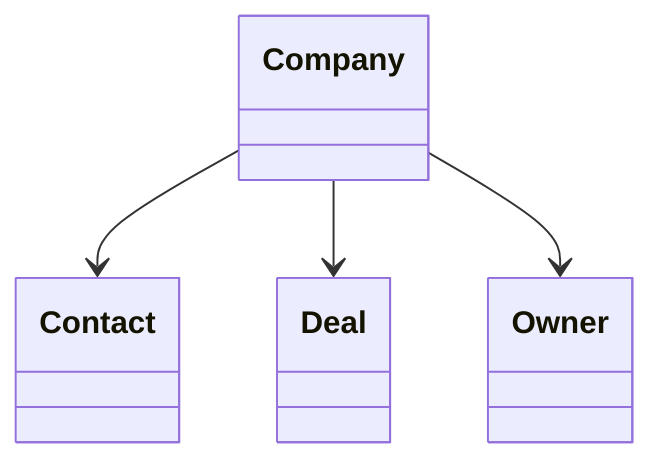

# Company

> Resource responsável por representar organizações na Capability **CRM**.

---

## Objetivo

O Resource **Company** representa uma organização, empresa ou instituição com a qual existe algum tipo de relacionamento comercial.

Seu objetivo é padronizar a representação de empresas entre diferentes plataformas de CRM, permitindo que a Dialyn utilize um único modelo canônico independentemente do Provider.

> Todo CRM Engine deverá converter os modelos de Company do Provider para este Resource.

---

## Filosofia

Cada plataforma representa empresas de maneira diferente.

| Provider | Entidade |
|----------|----------|
| ☁️ Salesforce | `Account` |
| 🟠 HubSpot | `Company` |
| 🔵 Pipedrive | `Organization` |
| 🟢 Zoho CRM | `Account` |
| ✅ **Dialyn** | **`Company`** |

> Apesar das diferenças de nomenclatura, todos representam uma organização. O CRM Engine é responsável por converter esses modelos para o contrato definido pela Dialyn.

---

## Modelo Canônico

```typescript
Company {
    id: string
    externalId: string
    name: string
    legalName: string
    document: string
    website: string
    email: Email
    phone: Phone
    address: Address
    industry: string
    size: CompanySize
    owner: OwnerReference
    status: CompanyStatus
    createdAt: datetime
    updatedAt: datetime
    metadata: Metadata
}
```

---

## Campos

| Campo | Tipo | Obrigatório | Descrição |
|--------|------|:-----------:|-----------|
| id | string | ✔ | Identificador interno |
| externalId | string | | Identificador do Provider |
| name | string | ✔ | Nome comercial |
| legalName | string | | Razão social |
| document | string | | Documento fiscal (CNPJ, EIN, etc.) |
| website | string | | Site institucional |
| email | Email | | E-mail principal |
| phone | Phone | | Telefone principal |
| address | Address | | Endereço |
| industry | string | | Segmento de atuação |
| size | CompanySize | | Porte da empresa |
| owner | OwnerReference | | Responsável pela conta |
| status | CompanyStatus | ✔ | Estado atual |
| createdAt | datetime | ✔ | Data de criação |
| updatedAt | datetime | | Última atualização |
| metadata | Metadata | | Informações específicas do Provider |

---

## Operações

### Core (obrigatórias)

| Operação | Objetivo |
|----------|----------|
| Create | Criar Company |
| Get | Consultar Company |
| List | Listar Companies |
| Update | Atualizar Company |
| Delete | Remover Company |

### Extended (opcionais)

| Operação | Objetivo |
|----------|----------|
| Search | Pesquisar empresas |
| Count | Contabilizar empresas |
| Exists | Verificar existência |
| Archive | Arquivar empresa |
| Restore | Restaurar empresa |
| Merge | Mesclar empresas |
| Assign | Alterar responsável |

---

## DTOs

Este Resource define os seguintes contratos.

| DTO | Objetivo |
|------|----------|
| CreateCompanyRequest | Criar empresa |
| CreateCompanyResponse | Resultado da criação |
| GetCompanyRequest | Consultar empresa |
| GetCompanyResponse | Resultado da consulta |
| ListCompaniesRequest | Listagem paginada |
| ListCompaniesResponse | Lista de empresas |
| UpdateCompanyRequest | Atualizar empresa |
| UpdateCompanyResponse | Resultado da atualização |
| DeleteCompanyRequest | Remover empresa |
| DeleteCompanyResponse | Resultado da remoção |

### DTOs Opcionais

| DTO | Objetivo |
|------|----------|
| SearchCompaniesRequest | Pesquisar empresas |
| SearchCompaniesResponse | Resultado da pesquisa |
| MergeCompaniesRequest | Mesclar empresas |
| MergeCompaniesResponse | Resultado da mesclagem |
| AssignCompanyRequest | Alterar responsável |
| AssignCompanyResponse | Resultado da atribuição |

---

## Relacionamentos



---

## Regras de Negócio

| # | Regra |
|---|-------|
| 1 | Toda Company deverá possuir um identificador único |
| 2 | Uma Company poderá possuir múltiplos Contacts |
| 3 | Uma Company poderá possuir múltiplos Deals |
| 4 | O documento fiscal poderá variar conforme o país |
| 5 | Informações específicas do Provider deverão ser armazenadas em `Metadata` |

---

## Responsabilidade do CRM Engine

| # | Responsabilidade |
|---|-----------------|
| 1 | Converter Companies do Provider para o modelo canônico |
| 2 | Preservar identificadores externos |
| 3 | Normalizar estados |
| 4 | Converter responsáveis para `OwnerReference` |
| 5 | Preservar dados específicos em `Metadata` |

---

## Princípios

| # | Princípio | Descrição |
|---|-----------|-----------|
| 1 | 🔗 **Independente** | De qualquer plataforma de CRM |
| 2 | 🔄 **Rastreável** | Dados fiscais e comerciais preservados |
| 3 | 🧩 **Flexível** | Suporte a diferentes portes e segmentos |
| 4 | 📖 **Documentado** | De forma consistente com a arquitetura |
| 5 | 🚫 **Abstraído** | Normaliza Account, Company e Organization |

---

## Benefícios

| # | Benefício |
|---|-----------|
| 1 | 🔗 **Desacoplamento** completo entre empresas Dialyn e CRMs |
| 2 | 🏗️ **Padronização** da representação de organizações |
| 3 | ➕ **Simplificação** da integração de novos CRMs |
| 4 | 📉 **Redução da complexidade** ao unificar o modelo de empresa |
| 5 | 🚀 **Facilidade** para evolução sem impacto na IA |

---

## Compatibilidade

Este Resource foi projetado para suportar:

- Salesforce
- HubSpot
- Pipedrive
- Zoho CRM
- RD Station CRM

> Novos Providers deverão reutilizar este contrato.

---

## Veja também

| Documento | Objetivo |
|-----------|----------|
| [common.md](./common.md) | Tipos compartilhados |
| [glossary.md](./glossary.md) | Conceitos da Capability |
| [relationships.md](./relationships.md) | Relacionamentos |
| [lead.md](./lead.md) | Potenciais clientes |
| [contact.md](./contact.md) | Contatos |
| [deal.md](./deal.md) | Oportunidades |
