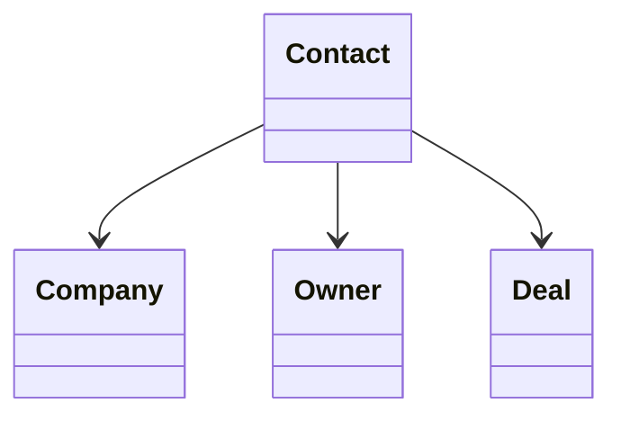

# Contact

> Resource responsável por representar pessoas na Capability **CRM**.

---

## Objetivo

O Resource **Contact** representa uma pessoa conhecida pela organização.

Um Contact pode ser cliente, prospect, parceiro, fornecedor ou qualquer outra pessoa com a qual a organização mantenha relacionamento.

Seu objetivo é padronizar a representação de contatos entre diferentes plataformas de CRM.

> Todo CRM Engine deverá converter os modelos de Contact do Provider para este Resource.

---

## Filosofia

Cada plataforma representa contatos de maneira diferente.

| Provider | Entidade |
|----------|----------|
| ☁️ Salesforce | `Contact` |
| 🟠 HubSpot | `Contact` |
| 🔵 Pipedrive | `Person` |
| 🟢 Zoho CRM | `Contact` |
| ✅ **Dialyn** | **`Contact`** |

> Apesar das diferenças de nomenclatura, todos representam uma pessoa. O CRM Engine é responsável por converter esses modelos para o contrato definido pela Dialyn.

---

## Modelo Canônico

```typescript
Contact {
    id: string
    externalId: string
    firstName: string
    lastName: string
    email: Email
    phone: Phone
    company: CompanyReference
    owner: OwnerReference
    status: ContactStatus
    jobTitle: string
    address: Address
    createdAt: datetime
    updatedAt: datetime
    metadata: Metadata
}
```

---

## Campos

| Campo | Tipo | Obrigatório | Descrição |
|--------|------|:-----------:|-----------|
| id | string | ✔ | Identificador interno |
| externalId | string | | Identificador do Provider |
| firstName | string | ✔ | Primeiro nome |
| lastName | string | | Sobrenome |
| email | Email | | E-mail principal |
| phone | Phone | | Telefone principal |
| company | CompanyReference | | Empresa relacionada |
| owner | OwnerReference | | Responsável pelo relacionamento |
| status | ContactStatus | ✔ | Situação atual |
| jobTitle | string | | Cargo |
| address | Address | | Endereço principal |
| createdAt | datetime | ✔ | Data de criação |
| updatedAt | datetime | | Última atualização |
| metadata | Metadata | | Informações específicas do Provider |

---

## Operações

### Core (obrigatórias)

| Operação | Objetivo |
|----------|----------|
| Create | Criar Contact |
| Get | Consultar Contact |
| List | Listar Contacts |
| Update | Atualizar Contact |
| Delete | Remover Contact |

### Extended (opcionais)

| Operação | Objetivo |
|----------|----------|
| Search | Pesquisar contatos |
| Count | Contabilizar contatos |
| Exists | Verificar existência |
| Archive | Arquivar |
| Restore | Restaurar |
| Merge | Mesclar contatos |
| Assign | Alterar responsável |

---

## DTOs

Este Resource define os seguintes contratos.

| DTO | Objetivo |
|------|----------|
| CreateContactRequest | Criar contato |
| CreateContactResponse | Resultado da criação |
| GetContactRequest | Consultar contato |
| GetContactResponse | Resultado da consulta |
| ListContactsRequest | Listagem paginada |
| ListContactsResponse | Lista de contatos |
| UpdateContactRequest | Atualizar contato |
| UpdateContactResponse | Resultado da atualização |
| DeleteContactRequest | Remover contato |
| DeleteContactResponse | Resultado da remoção |

### DTOs Opcionais

| DTO | Objetivo |
|------|----------|
| SearchContactsRequest | Pesquisar contatos |
| SearchContactsResponse | Resultado da pesquisa |
| MergeContactsRequest | Mesclar contatos |
| MergeContactsResponse | Resultado da mesclagem |
| AssignContactRequest | Alterar responsável |
| AssignContactResponse | Resultado da atribuição |

---

## Relacionamentos



---

## Regras de Negócio

| # | Regra |
|---|-------|
| 1 | Todo Contact deverá possuir um identificador único |
| 2 | Um Contact poderá existir sem Company associada |
| 3 | Um Contact poderá participar de múltiplos Deals |
| 4 | Um Contact poderá ser originado a partir da conversão de um Lead |
| 5 | Informações específicas do Provider deverão ser armazenadas em Metadata |

---

## Responsabilidade do CRM Engine

| # | Responsabilidade |
|---|-----------------|
| 1 | Converter Contacts do Provider para o modelo canônico |
| 2 | Preservar identificadores externos |
| 3 | Normalizar estados |
| 4 | Converter Owners para `OwnerReference` |
| 5 | Preservar informações específicas em Metadata |

---

## Princípios

| # | Princípio | Descrição |
|---|-----------|-----------|
| 1 | 🔗 **Independente** | De qualquer plataforma de CRM |
| 2 | 🔄 **Rastreável** | Associação com Company e Deals |
| 3 | 🧩 **Flexível** | Contato pode existir sem empresa vinculada |
| 4 | 📖 **Documentado** | De forma consistente com a arquitetura |
| 5 | 🚫 **Abstraído** | Normaliza Contact, Person e demais variações |

---

## Benefícios

| # | Benefício |
|---|-----------|
| 1 | 🔗 **Desacoplamento** completo entre contatos Dialyn e CRMs |
| 2 | 🏗️ **Padronização** da representação de pessoas |
| 3 | ➕ **Simplificação** da integração de novos CRMs |
| 4 | 📉 **Redução da complexidade** ao unificar o modelo de contato |
| 5 | 🚀 **Facilidade** para evolução sem impacto na IA |

---

## Compatibilidade

Este Resource foi projetado para suportar:

- Salesforce
- HubSpot
- Pipedrive
- Zoho CRM
- RD Station CRM

> Novos Providers deverão reutilizar este contrato.

---

## Veja também

| Documento | Objetivo |
|-----------|----------|
| [common.md](./common.md) | Tipos compartilhados |
| [glossary.md](./glossary.md) | Conceitos da Capability |
| [relationships.md](./relationships.md) | Relacionamentos |
| [lead.md](./lead.md) | Potenciais clientes |
| [company.md](./company.md) | Empresas |
| [deal.md](./deal.md) | Oportunidades |
