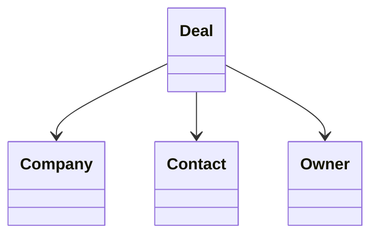

# Deal

> Resource responsável por representar oportunidades de negócio na Capability **CRM**.

---

## Objetivo

O Resource **Deal** representa uma oportunidade comercial entre uma organização e um potencial cliente.

Seu objetivo é padronizar a representação de oportunidades de negócio entre diferentes plataformas de CRM, permitindo que a Dialyn utilize um único modelo canônico independentemente do Provider.

> Todo CRM Engine deverá converter os modelos de Deal do Provider para este Resource.

---

## Filosofia

Cada plataforma representa oportunidades de maneira diferente.

| Provider | Entidade |
|----------|----------|
| ☁️ Salesforce | `Opportunity` |
| 🟠 HubSpot | `Deal` |
| 🔵 Pipedrive | `Deal` |
| 🟢 Zoho CRM | `Deal` |
| ✅ **Dialyn** | **`Deal`** |

> Apesar das diferenças de nomenclatura, todos representam uma negociação comercial. O CRM Engine é responsável por converter esses modelos para o contrato definido pela Dialyn.

---

## Modelo Canônico

```typescript
Deal {
    id: string
    externalId: string
    title: string
    description: string
    company: CompanyReference
    primaryContact: ContactReference
    owner: OwnerReference
    pipeline: PipelineReference
    stage: StageReference
    status: DealStatus
    amount: Money
    expectedCloseDate: datetime
    probability: integer
    createdAt: datetime
    updatedAt: datetime
    metadata: Metadata
}
```

---

## Campos

| Campo | Tipo | Obrigatório | Descrição |
|--------|------|:-----------:|-----------|
| id | string | ✔ | Identificador interno |
| externalId | string | | Identificador do Provider |
| title | string | ✔ | Nome da oportunidade |
| description | string | | Descrição da negociação |
| company | CompanyReference | | Empresa relacionada |
| primaryContact | ContactReference | | Contato principal |
| owner | OwnerReference | | Responsável pela negociação |
| pipeline | string | | Pipeline comercial |
| stage | string | | Etapa atual do pipeline |
| status | DealStatus | ✔ | Situação da oportunidade |
| amount | Money | | Valor estimado da negociação |
| expectedCloseDate | datetime | | Data prevista de fechamento |
| probability | integer | | Probabilidade de fechamento (0–100) |
| createdAt | datetime | ✔ | Data de criação |
| updatedAt | datetime | | Última atualização |
| metadata | Metadata | | Informações específicas do Provider |

---

## Operações

### Core (obrigatórias)

| Operação | Objetivo |
|----------|----------|
| Create | Criar Deal |
| Get | Consultar Deal |
| List | Listar Deals |
| Update | Atualizar Deal |
| Delete | Remover Deal |

### Extended (opcionais)

| Operação | Objetivo |
|----------|----------|
| Search | Pesquisar oportunidades |
| Count | Contabilizar oportunidades |
| Exists | Verificar existência |
| Archive | Arquivar oportunidade |
| Restore | Restaurar oportunidade |
| Assign | Alterar responsável |
| Move | Alterar estágio |
| Close | Encerrar negociação |
| Reopen | Reabrir negociação |

---

## DTOs

Este Resource define os seguintes contratos.

| DTO | Objetivo |
|------|----------|
| CreateDealRequest | Criar oportunidade |
| CreateDealResponse | Resultado da criação |
| GetDealRequest | Consultar oportunidade |
| GetDealResponse | Resultado da consulta |
| ListDealsRequest | Listagem paginada |
| ListDealsResponse | Lista de oportunidades |
| UpdateDealRequest | Atualizar oportunidade |
| UpdateDealResponse | Resultado da atualização |
| DeleteDealRequest | Remover oportunidade |
| DeleteDealResponse | Resultado da remoção |

### DTOs Opcionais

| DTO | Objetivo |
|------|----------|
| SearchDealsRequest | Pesquisar oportunidades |
| SearchDealsResponse | Resultado da pesquisa |
| AssignDealRequest | Alterar responsável |
| AssignDealResponse | Resultado da atribuição |
| MoveDealRequest | Alterar estágio |
| MoveDealResponse | Resultado da movimentação |
| CloseDealRequest | Encerrar negociação |
| CloseDealResponse | Resultado do encerramento |
| ReopenDealRequest | Reabrir negociação |
| ReopenDealResponse | Resultado da reabertura |

---

## Relacionamentos



---

## Regras de Negócio

| # | Regra |
|---|-------|
| 1 | Todo Deal deverá possuir um identificador único |
| 2 | Um Deal deverá estar associado a pelo menos um Contact ou uma Company |
| 3 | Um Deal poderá possuir apenas um Owner responsável |
| 4 | O valor da negociação deverá utilizar o tipo compartilhado `Money` |
| 5 | O estágio (`stage`) representa a posição no Pipeline |
| 6 | O status representa o estado geral da negociação |
| 7 | Informações específicas do Provider deverão ser armazenadas em `Metadata` |

---

## Responsabilidade do CRM Engine

| # | Responsabilidade |
|---|-----------------|
| 1 | Converter Deals do Provider para o modelo canônico |
| 2 | Preservar identificadores externos |
| 3 | Converter pipelines e estágios para o modelo definido pela Dialyn |
| 4 | Normalizar estados da negociação |
| 5 | Converter responsáveis para `OwnerReference` |
| 6 | Preservar dados específicos em `Metadata` |

---

## Princípios

| # | Princípio | Descrição |
|---|-----------|-----------|
| 1 | 🔗 **Independente** | De qualquer plataforma de CRM |
| 2 | 🔄 **Rastreável** | Pipeline, estágio e valor preservados |
| 3 | 🧩 **Flexível** | Associação flexível com Contact e/ou Company |
| 4 | 📖 **Documentado** | De forma consistente com a arquitetura |
| 5 | 🚫 **Abstraído** | Normaliza Opportunity, Deal e variações |

---

## Benefícios

| # | Benefício |
|---|-----------|
| 1 | 🔗 **Desacoplamento** completo entre oportunidades Dialyn e CRMs |
| 2 | 🏗️ **Padronização** da representação de negociações |
| 3 | ➕ **Simplificação** da integração de novos CRMs |
| 4 | 📉 **Redução da complexidade** ao unificar o modelo de oportunidade |
| 5 | 🚀 **Facilidade** para evolução sem impacto na IA |

---

## Compatibilidade

Este Resource foi projetado para suportar:

- Salesforce
- HubSpot
- Pipedrive
- Zoho CRM
- RD Station CRM

> Novos Providers deverão reutilizar este contrato.

---

## Veja também

| Documento | Objetivo |
|-----------|----------|
| [common.md](./common.md) | Tipos compartilhados |
| [glossary.md](./glossary.md) | Conceitos da Capability |
| [relationships.md](./relationships.md) | Relacionamentos |
| [lead.md](./lead.md) | Potenciais clientes |
| [contact.md](./contact.md) | Contatos |
| [company.md](./company.md) | Empresas |
