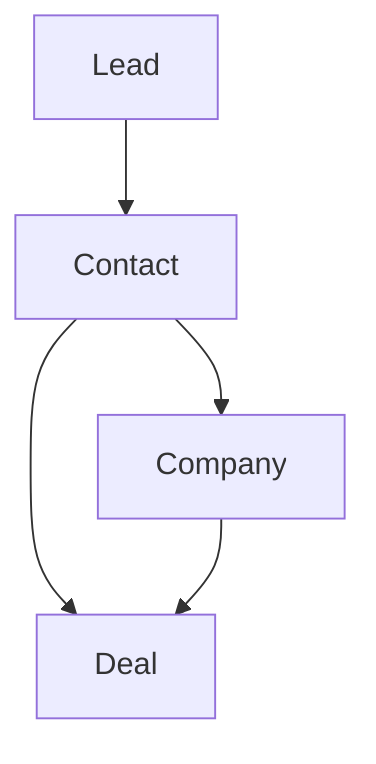

# Glossary

> Glossário de conceitos utilizados pela Capability **CRM**.

---

## Objetivo

Este documento reúne os principais conceitos utilizados pela Capability **CRM**.

Seu objetivo é padronizar a terminologia adotada pela Dialyn, garantindo que todos os Providers sejam interpretados sob a mesma linguagem de negócio.

> Sempre que um conceito possuir nomes diferentes entre plataformas, a Dialyn utilizará a terminologia definida neste documento.

---

## Filosofia

A Capability CRM representa relacionamentos comerciais entre empresas e pessoas.

Embora cada plataforma implemente esses conceitos de maneira diferente, a Dialyn trabalha apenas com um modelo canônico.

> Cabe ao CRM Engine realizar a tradução entre o Provider e os Resources definidos nesta documentação.

---

## Lead

Representa um potencial cliente que ainda está em processo de qualificação.

Um Lead ainda não representa uma oportunidade de negócio consolidada.

Exemplos:
- Cadastro em um formulário
- Contato vindo de uma campanha
- Interesse demonstrado em um produto

---

## Contact

Representa uma pessoa conhecida pela organização.

Um Contact pode existir independentemente de possuir oportunidades abertas.

Exemplos:
- Cliente
- Prospect
- Fornecedor
- Parceiro

---

## Company

Representa uma organização, empresa ou instituição.

> Uma Company poderá possuir diversos Contacts e diversos Deals.

---

## Deal

Representa uma oportunidade de negócio.

Um Deal normalmente percorre diversas etapas até ser concluído.

Exemplos:
- Em negociação
- Proposta enviada
- Ganha
- Perdida

---

## Owner

Representa o responsável por um Resource dentro do CRM.

Dependendo do Provider, pode representar:
- Vendedor
- Consultor
- Atendente
- Responsável comercial

---

## Pipeline

Representa o fluxo comercial utilizado para acompanhar oportunidades.

Cada Pipeline poderá possuir diversos estágios.

```
Novo Lead
  ↓
Qualificação
  ↓
Proposta
  ↓
Negociação
  ↓
Fechado
```

---

## Stage

Representa uma etapa dentro de um Pipeline.

> Cada Deal deverá pertencer a um Stage.

---

## Qualification

Processo utilizado para determinar se um Lead possui potencial para se tornar uma oportunidade de negócio.

---

## Conversion

Processo no qual um Lead deixa de ser apenas um potencial cliente e passa a integrar o relacionamento comercial da empresa.

Dependendo do Provider, essa conversão poderá resultar na criação automática de:
- Contact
- Company
- Deal

---

## Metadata

Informações específicas do Provider que não fazem parte do modelo canônico da Dialyn.

> Seu uso deverá ser restrito à preservação de dados não padronizados.

---

## Modelo Conceitual

A relação entre os principais conceitos da Capability CRM pode ser representada da seguinte forma.



---

## Equivalência entre Providers

| Dialyn | Salesforce | HubSpot | Pipedrive |
|---------|------------|----------|-----------|
| **Lead** | Lead | Contact (Lifecycle Lead) | Lead |
| **Contact** | Contact | Contact | Person |
| **Company** | Account | Company | Organization |
| **Deal** | Opportunity | Deal | Deal |
| **Owner** | Owner | Owner | Owner |

---

## Responsabilidade do CRM Engine

| # | Responsabilidade |
|---|-----------------|
| 1 | Converter os conceitos do Provider para o modelo canônico |
| 2 | Preservar informações específicas em `Metadata` |
| 3 | Manter compatibilidade entre diferentes plataformas |
| 4 | Evitar expor terminologias específicas do Provider para a Dialyn |

---

## Princípios

| # | Princípio | Descrição |
|---|-----------|-----------|
| 1 | 🔗 **Independência** | De qualquer plataforma de CRM |
| 2 | 🔄 **Estabilidade** | Contratos estáveis e versionados |
| 3 | 🧩 **Baixo acoplamento** | Resources relacionados através de `Reference` |
| 4 | 📖 **Consistência** | Modelo canônico único |
| 5 | 🚫 **Isolamento** | Conversão realizada exclusivamente pelo CRM Engine |

---

## Benefícios

| # | Benefício |
|---|-----------|
| 1 | 🔗 **Desacoplamento** entre a terminologia Dialyn e dos provedores |
| 2 | 🏗️ **Padronização** da comunicação entre todos os componentes |
| 3 | ➕ **Simplificação** da integração de novos CRMs |
| 4 | 📉 **Redução de ambiguidades** na implementação dos Engines |
| 5 | 🚀 **Facilidade** para evolução sem impacto na IA |

---

## Veja também

| Documento | Objetivo |
|-----------|----------|
| [README.md](./README.md) | Visão geral da Capability |
| [common.md](./common.md) | Tipos compartilhados |
| [relationships.md](./relationships.md) | Relacionamentos entre Resources |
| [lead.md](./lead.md) | Potenciais clientes |
| [contact.md](./contact.md) | Contatos |
| [company.md](./company.md) | Empresas |
| [deal.md](./deal.md) | Oportunidades |
