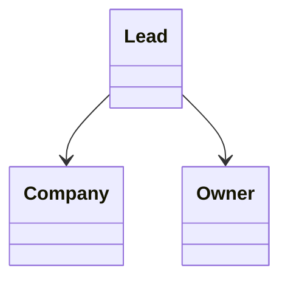

# Lead

> Resource responsável por representar potenciais clientes na Capability **CRM**.

---

## Objetivo

O Resource **Lead** representa uma pessoa ou organização que demonstrou interesse em um produto, serviço ou solução, mas que ainda não iniciou oficialmente um relacionamento comercial.

Seu objetivo é padronizar a representação de Leads entre diferentes plataformas de CRM, permitindo que a Dialyn utilize um único modelo de dados independentemente do Provider.

> Todo CRM Engine deverá converter os modelos de Lead do Provider para este Resource.

---

## Filosofia

Cada plataforma implementa Leads de maneira diferente.

| Provider | Entidade |
|----------|----------|
| ☁️ Salesforce | `Lead` |
| 🟠 HubSpot | `Contact` (Lifecycle Stage = Lead) |
| 🔵 Pipedrive | `Lead` |
| 🟢 Zoho CRM | `Lead` |
| ✅ **Dialyn** | **`Lead`** |

> Apesar das diferenças de implementação, todos representam um potencial cliente. O CRM Engine é responsável por converter esses modelos para o contrato definido pela Dialyn.

---

## Modelo Canônico

```typescript
Lead {
    id: string
    externalId: string
    firstName: string
    lastName: string
    email: Email
    phone: Phone
    company: CompanyReference
    owner: OwnerReference
    status: LeadStatus
    source: string
    score: integer
    createdAt: datetime
    updatedAt: datetime
    metadata: Metadata
}
```

---

## Campos

| Campo | Tipo | Obrigatório | Descrição |
|--------|------|:-----------:|-----------|
| id | string | ✔ | Identificador interno |
| externalId | string | | Identificador do Provider |
| firstName | string | ✔ | Primeiro nome |
| lastName | string | | Sobrenome |
| email | Email | | E-mail principal |
| phone | Phone | | Telefone principal |
| company | CompanyReference | | Empresa relacionada |
| owner | OwnerReference | | Responsável pelo Lead |
| status | LeadStatus | ✔ | Situação do Lead |
| source | string | | Origem do Lead |
| score | integer | | Pontuação utilizada pelo CRM |
| createdAt | datetime | ✔ | Data de criação |
| updatedAt | datetime | | Última atualização |
| metadata | Metadata | | Informações específicas do Provider |

---

## Operações

### Core (obrigatórias)

| Operação | Objetivo |
|----------|----------|
| Create | Criar Lead |
| Get | Consultar Lead |
| List | Listar Leads |
| Update | Atualizar Lead |
| Delete | Remover Lead |

### Extended (opcionais)

| Operação | Objetivo |
|----------|----------|
| Search | Pesquisar Leads |
| Count | Contabilizar Leads |
| Exists | Verificar existência |
| Archive | Arquivar Lead |
| Restore | Restaurar Lead |
| Merge | Mesclar Leads |
| Assign | Alterar responsável |
| Convert | Converter Lead |

---

## DTOs

Este Resource define os seguintes contratos.

| DTO | Objetivo |
|------|----------|
| CreateLeadRequest | Criar um novo Lead |
| CreateLeadResponse | Resultado da criação |
| GetLeadRequest | Consultar um Lead |
| GetLeadResponse | Resultado da consulta |
| ListLeadsRequest | Listagem paginada |
| ListLeadsResponse | Lista de Leads |
| UpdateLeadRequest | Atualizar informações |
| UpdateLeadResponse | Resultado da atualização |
| DeleteLeadRequest | Remover Lead |
| DeleteLeadResponse | Resultado da remoção |

### DTOs Opcionais

| DTO | Objetivo |
|------|----------|
| SearchLeadsRequest | Pesquisar Leads |
| SearchLeadsResponse | Resultado da pesquisa |
| MergeLeadsRequest | Mesclar Leads |
| MergeLeadsResponse | Resultado da mesclagem |
| ConvertLeadRequest | Converter Lead |
| ConvertLeadResponse | Resultado da conversão |
| AssignLeadRequest | Alterar responsável |
| AssignLeadResponse | Resultado da atribuição |

---

## Relacionamentos



---

## Regras de Negócio

| # | Regra |
|---|-------|
| 1 | Todo Lead deverá possuir um identificador único |
| 2 | Um Lead poderá existir sem empresa associada |
| 3 | Um Lead poderá existir sem e-mail quando suportado pelo Provider |
| 4 | Um Lead poderá ser convertido em Contact |
| 5 | O Owner representa o responsável comercial pelo Lead |
| 6 | Informações específicas do Provider deverão ser armazenadas em Metadata |

---

## Responsabilidade do CRM Engine

| # | Responsabilidade |
|---|-----------------|
| 1 | Converter Leads do Provider para o modelo canônico |
| 2 | Preservar identificadores externos |
| 3 | Normalizar estados do Lead |
| 4 | Converter Owners para `OwnerReference` |
| 5 | Preservar informações específicas em Metadata |

---

## Princípios

| # | Princípio | Descrição |
|---|-----------|-----------|
| 1 | 🔗 **Independente** | De qualquer plataforma de CRM |
| 2 | 🔄 **Rastreável** | Origem e pontuação do Lead preservadas |
| 3 | 🧩 **Flexível** | Lead pode existir sem empresa ou e-mail |
| 4 | 📖 **Documentado** | De forma consistente com a arquitetura |
| 5 | 🚫 **Abstraído** | Normaliza Lead, Contact (Lifecycle) e variações |

---

## Benefícios

| # | Benefício |
|---|-----------|
| 1 | 🔗 **Desacoplamento** completo entre Leads Dialyn e CRMs |
| 2 | 🏗️ **Padronização** da representação de potenciais clientes |
| 3 | ➕ **Simplificação** da integração de novos CRMs |
| 4 | 📉 **Redução da complexidade** ao unificar o modelo de Lead |
| 5 | 🚀 **Facilidade** para evolução sem impacto na IA |

---

## Compatibilidade

Este Resource foi projetado para suportar:

- Salesforce
- HubSpot
- Pipedrive
- Zoho CRM
- RD Station CRM

> Novos Providers deverão reutilizar este contrato.

---

## Veja também

| Documento | Objetivo |
|-----------|----------|
| [common.md](./common.md) | Tipos compartilhados |
| [glossary.md](./glossary.md) | Conceitos da Capability |
| [relationships.md](./relationships.md) | Relacionamentos |
| [contact.md](./contact.md) | Contatos |
| [company.md](./company.md) | Empresas |
| [deal.md](./deal.md) | Oportunidades |
