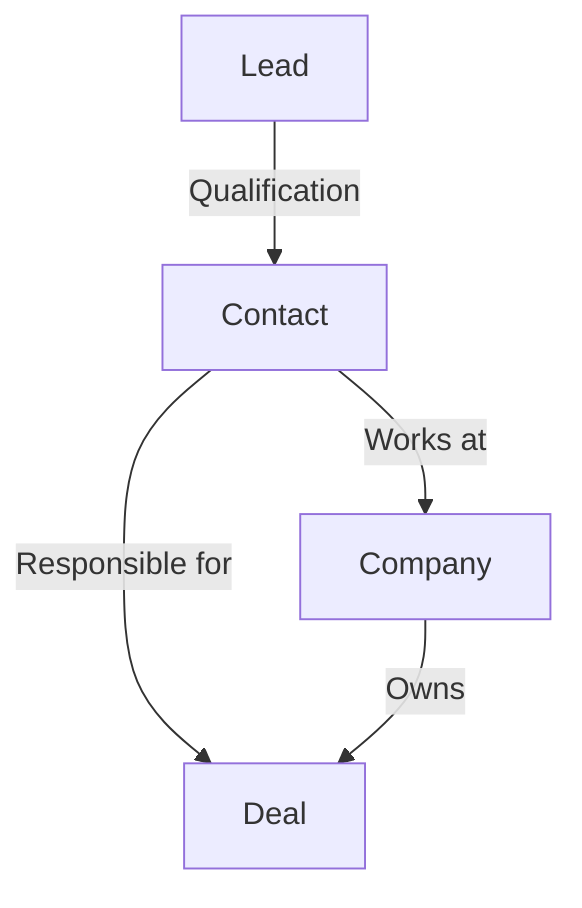
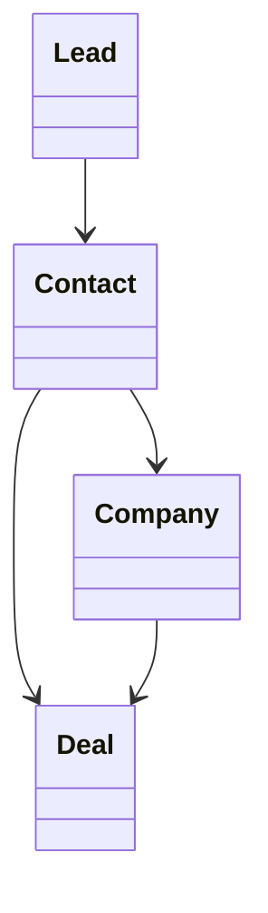
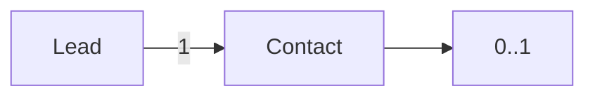
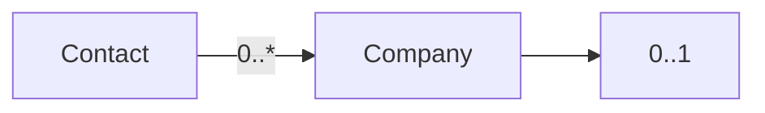
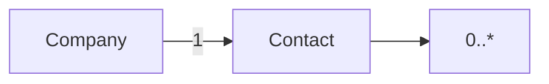
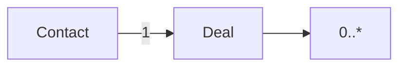
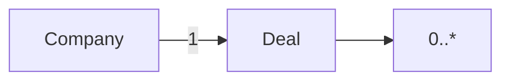
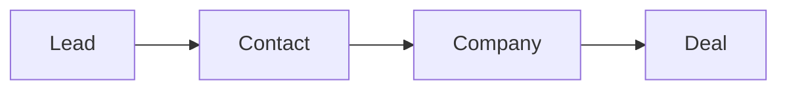

# Relationships

> Relacionamentos entre os Resources da Capability **CRM**.

---

## Objetivo

Este documento descreve como os Resources da Capability **CRM** se relacionam dentro do modelo canônico da Dialyn.

Seu objetivo é definir as dependências e associações entre os principais conceitos do domínio, independentemente do Provider utilizado.

> Todos os CRM Engines deverão preservar essas relações durante o processo de conversão entre o modelo do Provider e o modelo canônico da Dialyn.

---

## Filosofia

A Capability CRM representa relacionamentos comerciais.

Enquanto cada Provider possui sua própria estrutura de dados, a Dialyn trabalha apenas com quatro Resources principais: **Lead**, **Contact**, **Company** e **Deal**.

| Provider | Lead | Contact | Company | Deal |
|----------|------|---------|---------|------|
| ☁️ Salesforce | Lead | Contact | Account | Opportunity |
| 🟠 HubSpot | Contact (Lead) | Contact | Company | Deal |
| 🔵 Pipedrive | Lead | Person | Organization | Deal |
| ✅ **Dialyn** | **Lead** | **Contact** | **Company** | **Deal** |

> Os relacionamentos descritos neste documento representam o comportamento esperado entre esses Resources.

---

## Modelo Conceitual



---

## Modelo de Classes



---

## Lead → Contact

Um Lead representa um potencial cliente. Após o processo de qualificação, poderá originar um Contact.



**Cardinalidade:** `1 : 0..1`

> Nem todo Lead será convertido.

---

## Contact → Company

Um Contact poderá estar vinculado a uma Company.



**Cardinalidade:** `0..* : 0..1`

> Um Contact poderá existir sem empresa associada.

---

## Company → Contact

Uma Company poderá possuir diversos Contacts.



**Cardinalidade:** `1 : 0..*`

---

## Contact → Deal

Um Contact poderá estar relacionado a diversas oportunidades.



**Cardinalidade:** `1 : 0..*`

---

## Company → Deal

Uma Company poderá possuir diversas oportunidades.



**Cardinalidade:** `1 : 0..*`

---

## Fluxo de Conversão

O fluxo comercial normalmente ocorre da seguinte maneira.



Dependendo do Provider, algumas etapas poderão ocorrer automaticamente.

Exemplo:
- Converter um Lead poderá criar automaticamente um Contact
- Um Contact poderá ser associado a uma Company existente
- A conversão poderá gerar um novo Deal

> Essas diferenças deverão ser abstraídas pelo CRM Engine.

---

## Referências entre Resources

Para evitar acoplamento entre os contratos, os Resources deverão utilizar apenas tipos de referência.

```
CompanyReference
ContactReference
LeadReference
DealReference
OwnerReference
```

> Nenhum Resource deverá conter outro Resource completo.

---

## Regras de Relacionamento

| # | Regra |
|---|-------|
| 1 | Um Lead poderá ser convertido em um Contact |
| 2 | Um Contact poderá existir sem Company |
| 3 | Uma Company poderá existir sem Contacts |
| 4 | Um Deal deverá estar associado a pelo menos um Contact ou uma Company |
| 5 | Um Contact poderá participar de múltiplos Deals |
| 6 | Uma Company poderá possuir múltiplos Deals |

---

## Responsabilidade do CRM Engine

| # | Responsabilidade |
|---|-----------------|
| 1 | Preservar os relacionamentos definidos neste documento |
| 2 | Converter relacionamentos específicos do Provider para o modelo canônico |
| 3 | Utilizar tipos `Reference` para representar associações |
| 4 | Manter a consistência entre Resources relacionados |

---

## Compatibilidade

Este modelo foi projetado para suportar plataformas como:

- Salesforce
- HubSpot
- Pipedrive
- Zoho CRM
- RD Station CRM

> Novos Providers deverão respeitar estes relacionamentos.

---

## Princípios

| # | Princípio | Descrição |
|---|-----------|-----------|
| 1 | 🔗 **Independência** | De qualquer plataforma de CRM |
| 2 | 🔄 **Integridade** | Relacionamentos preservados entre Resources |
| 3 | 🧩 **Baixo acoplamento** | Uso de `Reference` em vez de objetos completos |
| 4 | 📖 **Consistência** | Modelo de domínio único para todos os Engines |
| 5 | 🚫 **Abstração** | Diferenças de providers abstraídas pelo Engine |

---

## Benefícios

| # | Benefício |
|---|-----------|
| 1 | 🔗 **Visão única** do domínio de CRM para todos os Engines |
| 2 | 🏗️ **Padronização** dos relacionamentos entre Resources |
| 3 | ➕ **Simplificação** da integração de novos CRMs |
| 4 | 📉 **Redução da complexidade** ao isolar o modelo de domínio |
| 5 | 🚀 **Facilidade** para evolução sem impacto na IA |

---

## Veja também

| Documento | Objetivo |
|-----------|----------|
| [README.md](./README.md) | Visão geral da Capability |
| [common.md](./common.md) | Tipos compartilhados |
| [glossary.md](./glossary.md) | Conceitos da Capability |
| [lead.md](./lead.md) | Potenciais clientes |
| [contact.md](./contact.md) | Contatos |
| [company.md](./company.md) | Empresas |
| [deal.md](./deal.md) | Oportunidades |
