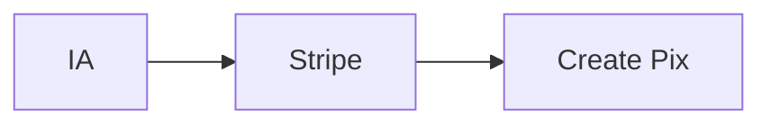
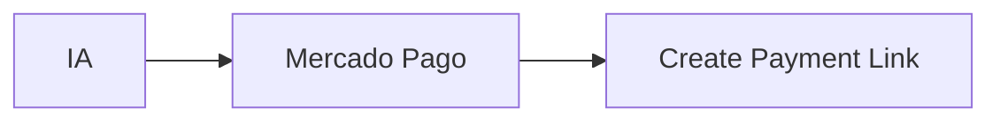
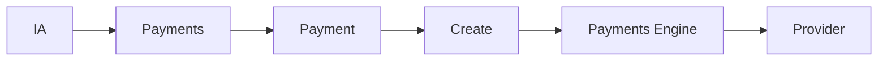
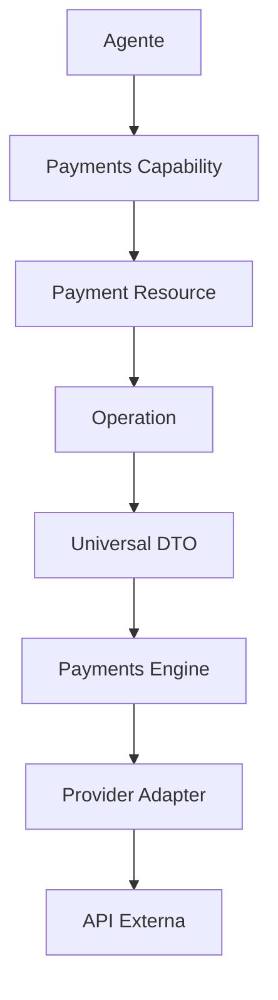
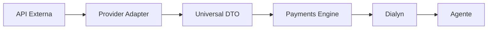
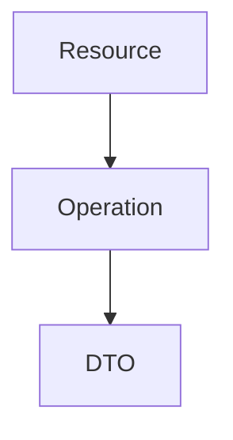
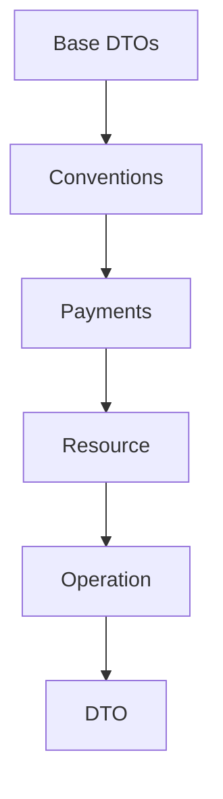

# Payments

> Capability responsável pela integração com provedores de pagamentos da Arquitetura de Apps da Dialyn.

---

## Objetivo

A Capability **Payments** fornece uma camada universal para execução de operações financeiras através de diferentes provedores de pagamento.

Seu principal objetivo é **abstrair completamente as APIs externas**, permitindo que a Dialyn trabalhe apenas com contratos universais de dados (Universal DTOs).

> Independentemente do provedor utilizado, toda operação financeira deverá seguir os **mesmos contratos** definidos nesta documentação.

---

## Filosofia

A Dialyn **não conhece** gateways de pagamento. Ela conhece apenas o domínio **Payments**.

### ❌ Incorreto





### ✅ Correto



> O **Payments Engine** será responsável por traduzir essa solicitação para o provedor configurado pelo usuário. Da mesma forma, qualquer resposta retornada por um provedor será convertida para um **Universal DTO** antes de chegar à plataforma.

---

## Arquitetura

Toda comunicação da Capability Payments segue o mesmo fluxo.

### Envio (Dialyn → Provedor)



### Retorno (Provedor → Dialyn)



> Essa arquitetura garante que a IA permaneça **totalmente desacoplada** das implementações específicas de cada provedor.

---

## Providers suportados

| Provedor | Status |
|----------|--------|
| 💳 Stripe | Planejado |
| 💰 Mercado Pago | Planejado |
| 🏦 Asaas | Planejado |

> Novos provedores poderão ser adicionados futuramente **sem alterações na arquitetura** da Dialyn.

---

## Resources

A Capability Payments é composta pelos seguintes **Resources**:

| Resource | Responsabilidade |
|----------|------------------|
| 💳 **Payment** | Representa uma cobrança ou transação financeira |
| 👤 **Customer** | Representa um cliente financeiro |
| 📄 **Invoice** | Representa uma cobrança formal (fatura) |
| ↩️ **Refund** | Representa um reembolso de pagamento |

> Cada Resource possui seu próprio **contrato canônico** de dados e suas respectivas operações.

---

## Operações

Todos os Resources da Capability Payments utilizam o mesmo modelo arquitetural.



### Exemplos

| Caminho | DTO |
|---------|-----|
| `Payment` → `Create` | `CreatePaymentRequest` |
| `Invoice` → `List` | `ListInvoicesResponse` |

---

## Organização da documentação

A documentação desta Capability está organizada da seguinte forma:

```
payments/
├── README.md      ← Documento introdutório
├── common.md      ← Tipos compartilhados
├── payment.md     ← Modelo canônico do Payment
├── customer.md    ← Recurso Customer
├── invoice.md     ← Recurso Invoice
└── refund.md      ← Recurso Refund
```

---

## Documentos

| Documento | Descrição |
|-----------|-----------|
| 📖 **README.md** | Documento introdutório — conceitos gerais, arquitetura, Resources e organização |
| 🔄 **common.md** | Tipos compartilhados: `Money`, `Currency`, `PaymentStatus`, `PaymentMethod`, `CustomerReference`, `Address`, `Metadata` |
| 💳 **payment.md** | Modelo canônico do **Payment** — dados, operações, DTOs, validações e regras de negócio |
| 👤 **customer.md** | Recurso **Customer** — contratos do cliente utilizado por provedores de pagamento |
| 📄 **invoice.md** | Recurso **Invoice** — representação de cobranças formais |
| ↩️ **refund.md** | Recurso **Refund** — representação de reembolsos financeiros |

---

## Relação com os Universal DTOs

Todos os DTOs desta Capability seguem os contratos definidos na documentação global da arquitetura.



> ⚠️ Nenhum DTO desta Capability poderá violar as convenções definidas pela plataforma.

---

## Independência de Providers

Os Resources definidos nesta documentação representam exclusivamente **conceitos de negócio**.

| ✅ Permitido | ❌ Proibido |
|-------------|-------------|
| Modelos universais | Nomes de APIs externas |
| Campos padronizados | Campos específicos de provedores |
| Contratos da Dialyn | URLs de integração |
| | Estruturas proprietárias |

> A responsabilidade de converter dados entre o Provider e os Universal DTOs pertence **exclusivamente ao Payments Engine**.

---

## Princípios

| # | Princípio |
|---|-----------|
| 1 | 🔗 **Independência** de provedores |
| 2 | 🔄 **Reutilização** de tipos compartilhados |
| 3 | 🏗️ **Padronização** dos contratos |
| 4 | 🔽 **Baixo acoplamento** |
| 5 | 🎯 **Alta coesão** |
| 6 | 🔖 **Versionamento explícito** |
| 7 | 📖 **Documentação** como fonte oficial da arquitetura |

---

## Estrutura da Capability

A organização lógica da Capability Payments pode ser representada da seguinte forma:

```
Payments
├── Common Types
│   ├── Money
│   ├── Currency
│   ├── PaymentStatus
│   ├── PaymentMethod
│   ├── Address
│   └── CustomerReference
│
├── Resources
│   ├── Payment
│   ├── Customer
│   ├── Invoice
│   └── Refund
│
└── Operations
    ├── Create
    ├── Get
    ├── List
    ├── Update
    ├── Search
    ├── Cancel
    ├── Refund
    └── Count
```

---

## Próximo Passo

Os próximos documentos desta Capability detalham cada **Resource individualmente**. Cada Resource especificará:

| Item | Descrição |
|------|-----------|
| 📐 Modelo canônico | Estrutura de dados padronizada |
| 🏷️ Propriedades | Campos e tipos |
| ⚡ Operações suportadas | Ações disponíveis |
| 📤 DTOs Request | Objetos de requisição |
| 📥 DTOs Response | Objetos de resposta |
| ✅ Validações | Regras de validação |
| 📋 Regras de negócio | Comportamentos esperados |
| 📝 Exemplos de utilização | Casos de uso |

> Esses documentos representam o **contrato oficial** entre a Dialyn, os Engines e todos os provedores de pagamento.

# Estrutura da Capability

| Documento | Objetivo |
|-----------|----------|
| [README.md](./README.md) | Introdução da Capability |
| [glossary.md](./glossary.md) | Conceitos e terminologia |
| [relationships.md](./relationships.md) | Relações entre os Resources |
| [common.md](./common.md) | Tipos compartilhados |
| [payment.md](./payment.md) | Modelo do Payment |
| [customer.md](./customer.md) | Modelo do Customer |
| [invoice.md](./invoice.md) | Modelo do Invoice |
| [refund.md](./refund.md) | Modelo do Refund |