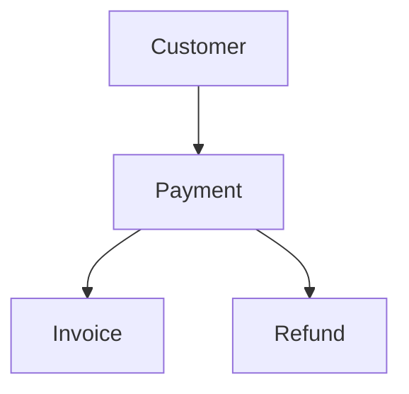

# Customer

> Modelo canônico do recurso **Customer** utilizado pela Capability **Payments**.

---

## Objetivo

O recurso **Customer** representa uma entidade financeira capaz de realizar pagamentos, receber cobranças e possuir um histórico financeiro.

Independentemente do provedor utilizado, toda representação de cliente deverá ser convertida para este modelo.

Este recurso não representa usuários da Dialyn nem contatos de um CRM. Seu único objetivo é representar clientes financeiros utilizados pelos provedores de pagamento.

---

## Filosofia

Cada provedor possui sua própria representação de cliente.

| Provedor | Entidade |
|----------|----------|
| 💳 Stripe | `Customer` |
| 💰 Mercado Pago | `Payer` |
| 🏦 Asaas | `Customer` |
| ✅ **Dialyn** | **`Customer`** |

> A IA nunca deverá conhecer essas diferenças. Todos serão convertidos para o mesmo Resource.

---

## Modelo Canônico

```typescript
Customer {
    id: string
    externalId: string
    reference: string
    type: CustomerType
    name: string
    email: string
    phone: string
    document: Document
    address: Address
    status: CustomerStatus
    createdAt: datetime
    updatedAt: datetime
    metadata: object
}
```

---

## Campos

| Campo | Obrigatório | Descrição |
|--------|:----------:|-----------|
| id | ✔ | Identificador interno |
| externalId | | Identificador do Provider |
| reference | | Código interno do cliente |
| type | ✔ | Tipo do cliente |
| name | ✔ | Nome completo |
| email | | E-mail principal |
| phone | | Telefone |
| document | | Documento fiscal |
| address | | Endereço |
| status | ✔ | Situação do cliente |
| createdAt | ✔ | Data de criação |
| updatedAt | ✔ | Última atualização |
| metadata | | Informações adicionais |

---

## CustomerType

```
INDIVIDUAL
COMPANY
```

---

## CustomerStatus

```
ACTIVE
INACTIVE
BLOCKED
ARCHIVED
```

---

## Document

Representa um documento fiscal.

```typescript
Document {
    type: DocumentType
    value: string
}
```

---

## DocumentType

```
CPF
CNPJ
PASSPORT
OTHER
```

---

## Operações

| Categoria | Operações |
|-----------|-----------|
| ⚡ **Core** | `Create`, `Get`, `List`, `Update`, `Delete` |
| 🔧 **Extended** | `Search`, `Archive`, `Restore`, `Count`, `Exists` |

---

## DTOs

```
Customer
├── CreateCustomerRequest
├── CreateCustomerResponse
├── UpdateCustomerRequest
├── UpdateCustomerResponse
├── GetCustomerRequest
├── GetCustomerResponse
├── ListCustomersRequest
├── ListCustomersResponse
├── SearchCustomersRequest
├── SearchCustomersResponse
├── DeleteCustomerRequest
├── DeleteCustomerResponse
├── ArchiveCustomerRequest
├── ArchiveCustomerResponse
├── RestoreCustomerRequest
├── RestoreCustomerResponse
├── ExistsCustomerRequest
├── ExistsCustomerResponse
├── CountCustomersRequest
└── CountCustomersResponse
```

### CreateCustomerRequest

```typescript
CreateCustomerRequest {
    reference: string
    type: CustomerType
    name: string
    email: string
    phone: string
    document: Document
    address: Address
    metadata: object
}
```

### CreateCustomerResponse

```typescript
CreateCustomerResponse {
    customer: Customer
}
```

### UpdateCustomerRequest

```typescript
UpdateCustomerRequest {
    id: string
    name: string
    email: string
    phone: string
    document: Document
    address: Address
    metadata: object
}
```

### UpdateCustomerResponse

```typescript
UpdateCustomerResponse {
    customer: Customer
}
```

### GetCustomerRequest

```typescript
GetCustomerRequest {
    id: string
}
```

### GetCustomerResponse

```typescript
GetCustomerResponse {
    customer: Customer
}
```

### ListCustomersRequest

```typescript
ListCustomersRequest {
    page: integer
    limit: integer
    status: CustomerStatus
}
```

### ListCustomersResponse

```typescript
ListCustomersResponse {
    items: Customer[]
    total: integer
    page: integer
    pages: integer
}
```

### SearchCustomersRequest

```typescript
SearchCustomersRequest {
    query: string
    filters: object
}
```

### SearchCustomersResponse

```typescript
SearchCustomersResponse {
    items: Customer[]
}
```

### DeleteCustomerRequest

```typescript
DeleteCustomerRequest {
    id: string
}
```

### DeleteCustomerResponse

```typescript
DeleteCustomerResponse {
    customer: Customer
}
```

### ArchiveCustomerRequest

```typescript
ArchiveCustomerRequest {
    id: string
}
```

### ArchiveCustomerResponse

```typescript
ArchiveCustomerResponse {
    customer: Customer
}
```

### RestoreCustomerRequest

```typescript
RestoreCustomerRequest {
    id: string
}
```

### RestoreCustomerResponse

```typescript
RestoreCustomerResponse {
    customer: Customer
}
```

### ExistsCustomerRequest

```typescript
ExistsCustomerRequest {
    id: string
}
```

### ExistsCustomerResponse

```typescript
ExistsCustomerResponse {
    exists: boolean
}
```

### CountCustomersRequest

```typescript
CountCustomersRequest {
    status: CustomerStatus
}
```

### CountCustomersResponse

```typescript
CountCustomersResponse {
    total: integer
}
```

---

## Regras de Validação

| # | Regra |
|---|-------|
| 1 | O nome deverá possuir pelo menos um caractere |
| 2 | O e-mail deverá seguir um formato válido quando informado |
| 3 | O documento deverá ser compatível com o tipo informado |
| 4 | O tipo do cliente deverá pertencer ao enum `CustomerType` |
| 5 | O status deverá pertencer ao enum `CustomerStatus` |
| 6 | O endereço é opcional, mas quando informado deverá estar completo conforme o contrato `Address` |

---

## Regras de Negócio

| # | Regra |
|---|-------|
| 1 | Todo cliente nasce com status `ACTIVE`, salvo comportamento específico do provedor convertido pelo Engine |
| 2 | O `externalId` somente será preenchido após a criação no Provider |
| 3 | Um cliente arquivado não poderá receber novas cobranças até ser restaurado, caso o provedor suporte essa restrição |
| 4 | Os Engines deverão converter qualquer estrutura de cliente para o modelo canônico definido neste documento |

---

## Responsabilidade dos Engines

| # | Responsabilidade |
|---|-----------------|
| 1 | Converter clientes de qualquer provedor para o modelo `Customer` |
| 2 | Normalizar documentos e endereços |
| 3 | Preencher corretamente os enums definidos pela Capability |
| 4 | Nunca expor estruturas específicas do Provider para a Dialyn |

---

## Princípios

| # | Princípio | Descrição |
|---|-----------|-----------|
| 1 | 🔗 **Independente** | De qualquer provedor de pagamento |
| 2 | 🔄 **Reutilizável** | Por diferentes Payments Engines |
| 3 | 🧩 **Compatível** | Com todas as operações do Resource |
| 4 | 🧊 **Imutável** | Durante a comunicação entre componentes |
| 5 | 📖 **Documentado** | De forma consistente com a arquitetura |

---

## Benefícios

| # | Benefício |
|---|-----------|
| 1 | 🔗 **Desacoplamento** completo entre a Dialyn e provedores de pagamento |
| 2 | 🏗️ **Padronização** da comunicação entre Payments Engines |
| 3 | ➕ **Simplificação** da implementação de novos provedores |
| 4 | 📉 **Redução da complexidade** da plataforma |
| 5 | 🚀 **Facilidade** para evolução sem impacto na IA |

---

## Relação com outros Resources

O recurso **Customer** poderá ser referenciado por:

- **Payment** — transações financeiras realizadas pelo cliente
- **Invoice** — cobranças emitidas para o cliente
- **Refund** — reembolsos associados aos pagamentos do cliente



Sempre através do identificador interno da Dialyn ou de uma referência canônica (`CustomerReference`), evitando acoplamento direto com IDs de provedores externos.

---

## Veja também

- [README](./README.md)
- [Common Types](./common.md)
- [Relationships](./relationships.md)
- [Glossary](./glossary.md)
- [Payment](./payment.md)
- [Invoice](./invoice.md)
- [Refund](./refund.md)
