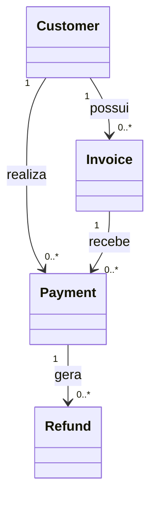

# Glossary

> Glossário oficial de termos utilizados pela Capability **Payments** da Arquitetura de Apps da Dialyn.

---

## Objetivo

Este documento reúne os principais conceitos utilizados pela Capability **Payments**.

Seu objetivo é padronizar a terminologia utilizada em toda a arquitetura, evitando ambiguidades entre Providers, Engines e Universal DTOs.

Sempre que possível, a Dialyn utiliza uma linguagem de negócio, independente da nomenclatura adotada pelas APIs externas.

---

## Filosofia

Cada Provider possui sua própria terminologia.

| Provider | Termo |
|----------|-------|
| 💳 Stripe | `PaymentIntent` |
| 💰 Mercado Pago | `Payment` |
| 🏦 Asaas | `Payment` |
| ✅ **Dialyn** | **`Payment` (canônico)** |

> Todos representam conceitos semelhantes. Na Dialyn, todos serão convertidos para o modelo canônico.

---

## Customer

Representa a entidade financeira responsável por pagamentos, cobranças e reembolsos.

Um Customer pode representar:
- uma pessoa física
- uma empresa
- qualquer entidade capaz de realizar pagamentos

> O Customer da Capability Payments **não representa** um usuário da Dialyn nem um contato de CRM.

---

## Invoice

Representa uma cobrança.

Uma Invoice descreve o que deve ser pago. Ela pode existir antes do pagamento e permanecer aberta até ser quitada ou cancelada.

Exemplos:
- boleto emitido
- cobrança PIX
- fatura recorrente

---

## Payment

Representa uma transação financeira.

Um Payment registra a tentativa ou a conclusão do pagamento de uma cobrança ou de uma venda.

Exemplos:
- pagamento via PIX
- pagamento com cartão
- pagamento por boleto
- pagamento por transferência

---

## Refund

Representa uma reversão financeira.

Um Refund devolve total ou parcialmente um valor previamente pago.

> Um Payment pode possuir **nenhum, um ou vários** Refunds.

---

## Money

Representa um valor monetário. Sempre é composto por valor e moeda.

```
amount: 150.00
currency: BRL
```

---

## Currency

Código internacional da moeda utilizada na operação. Segue o padrão **ISO-4217**.

```
BRL
USD
EUR
GBP
```

---

## Payment Method

Forma utilizada para realizar um pagamento.

```
PIX
CREDIT_CARD
DEBIT_CARD
BANK_SLIP
BANK_TRANSFER
CASH
WALLET
```

---

## Status

### Payment Status

Representa o estado atual de uma transação financeira.

```
PENDING
AUTHORIZED
PROCESSING
PAID
FAILED
CANCELED
REFUNDED
```

### Invoice Status

Representa o ciclo de vida de uma cobrança.

```
DRAFT
OPEN
PENDING
PARTIALLY_PAID
PAID
OVERDUE
CANCELED
VOID
```

### Refund Status

Representa o estado de um reembolso.

```
PENDING
PROCESSING
COMPLETED
FAILED
CANCELED
```

> Os Engines deverão converter os estados específicos dos Providers para esses modelos canônicos.

---

## Customer Reference

Objeto leve utilizado para referenciar um Customer em outros Resources. Seu objetivo é evitar duplicação de informações.

---

## Metadata

Objeto destinado ao armazenamento de informações complementares.

> A Dialyn **não interpreta** o conteúdo de `metadata`. Esse campo existe para preservar informações adicionais dos Providers sem alterar o modelo canônico.

---

## External ID

Identificador utilizado pelo Provider.

| Provider | Formato |
|----------|---------|
| Stripe | `cus_xxxxx` |
| Mercado Pago | `123456789` |

> Esse identificador **nunca substitui** o ID interno da Dialyn.

---

## Internal ID

Identificador único gerado pela Dialyn. É utilizado para relacionar Resources dentro da plataforma.

> Todos os relacionamentos internos deverão utilizar esse identificador.

---

## Engine

Camada responsável por traduzir os Universal DTOs da Dialyn para a API específica de um Provider.

```
Dialyn
  ↓
Payments Engine
  ↓
Stripe
```

---

## Provider

Sistema externo integrado pela Capability Payments.

Exemplos:
- Stripe
- Mercado Pago
- Asaas

> Os Providers **nunca** são acessados diretamente pela IA. Toda comunicação ocorre por meio do Payments Engine.

---

## Adapter

Componente responsável por converter os contratos do Provider para o modelo canônico da Dialyn. Cada Provider possui seu próprio Adapter.

```
StripeAdapter
MercadoPagoAdapter
AsaasAdapter
```

---

## Universal DTO

Contrato de dados independente de qualquer Provider.

> Todos os Engines recebem e retornam Universal DTOs. Eles representam a **linguagem oficial** da Dialyn.

---

## Webhook

Mecanismo utilizado pelos Providers para informar eventos à Dialyn.

Exemplos:
- pagamento aprovado
- pagamento recusado
- reembolso concluído

> Sempre que disponível, Webhooks deverão ser utilizados como principal mecanismo de sincronização.

---

## Capability

Conjunto de Resources pertencentes ao mesmo domínio de negócio.

Exemplos:
- Payments
- Commerce
- CRM
- Productivity

Cada Capability possui seus próprios Resources e contratos.

---

## Resource

Representa uma entidade de negócio da plataforma.

Na Capability Payments os principais Resources são:
- Customer
- Payment
- Invoice
- Refund

> Cada Resource possui seu próprio modelo canônico e seus próprios DTOs.

---

## Operation

Representa uma ação realizada sobre um Resource.

```
Create
Get
List
Update
Delete
Search
```

Essas operações seguem os contratos universais definidos pela arquitetura.

---

## DTO

(Data Transfer Object)

Objeto utilizado para transportar dados entre a Dialyn, os Engines e os Providers.

> Todo DTO deverá seguir as convenções definidas pela plataforma.

---

## Modelo Conceitual

A Capability **Payments** é composta por quatro Resources principais.



---

## Resumo

| Conceito | Definição |
|----------|-----------|
| **Customer** | Entidade financeira responsável pelos pagamentos |
| **Invoice** | Cobrança emitida ao cliente |
| **Payment** | Transação financeira realizada |
| **Refund** | Reversão de um pagamento |
| **Money** | Representação padronizada de valores monetários |
| **Currency** | Moeda utilizada na operação |
| **Engine** | Traduz os contratos da Dialyn para APIs externas |
| **Provider** | Sistema externo integrado |
| **Adapter** | Converte contratos entre Provider e Dialyn |
| **Universal DTO** | Contrato canônico de comunicação |
| **Webhook** | Evento enviado por um Provider |
| **Capability** | Domínio funcional da arquitetura |
| **Resource** | Entidade de negócio dentro de uma Capability |
| **Operation** | Ação executada sobre um Resource |
| **DTO** | Objeto de transferência de dados |

---

## Princípios

| # | Princípio | Descrição |
|---|-----------|-----------|
| 1 | 🔗 **Independência** | Terminologia desacoplada de qualquer provedor |
| 2 | 🔄 **Padronização** | Linguagem única entre Engines e componentes |
| 3 | 🧩 **Clareza** | Evita ambiguidades entre naming de diferentes providers |
| 4 | 📖 **Documentado** | Definições consistentes em toda a arquitetura |
| 5 | 🚫 **Isolamento** | A IA nunca precisa conhecer termos específicos de providers |

---

## Benefícios

| # | Benefício |
|---|-----------|
| 1 | 🔗 **Desacoplamento** entre a terminologia da Dialyn e dos provedores |
| 2 | 🏗️ **Padronização** da comunicação entre todos os componentes |
| 3 | ➕ **Simplificação** da integração de novos provedores |
| 4 | 📉 **Redução de ambiguidades** na implementação dos Engines |
| 5 | 🚀 **Facilidade** para evolução da plataforma sem impacto na IA |

---

## Veja também

- [README](./README.md)
- [Common Types](./common.md)
- [Relationships](./relationships.md)
- [Customer](./customer.md)
- [Invoice](./invoice.md)
- [Payment](./payment.md)
- [Refund](./refund.md)
