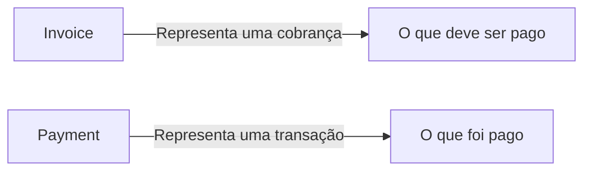
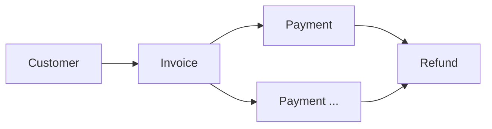

# Invoice

> Modelo canônico do recurso **Invoice** utilizado pela Capability **Payments**.

---

## Objetivo

O recurso **Invoice** representa uma cobrança emitida para um cliente.

Uma Invoice define **o que deve ser pago**, independentemente de o pagamento já ter sido realizado.

Ela pode possuir vencimento, descrição, itens, impostos e estar associada a um ou mais pagamentos.

---

## Filosofia

A Dialyn diferencia o conceito de cobrança do conceito de pagamento.



> Essa separação permite que diferentes provedores sejam convertidos para um mesmo modelo de negócio, independentemente de como cada um trata cobranças e pagamentos.

---

## Modelo Canônico

```typescript
Invoice {
    id: string
    externalId: string
    reference: string
    number: string
    customer: CustomerReference
    description: string
    items: InvoiceItem[]
    subtotal: Money
    discount: Money
    tax: Money
    total: Money
    currency: Currency
    dueDate: datetime
    paidAt: datetime
    status: InvoiceStatus
    createdAt: datetime
    updatedAt: datetime
    metadata: object
}
```

---

## Campos

| Campo | Obrigatório | Descrição |
|--------|:----------:|-----------|
| id | ✔ | Identificador interno |
| externalId | | Identificador do Provider |
| reference | | Referência de negócio |
| number | | Número da cobrança |
| customer | ✔ | Cliente responsável |
| description | | Descrição da cobrança |
| items | | Itens da cobrança |
| subtotal | ✔ | Valor antes de descontos e impostos |
| discount | | Valor de desconto |
| tax | | Valor de impostos |
| total | ✔ | Valor final |
| currency | ✔ | Moeda |
| dueDate | | Data de vencimento |
| paidAt | | Data de liquidação |
| status | ✔ | Estado da cobrança |
| createdAt | ✔ | Data de criação |
| updatedAt | ✔ | Última atualização |
| metadata | | Dados adicionais |

---

## InvoiceItem

Representa um item pertencente à cobrança.

```typescript
InvoiceItem {
    id: string
    description: string
    quantity: decimal
    unitPrice: Money
    total: Money
}
```

---

## InvoiceStatus

```
DRAFT
OPEN
PENDING
PARTIALLY_PAID
PAID
OVERDUE
CANCELED
VOID
```

> Todos os Providers deverão converter seus estados para este enum.

---

## Operações

| Categoria | Operações |
|-----------|-----------|
| ⚡ **Core** | `Create`, `Get`, `List`, `Update`, `Delete` |
| 🔧 **Extended** | `Search`, `Archive`, `Restore`, `Count`, `Exists`, `Send`, `Duplicate` |

---

## DTOs

```
Invoice
├── CreateInvoiceRequest
├── CreateInvoiceResponse
├── UpdateInvoiceRequest
├── UpdateInvoiceResponse
├── GetInvoiceRequest
├── GetInvoiceResponse
├── ListInvoicesRequest
├── ListInvoicesResponse
├── SearchInvoicesRequest
├── SearchInvoicesResponse
├── DeleteInvoiceRequest
├── DeleteInvoiceResponse
├── SendInvoiceRequest
├── SendInvoiceResponse
├── DuplicateInvoiceRequest
├── DuplicateInvoiceResponse
├── ExistsInvoiceRequest
├── ExistsInvoiceResponse
├── CountInvoicesRequest
└── CountInvoicesResponse
```

### CreateInvoiceRequest

```typescript
CreateInvoiceRequest {
    reference: string
    customerId: string
    description: string
    items: InvoiceItem[]
    dueDate: datetime
    metadata: object
}
```

### CreateInvoiceResponse

```typescript
CreateInvoiceResponse {
    invoice: Invoice
}
```

### UpdateInvoiceRequest

```typescript
UpdateInvoiceRequest {
    id: string
    description: string
    dueDate: datetime
    metadata: object
}
```

### UpdateInvoiceResponse

```typescript
UpdateInvoiceResponse {
    invoice: Invoice
}
```

### GetInvoiceRequest

```typescript
GetInvoiceRequest {
    id: string
}
```

### GetInvoiceResponse

```typescript
GetInvoiceResponse {
    invoice: Invoice
}
```

### ListInvoicesRequest

```typescript
ListInvoicesRequest {
    page: integer
    limit: integer
    status: InvoiceStatus
}
```

### ListInvoicesResponse

```typescript
ListInvoicesResponse {
    items: Invoice[]
    total: integer
    page: integer
    pages: integer
}
```

### SearchInvoicesRequest

```typescript
SearchInvoicesRequest {
    query: string
    filters: object
}
```

### SearchInvoicesResponse

```typescript
SearchInvoicesResponse {
    items: Invoice[]
}
```

### DeleteInvoiceRequest

```typescript
DeleteInvoiceRequest {
    id: string
}
```

### DeleteInvoiceResponse

```typescript
DeleteInvoiceResponse {
    invoice: Invoice
}
```

### SendInvoiceRequest

```typescript
SendInvoiceRequest {
    id: string
}
```

### SendInvoiceResponse

```typescript
SendInvoiceResponse {
    invoice: Invoice
}
```

### DuplicateInvoiceRequest

```typescript
DuplicateInvoiceRequest {
    id: string
}
```

### DuplicateInvoiceResponse

```typescript
DuplicateInvoiceResponse {
    invoice: Invoice
}
```

### ExistsInvoiceRequest

```typescript
ExistsInvoiceRequest {
    id: string
}
```

### ExistsInvoiceResponse

```typescript
ExistsInvoiceResponse {
    exists: boolean
}
```

### CountInvoicesRequest

```typescript
CountInvoicesRequest {
    status: InvoiceStatus
}
```

### CountInvoicesResponse

```typescript
CountInvoicesResponse {
    total: integer
}
```

---

## Regras de Validação

| # | Regra |
|---|-------|
| 1 | Uma Invoice deverá possuir pelo menos um item ou um valor total válido, conforme suportado pelo Provider |
| 2 | O valor total deverá ser igual ao subtotal menos descontos mais impostos |
| 3 | O vencimento (`dueDate`) deverá ser igual ou posterior à data de emissão quando informado |
| 4 | A moeda deverá seguir o padrão ISO-4217 |
| 5 | O status deverá pertencer ao enum `InvoiceStatus` |

---

## Regras de Negócio

| # | Regra |
|---|-------|
| 1 | Toda Invoice nasce com status `DRAFT`, `OPEN` ou equivalente, conforme convertido pelo Engine |
| 2 | Uma Invoice `PAID` não poderá ser alterada |
| 3 | O pagamento de uma Invoice deverá refletir no status da cobrança |
| 4 | Uma Invoice poderá estar associada a um ou mais Payments, dependendo das capacidades do Provider |
| 5 | Os Engines deverão converter qualquer estrutura de cobrança para este modelo canônico |

---

## Responsabilidade dos Engines

| # | Responsabilidade |
|---|-----------------|
| 1 | Converter cobranças para o modelo `Invoice` |
| 2 | Normalizar valores monetários |
| 3 | Calcular ou mapear corretamente subtotal, descontos, impostos e total quando aplicável |
| 4 | Converter estados do Provider para `InvoiceStatus` |
| 5 | Nunca expor estruturas proprietárias para a Dialyn |

---

## Princípios

| # | Princípio | Descrição |
|---|-----------|-----------|
| 1 | 🔗 **Independente** | De qualquer provedor de pagamento |
| 2 | 🔄 **Rastreável** | Associação clara entre cobrança e pagamentos |
| 3 | 🧩 **Flexível** | Suporte a pagamentos parciais e múltiplos |
| 4 | 🧊 **Imutável** | Uma Invoice `PAID` não pode ser alterada |
| 5 | 📖 **Documentado** | De forma consistente com a arquitetura |

---

## Benefícios

| # | Benefício |
|---|-----------|
| 1 | 🔗 **Desacoplamento** completo entre cobranças Dialyn e provedores |
| 2 | 🏗️ **Padronização** do ciclo de vida de cobranças |
| 3 | ➕ **Simplificação** da implementação de novos provedores |
| 4 | 📉 **Redução da complexidade** ao separar cobrança de pagamento |
| 5 | 🚀 **Facilidade** para evolução sem impacto na IA |

---

## Relação com outros Resources

O recurso **Invoice** poderá se relacionar com:



- **Customer** — responsável pela cobrança
- **Payment** — transações utilizadas para liquidar a cobrança
- **Refund** — reembolsos associados aos pagamentos dessa cobrança

A relação entre esses Resources deverá ser sempre realizada por meio dos contratos canônicos definidos pela Capability **Payments**.

---

## Veja também

- [README](./README.md)
- [Common Types](./common.md)
- [Relationships](./relationships.md)
- [Glossary](./glossary.md)
- [Customer](./customer.md)
- [Payment](./payment.md)
- [Refund](./refund.md)
