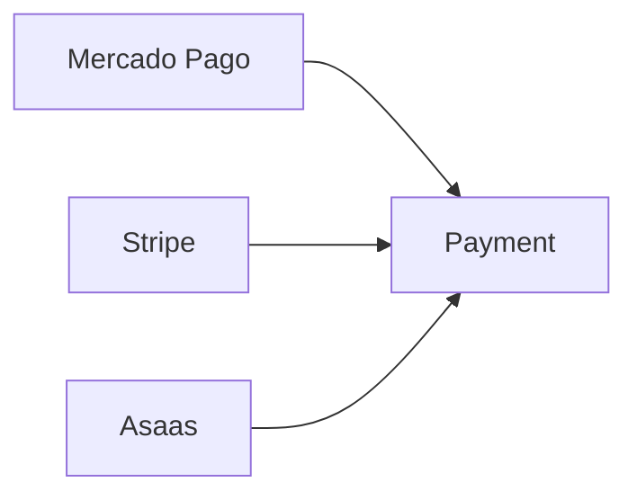

# Payment

> Modelo canônico do recurso **Payment** utilizado pela Arquitetura de Apps da Dialyn.

---

## Objetivo

O recurso **Payment** representa qualquer operação financeira realizada através de um Payments Engine.

Independentemente do provedor utilizado (Stripe, Mercado Pago, Asaas ou qualquer outro), todo pagamento deverá ser convertido para este modelo **antes** de ser utilizado pela Dialyn.

> O Payment é o principal recurso da Capability **Payments** e representa uma cobrança, transação ou recebimento financeiro.

---

## Filosofia

A Dialyn **não conhece gateways de pagamento**. Ela conhece apenas o conceito de um **pagamento**.



> Todos serão convertidos **exatamente para o mesmo modelo**.

---

## Modelo Canônico

```typescript
Payment {
    id: string
    externalId: string
    reference: string
    description: string
    amount: decimal
    currency: string
    status: PaymentStatus
    method: PaymentMethod
    customer: CustomerReference
    expiresAt: datetime
    paidAt: datetime
    createdAt: datetime
    updatedAt: datetime
    metadata: object
}
```

---

## Descrição dos Campos

| Campo | Obrigatório | Descrição |
|-------|:-----------:|-----------|
| `id` | ✅ | Identificador interno da Dialyn |
| `externalId` | ✅ | Identificador retornado pelo Provider |
| `reference` | ✅ | Identificador de negócio da cobrança |
| `description` | ❌ | Descrição da cobrança |
| `amount` | ✅ | Valor da cobrança |
| `currency` | ✅ | Código ISO da moeda |
| `status` | ✅ | Estado atual do pagamento |
| `method` | ✅ | Método utilizado |
| `customer` | ❌ | Referência ao cliente |
| `expiresAt` | ❌ | Data de expiração |
| `paidAt` | ❌ | Data da confirmação |
| `createdAt` | ✅ | Data de criação |
| `updatedAt` | ✅ | Última atualização |
| `metadata` | ❌ | Informações adicionais |

---

## PaymentStatus

Todos os Engines deverão converter seus status para um destes valores.

| Status | Descrição |
|--------|-----------|
| `PENDING` | Aguardando processamento |
| `PROCESSING` | Em processamento |
| `AUTHORIZED` | Autorizado |
| `APPROVED` | Aprovado |
| `PARTIALLY_PAID` | Parcialmente pago |
| `REFUNDED` | Reembolsado |
| `PARTIALLY_REFUNDED` | Parcialmente reembolsado |
| `FAILED` | Falhou |
| `CANCELED` | Cancelado |
| `EXPIRED` | Expirado |

> Nenhum status específico de Provider poderá ser exposto para a Dialyn.

---

## PaymentMethod

Métodos de pagamento suportados.

| Método | Descrição |
|--------|-----------|
| `PIX` | Pagamento instantâneo brasileiro |
| `CREDIT_CARD` | Cartão de crédito |
| `DEBIT_CARD` | Cartão de débito |
| `BOLETO` | Boleto bancário |
| `BANK_TRANSFER` | Transferência bancária |
| `WALLET` | Carteira digital |
| `CASH` | Dinheiro |
| `OTHER` | Outro |

> Novos métodos poderão ser adicionados futuramente **sem alterar a arquitetura**.

---

## CustomerReference

Representa uma referência **simplificada** ao cliente.

```typescript
CustomerReference {
    id: string
    name: string
    email: string
}
```

---

## Operações Suportadas

### Core Operations

| Operação | Descrição |
|----------|-----------|
| `Create` | Criar pagamento |
| `Get` | Obter pagamento |
| `List` | Listar pagamentos |
| `Update` | Atualizar pagamento |

### Extended Operations

| Operação | Descrição |
|----------|-----------|
| `Search` | Pesquisar pagamentos |
| `Cancel` | Cancelar pagamento |
| `Refund` | Reembolsar pagamento |
| `Count` | Contar pagamentos |
| `Exists` | Verificar existência |

---

## DTOs

### CreatePaymentRequest

```typescript
CreatePaymentRequest {
    reference: string
    description: string
    amount: decimal
    currency: string
    method: PaymentMethod
    customerId: string
    expiresAt: datetime
    metadata: object
}
```

### CreatePaymentResponse

```typescript
CreatePaymentResponse {
    payment: Payment
}
```

---

### UpdatePaymentRequest

```typescript
UpdatePaymentRequest {
    id: string
    description: string
    expiresAt: datetime
    metadata: object
}
```

### UpdatePaymentResponse

```typescript
UpdatePaymentResponse {
    payment: Payment
}
```

---

### GetPaymentRequest / GetPaymentResponse

| Request | Response |
|---------|----------|
| `GetPaymentRequest { id: string }` | `GetPaymentResponse { payment: Payment }` |

### ListPaymentsRequest / ListPaymentsResponse

| Request | Response |
|---------|----------|
| `ListPaymentsRequest { page, limit, status, customerId }` | `ListPaymentsResponse { items: Payment[], total, page, pages }` |

### SearchPaymentsRequest / SearchPaymentsResponse

| Request | Response |
|---------|----------|
| `SearchPaymentsRequest { query, filters }` | `SearchPaymentsResponse { items: Payment[] }` |

### CancelPaymentRequest / CancelPaymentResponse

| Request | Response |
|---------|----------|
| `CancelPaymentRequest { id, reason }` | `CancelPaymentResponse { payment: Payment }` |

### RefundPaymentRequest / RefundPaymentResponse

| Request | Response |
|---------|----------|
| `RefundPaymentRequest { id, amount, reason }` | `RefundPaymentResponse { payment: Payment }` |

### ExistsPaymentRequest / ExistsPaymentResponse

| Request | Response |
|---------|----------|
| `ExistsPaymentRequest { id }` | `ExistsPaymentResponse { exists: boolean }` |

### CountPaymentsRequest / CountPaymentsResponse

| Request | Response |
|---------|----------|
| `CountPaymentsRequest { status }` | `CountPaymentsResponse { total: integer }` |

---

## Regras de Validação

| # | Regra |
|---|-------|
| 1 | O valor (`amount`) deverá ser **maior que zero** |
| 2 | A moeda deverá seguir o padrão **ISO-4217** |
| 3 | O método de pagamento deverá pertencer ao enum `PaymentMethod` |
| 4 | O status deverá pertencer ao enum `PaymentStatus` |
| 5 | O `externalId` somente poderá ser preenchido **após a criação** no Provider |
| 6 | O campo `paidAt` somente poderá existir quando o pagamento estiver **confirmado** |
| 7 | O `expiresAt` deverá ser **maior que a data atual** quando informado |

---

## Regras de Negócio

| # | Regra |
|---|-------|
| 1 | Todo pagamento nasce com status **`PENDING`**, salvo quando o Provider retornar um estado diferente de forma síncrona |
| 2 | Um pagamento **cancelado** não poderá voltar para `PENDING` |
| 3 | Um pagamento **aprovado** não poderá ser removido |
| 4 | O reembolso deverá gerar um recurso **`Refund`**, mantendo o `Payment` como histórico da transação |
| 5 | Todo Engine deverá **converter** seus estados internos para os enums definidos neste documento |

---

## Responsabilidade dos Engines

Todo Payments Engine deverá:

| # | Responsabilidade |
|---|------------------|
| 1 | 🔄 Converter qualquer modelo externo para o modelo **`Payment`** |
| 2 | 🔄 Converter enums específicos para **`PaymentStatus`** |
| 3 | 🔄 Converter métodos de pagamento para **`PaymentMethod`** |
| 4 | 📦 Preencher os **DTOs** definidos neste documento |
| 5 | 🚫 **Nunca** expor campos específicos do Provider para a Dialyn |

---

## Evolução

| Situação | Ação |
|----------|------|
| ➕ Novos atributos | Podem ser adicionados desde que mantenham **compatibilidade retroativa** |
| 🔄 Alterações incompatíveis | Devem ser introduzidas através de **versionamento** dos DTOs |

# Veja também

- [README](./README.md)
- [Common Types](./common.md)
- [Relationships](./relationships.md)
- [Glossary](./glossary.md)
- [Customer](./customer.md)
- [Invoice](./invoice.md)
- [Refund](./refund.md)