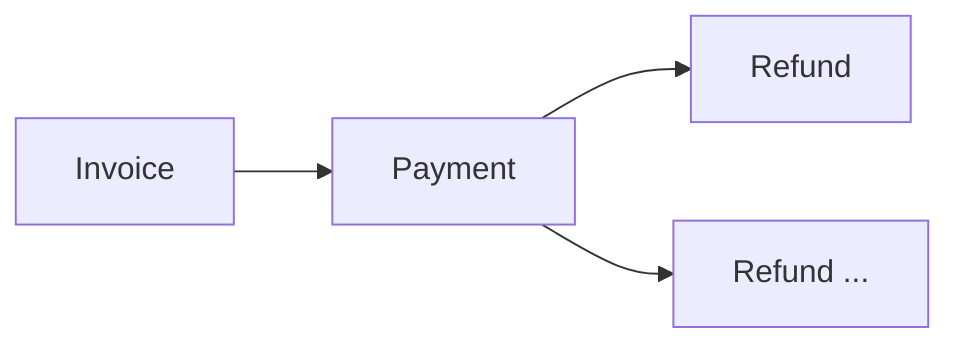
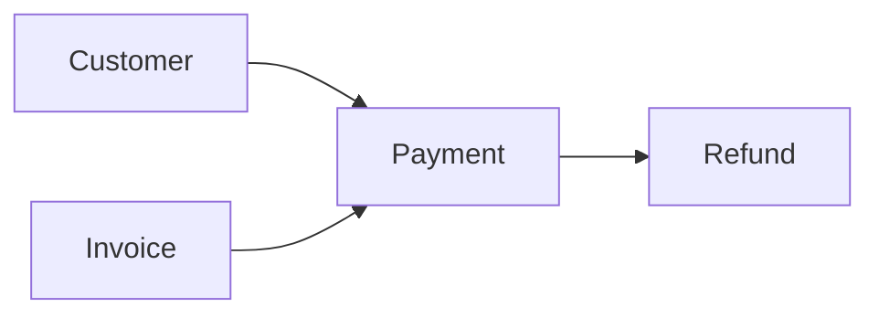

# Refund

> Modelo canônico do recurso **Refund** utilizado pela Capability **Payments**.

---

## Objetivo

O recurso **Refund** representa uma operação de reversão financeira realizada sobre um pagamento previamente efetuado.

Independentemente do provedor utilizado, qualquer solicitação de estorno deverá ser convertida para este modelo canônico.

O Refund representa o ciclo completo do processo de reembolso, desde sua criação até sua conclusão.

---

## Filosofia

Uma cobrança gera um pagamento. Um pagamento pode gerar um ou mais reembolsos.



> Essa separação permite representar diferentes modelos suportados pelos provedores, incluindo reembolsos parciais, múltiplos reembolsos e processamento assíncrono.

---

## Modelo Canônico

```typescript
Refund {
    id: string
    externalId: string
    reference: string
    paymentId: string
    customer: CustomerReference
    amount: Money
    currency: Currency
    reason: RefundReason
    status: RefundStatus
    requestedAt: datetime
    processedAt: datetime
    metadata: object
}
```

---

## Campos

| Campo | Obrigatório | Descrição |
|--------|:----------:|-----------|
| id | ✔ | Identificador interno |
| externalId | | Identificador do Provider |
| reference | | Referência da operação |
| paymentId | ✔ | Pagamento relacionado |
| customer | ✔ | Cliente relacionado |
| amount | ✔ | Valor do reembolso |
| currency | ✔ | Moeda |
| reason | | Motivo do reembolso |
| status | ✔ | Estado atual |
| requestedAt | ✔ | Data da solicitação |
| processedAt | | Data de conclusão |
| metadata | | Informações adicionais |

---

## RefundStatus

```
PENDING
PROCESSING
COMPLETED
FAILED
CANCELED
```

> Todos os Engines deverão converter os estados do Provider para este enum.

---

## RefundReason

```
REQUESTED_BY_CUSTOMER
DUPLICATE_PAYMENT
FRAUD
ORDER_CANCELED
PRODUCT_RETURNED
OTHER
```

Cada Provider poderá possuir seus próprios motivos, porém deverão ser convertidos para este modelo sempre que possível.

---

## Operações

| Categoria | Operações |
|-----------|-----------|
| ⚡ **Core** | `Create`, `Get`, `List` |
| 🔧 **Extended** | `Search`, `Count`, `Exists`, `Cancel` |

> Um Refund normalmente não poderá ser atualizado nem removido após sua criação, pois representa uma operação financeira auditável.

---

## DTOs

```
Refund
├── CreateRefundRequest
├── CreateRefundResponse
├── GetRefundRequest
├── GetRefundResponse
├── ListRefundsRequest
├── ListRefundsResponse
├── SearchRefundsRequest
├── SearchRefundsResponse
├── CancelRefundRequest
├── CancelRefundResponse
├── ExistsRefundRequest
├── ExistsRefundResponse
├── CountRefundsRequest
└── CountRefundsResponse
```

### CreateRefundRequest

```typescript
CreateRefundRequest {
    paymentId: string
    amount: Money
    reason: RefundReason
    metadata: object
}
```

### CreateRefundResponse

```typescript
CreateRefundResponse {
    refund: Refund
}
```

### GetRefundRequest

```typescript
GetRefundRequest {
    id: string
}
```

### GetRefundResponse

```typescript
GetRefundResponse {
    refund: Refund
}
```

### ListRefundsRequest

```typescript
ListRefundsRequest {
    page: integer
    limit: integer
    status: RefundStatus
}
```

### ListRefundsResponse

```typescript
ListRefundsResponse {
    items: Refund[]
    total: integer
    page: integer
    pages: integer
}
```

### SearchRefundsRequest

```typescript
SearchRefundsRequest {
    query: string
    filters: object
}
```

### SearchRefundsResponse

```typescript
SearchRefundsResponse {
    items: Refund[]
}
```

### CancelRefundRequest

```typescript
CancelRefundRequest {
    id: string
}
```

### CancelRefundResponse

```typescript
CancelRefundResponse {
    refund: Refund
}
```

### ExistsRefundRequest

```typescript
ExistsRefundRequest {
    id: string
}
```

### ExistsRefundResponse

```typescript
ExistsRefundResponse {
    exists: boolean
}
```

### CountRefundsRequest

```typescript
CountRefundsRequest {
    status: RefundStatus
}
```

### CountRefundsResponse

```typescript
CountRefundsResponse {
    total: integer
}
```

---

## Regras de Validação

| # | Regra |
|---|-------|
| 1 | Todo Refund deverá estar associado a um Payment existente |
| 2 | O valor do reembolso deverá ser maior que zero |
| 3 | O valor total dos reembolsos não poderá ultrapassar o valor originalmente pago, salvo comportamento específico convertido pelo Engine |
| 4 | O status deverá pertencer ao enum `RefundStatus` |
| 5 | O motivo deverá utilizar um valor definido em `RefundReason`, quando informado |

---

## Regras de Negócio

| # | Regra |
|---|-------|
| 1 | Um pagamento poderá possuir múltiplos reembolsos |
| 2 | Um reembolso poderá ser parcial ou integral |
| 3 | A criação de um Refund não garante sua conclusão imediata; alguns provedores processam essa operação de forma assíncrona |
| 4 | O estado final do reembolso deverá ser sincronizado pelo Engine, preferencialmente através de Webhooks |
| 5 | Após concluído, um Refund não deverá ser alterado |

---

## Responsabilidade dos Engines

| # | Responsabilidade |
|---|-----------------|
| 1 | Converter reembolsos do Provider para o modelo `Refund` |
| 2 | Normalizar valores monetários |
| 3 | Converter estados proprietários para `RefundStatus` |
| 4 | Mapear motivos específicos para `RefundReason` quando possível |
| 5 | Acompanhar atualizações assíncronas utilizando Webhooks sempre que disponíveis |

---

## Princípios

| # | Princípio | Descrição |
|---|-----------|-----------|
| 1 | 🔗 **Independente** | De qualquer provedor de pagamento |
| 2 | 🔄 **Auditável** | Registro de reversão financeira imutável |
| 3 | 🧩 **Flexível** | Suporte a reembolsos parciais e múltiplos |
| 4 | ⏳ **Assíncrono** | Processamento pode não ser imediato |
| 5 | 📖 **Documentado** | De forma consistente com a arquitetura |

---

## Benefícios

| # | Benefício |
|---|-----------|
| 1 | 🔗 **Desacoplamento** completo entre reembolsos Dialyn e provedores |
| 2 | 🏗️ **Padronização** do ciclo de vida de reembolsos |
| 3 | ➕ **Simplificação** da implementação de novos provedores |
| 4 | 📉 **Redução da complexidade** ao tratar reembolsos de forma unificada |
| 5 | 🚀 **Facilidade** para evolução sem impacto na IA |

---

## Relação com outros Resources

O recurso **Refund** se relaciona diretamente com:



- **Payment** — operação financeira que está sendo revertida
- **Customer** — cliente associado ao pagamento
- **Invoice** — cobrança original, quando aplicável

Todas essas relações deverão utilizar os contratos canônicos definidos pela Capability **Payments**, mantendo a independência em relação aos provedores externos.

---

## Veja também

- [README](./README.md)
- [Common Types](./common.md)
- [Relationships](./relationships.md)
- [Glossary](./glossary.md)
- [Customer](./customer.md)
- [Payment](./payment.md)
- [Invoice](./invoice.md)
