# Relationships

> Relacionamentos entre os Resources da Capability **Payments**.

---

## Objetivo

Este documento define como os Resources da Capability **Payments** se relacionam entre si.

Esses relacionamentos representam exclusivamente o modelo de domínio da Dialyn e não refletem, necessariamente, a implementação utilizada pelos Providers.

O objetivo é fornecer uma visão única do domínio financeiro utilizada por todos os Engines.

---

## Filosofia

Os relacionamentos definidos nesta documentação representam conceitos de negócio.

Eles não devem ser interpretados como relacionamentos de banco de dados, nem como estruturas específica
> Cada Engine será responsável por converter os modelos dos Providers para este modelo canônico.

---

## Modelo do Domínio

A Capability Payments é composta pelos seguintes Resources.

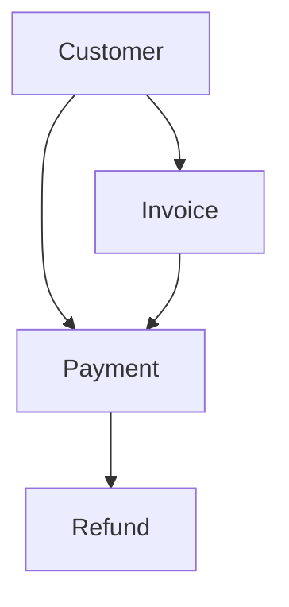

---

## Customer

Representa uma entidade financeira.

Um Customer pode possuir:
- diversas cobranças
- diversos pagamentos
- diversos reembolsos

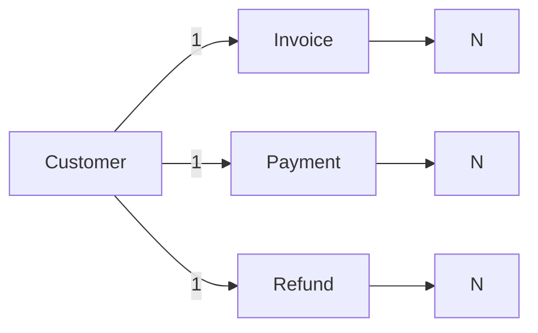

**Cardinalidade:** `1 : N` para Invoice, Payment e Refund.

---

## Invoice

Uma Invoice representa uma cobrança. Ela existe independentemente do pagamento.

Uma Invoice poderá:
- ainda não possuir pagamento
- possuir pagamento parcial
- possuir pagamento integral
- ser cancelada

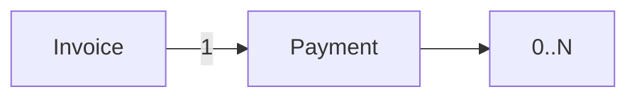

**Cardinalidade:** `1 : 0..N` para Payment.

### Exemplos

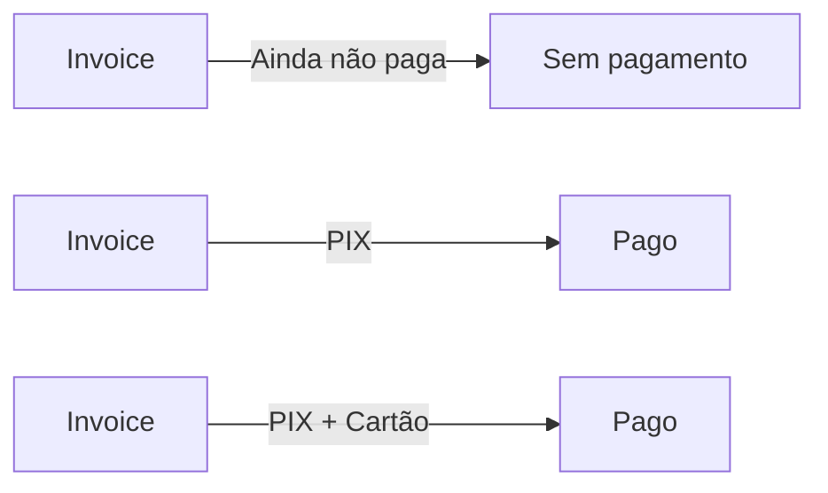

> Essa estrutura permite representar pagamentos parciais e múltiplos meios de pagamento.

---

## Payment

Representa uma transação financeira.

Um Payment sempre pertence a um Customer. Opcionalmente poderá estar associado a uma Invoice.

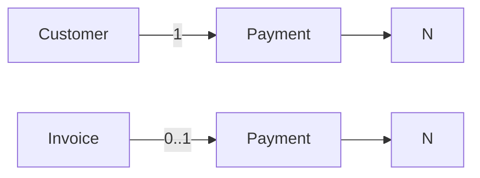

**Cardinalidade:**
- Customer `1 : N` Payment
- Invoice `0..1 : N` Payment

> Nem todo pagamento precisa nascer de uma cobrança formal. Exemplo: Payment Link, Checkout, POS.

---

## Refund

Representa uma reversão financeira.

Todo Refund deverá estar associado a um Payment.

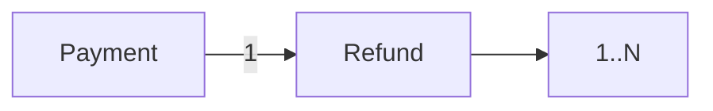

**Cardinalidade:** `1 : N` para Refund.

### Exemplo

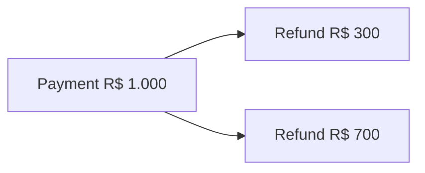

> Isso permite múltiplos reembolsos parciais.

---

## Fluxo Financeiro

O fluxo financeiro mais comum da plataforma pode ser representado da seguinte forma.

---

## Fluxos Alternativos

### Pagamento direto

Nem todo pagamento necessita de uma Invoice.

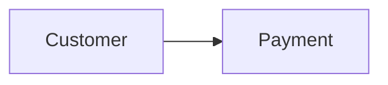

Exemplos: Payment Link, Checkout, POS, Cobrança avulsa.

---

### Cobrança sem pagamento

Uma Invoice poderá existir indefinidamente sem possuir pagamentos.

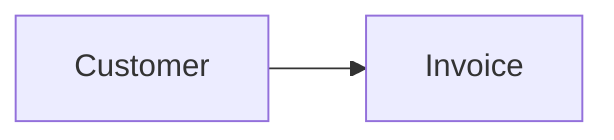

Status possíveis: `OPEN`, `PENDING`, `OVERDUE`.

---

### Pagamento parcial

Uma Invoice poderá receber diversos pagamentos.

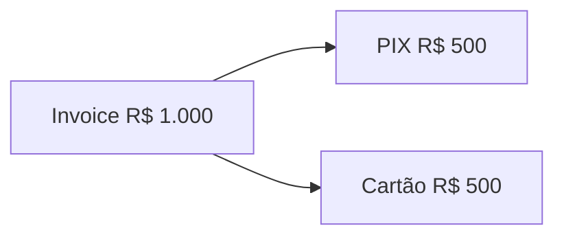

---

### Reembolso parcial

Um Payment poderá possuir vários Refunds.

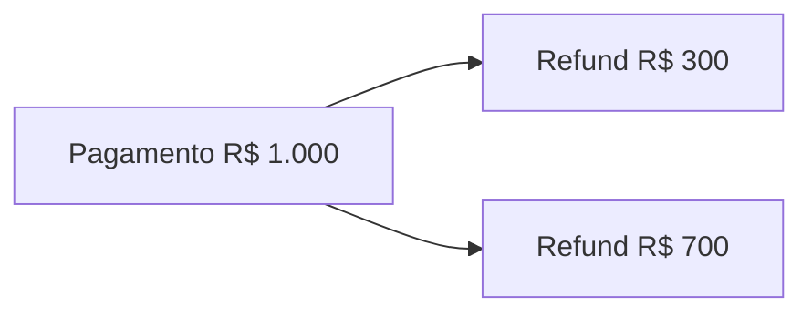

---

## Independência dos Providers

Esses relacionamentos não representam modelos específicos de APIs externas. Cada Provider possui sua própria estrutura.

| Provider | Estrutura |
|----------|-----------|
| 💳 Stripe | `Customer → PaymentIntent → Charge → Refund` |
| 💰 Mercado Pago | `Payer → Payment → Refund` |
| 🏦 Asaas | `Customer → Payment → Refund` |

> Independentemente dessas diferenças, todos os Engines deverão converter os dados para os Resources definidos nesta Capability.

---

## Responsabilidade dos Engines

| # | Responsabilidade |
|---|-----------------|
| 1 | Converter os relacionamentos do Provider para o modelo canônico |
| 2 | Manter a integridade entre os Resources |
| 3 | Evitar dependência direta de identificadores externos |
| 4 | Preservar as cardinalidades definidas neste documento sempre que suportadas pelo Provider |

---

## Princípios

| # | Princípio | Descrição |
|---|-----------|-----------|
| 1 | 🔗 **Independência** | De provedores externos |
| 2 | 🔗 **Baixo acoplamento** | Resources independentes entre si |
| 3 | 🧩 **Alta coesão** | Cada Resource com responsabilidade bem definida |
| 4 | 🔄 **Reutilização** | Dos Resources entre diferentes fluxos |
| 5 | 📖 **Consistência** | Dos contratos em toda a plataforma |
| 6 | 🏗️ **Padronização** | Entre todos os Engines da Capability |

---

## Benefícios

| # | Benefício |
|---|-----------|
| 1 | 🔗 **Visão única** do domínio financeiro para todos os Engines |
| 2 | 🏗️ **Padronização** dos relacionamentos entre Resources |
| 3 | ➕ **Simplificação** da integração de novos provedores |
| 4 | 📉 **Redução da complexidade** ao isolar o modelo de domínio |
| 5 | 🚀 **Facilidade** para evolução sem impacto na IA |

---

## Resumo

A estrutura conceitual da Capability Payments é representada pelo seguinte modelo.

Cada Resource possui uma responsabilidade específica:

| Resource | Responsabilidade |
|----------|------------------|
| **Customer** | Representa o cliente financeiro |
| **Invoice** | Representa uma cobrança |
| **Payment** | Representa uma transação financeira |
| **Refund** | Representa uma reversão financeira |

> Essa separação permite que diferentes provedores sejam integrados sem alterar o modelo de domínio da Dialyn.

---

## Veja também

- [README](./README.md)
- [Common Types](./common.md)
- [Glossary](./glossary.md)
- [Customer](./customer.md)
- [Payment](./payment.md)
- [Invoice](./invoice.md)

---