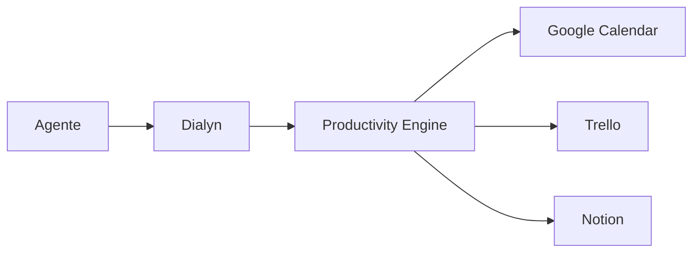

# Productivity

> Capability responsável pela integração da Dialyn com plataformas de produtividade.

---

## Objetivo

A Capability **Productivity** fornece um modelo canônico para integração com plataformas de produtividade, colaboração e gerenciamento de tarefas.

Seu objetivo é abstrair as diferenças entre diferentes Providers, permitindo que Agentes e Engines trabalhem utilizando um único conjunto de contratos.

> A Dialyn nunca se comunica diretamente com Google Calendar, Trello, Notion ou qualquer outro Provider. Toda comunicação ocorre através do **Productivity Engine**, responsável por converter o modelo canônico da Dialyn para a API específica de cada plataforma.

---

## Filosofia

Cada plataforma de produtividade possui sua própria estrutura de dados.

| Provider | Estrutura |
|----------|-----------|
| Google Calendar | Calendars e Events |
| Trello | Boards, Lists e Cards |
| Notion | Pages, Databases e Blocks |

> Apesar dessas diferenças, todas compartilham conceitos semelhantes. A Capability Productivity define um modelo canônico para representar esses conceitos de forma unificada.

---

## Arquitetura



> O Agente nunca conhece o Provider. Ele solicita apenas operações sobre Resources da Capability.

---

## Providers Suportados

| Provider | Categoria |
|----------|-----------|
| Google Calendar | Calendário |
| Trello | Gestão de tarefas |
| Notion | Workspace colaborativo |

> Novos Providers poderão ser adicionados futuramente sem alteração do contrato da Capability.

---

## Resources

A Capability Productivity é composta pelos seguintes Resources.

| Resource | Objetivo |
|----------|----------|
| Calendar | Representa calendários |
| Event | Representa eventos e compromissos |
| Task | Representa tarefas |
| Board | Representa quadros de trabalho |
| Card | Representa cartões de trabalho |
| Page | Representa páginas de conteúdo |
| Database | Representa bases estruturadas |
| Block | Representa blocos de conteúdo |

Cada Resource possui sua própria documentação contendo modelo canônico, DTOs, operações, regras de negócio e compatibilidade entre Providers.

---

## Tipos Compartilhados

Os tipos reutilizados pelos Resources encontram-se em [common.md](./common.md). Este documento define estruturas compartilhadas como `DateTimeRange`, `UserReference`, `WorkspaceReference` e `Metadata`.

---

## Relacionamentos

Os relacionamentos entre os Resources encontram-se em [relationships.md](./relationships.md). Este documento descreve como Calendars, Events, Tasks, Boards, Cards, Pages e Databases se relacionam.

---

## Glossário

Os conceitos utilizados pela Capability encontram-se em [glossary.md](./glossary.md). Este documento padroniza a terminologia utilizada independentemente do Provider.

---

## Operações

### Core (obrigatórias)

| Operação | Objetivo |
|----------|----------|
| Create | Criar Resource |
| Get | Consultar Resource |
| List | Listar Resources |
| Update | Atualizar Resource |
| Delete | Remover Resource |

### Extended (opcionais)

| Operação | Objetivo |
|----------|----------|
| Search | Pesquisar |
| Archive | Arquivar |
| Restore | Restaurar |
| Move | Mover |
| Assign | Atribuir |
| Duplicate | Duplicar |
| Export | Exportar |
| Import | Importar |

---

## Compatibilidade

A Capability Productivity foi projetada para abstrair diferentes plataformas de produtividade mantendo um único contrato de integração.

> Cada Productivity Engine deverá converter seus modelos internos para os Resources definidos nesta documentação.

---

## Estrutura

```
productivity/
├── README.md
├── common.md
├── relationships.md
├── glossary.md
├── calendar.md
├── event.md
├── task.md
├── board.md
├── card.md
├── page.md
├── database.md
└── block.md
```

---

## Responsabilidade do Productivity Engine

| # | Responsabilidade |
|---|-----------------|
| 1 | Converter os modelos dos Providers para o modelo canônico |
| 2 | Preservar informações específicas em `Metadata` |
| 3 | Implementar as operações obrigatórias definidas pela arquitetura |
| 4 | Manter compatibilidade entre diferentes plataformas |

---

## Princípios

| # | Princípio | Descrição |
|---|-----------|-----------|
| 1 | 🔗 **Independência** | De qualquer plataforma de produtividade |
| 2 | 🏗️ **Modelo único** | Um modelo canônico para todos os Providers |
| 3 | 🔄 **Baixo acoplamento** | Resources relacionados via `Reference` |
| 4 | 📖 **Contratos estáveis** | Que não mudam com a troca de Provider |
| 5 | 🚫 **Conversão isolada** | Realizada exclusivamente pelo Productivity Engine |

---

## Benefícios

| # | Benefício |
|---|-----------|
| 1 | 🔗 **Desacoplamento** completo entre a Dialyn e plataformas de produtividade |
| 2 | 🏗️ **Padronização** da representação de tarefas, eventos e documentos |
| 3 | ➕ **Simplificação** da integração de novos Providers |
| 4 | 📉 **Redução da complexidade** ao unificar calendários, quadros e páginas |
| 5 | 🚀 **Facilidade** para evolução sem impacto na IA |

---

## Veja também

| Documento | Objetivo |
|-----------|----------|
| [common.md](./common.md) | Tipos compartilhados |
| [relationships.md](./relationships.md) | Relacionamentos entre Resources |
| [glossary.md](./glossary.md) | Conceitos da Capability |
| [calendar.md](./calendar.md) | Calendários |
| [event.md](./event.md) | Eventos |
| [task.md](./task.md) | Tarefas |
| [board.md](./board.md) | Quadros |
| [card.md](./card.md) | Cartões |
| [page.md](./page.md) | Páginas |
| [database.md](./database.md) | Bases de dados |
| [block.md](./block.md) | Blocos de conteúdo |
