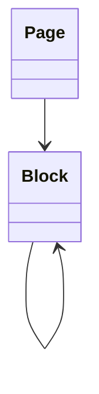

# Block

> Resource responsável por representar blocos de conteúdo na Capability **Productivity**.

---

## Objetivo

O Resource **Block** representa a menor unidade de conteúdo estruturado dentro de um documento.

Seu objetivo é padronizar a representação de blocos entre diferentes plataformas de produtividade, permitindo que a Dialyn utilize um único modelo canônico independentemente do Provider.

> Todo Productivity Engine deverá converter os modelos de Block do Provider para este Resource.

---

## Filosofia

| Provider | Entidade |
|----------|----------|
| ☁️ Notion | `Block` |
| 🟠 Coda | `Block` |
| 🔵 Confluence | `Content Node` |
| 🟢 Slite | `Block` |
| ✅ **Dialyn** | **`Block`** |

> Cada Provider possui dezenas de tipos próprios, porém todos podem ser convertidos para um modelo canônico. O Productivity Engine é responsável por converter esses modelos para o contrato definido pela Dialyn.

---

## Modelo Canônico

```typescript
Block {
    id: string
    externalId: string
    page: PageReference
    parent: BlockReference
    type: BlockType
    content: Content
    position: integer
    archived: boolean
    createdAt: datetime
    updatedAt: datetime
    metadata: Metadata
}
```

---

## Campos

| Campo | Tipo | Obrigatório | Descrição |
|--------|------|:-----------:|-----------|
| id | string | ✔ | Identificador interno |
| externalId | string | | Identificador do Provider |
| page | PageReference | ✔ | Página proprietária |
| parent | BlockReference | | Bloco pai |
| type | BlockType | ✔ | Tipo do bloco |
| content | Content | ✔ | Conteúdo do bloco |
| position | integer | ✔ | Ordem dentro da página |
| archived | boolean | | Indica se o bloco está arquivado |
| createdAt | datetime | ✔ | Data de criação |
| updatedAt | datetime | | Última atualização |
| metadata | Metadata | | Informações específicas do Provider |

---

## Operações

### Core (obrigatórias)

| Operação | Objetivo |
|----------|----------|
| Create | Criar Block |
| Get | Consultar Block |
| List | Listar Blocks |
| Update | Atualizar Block |
| Delete | Remover Block |

### Extended (opcionais)

| Operação | Objetivo |
|----------|----------|
| Search | Pesquisar Blocks |
| Exists | Verificar existência |
| Count | Contabilizar Blocks |
| Move | Reordenar ou mover |
| Duplicate | Duplicar Block |
| Archive | Arquivar |
| Restore | Restaurar |

---

## DTOs

Este Resource define os seguintes contratos.

| DTO | Objetivo |
|------|----------|
| CreateBlockRequest | Criar Block |
| CreateBlockResponse | Resultado da criação |
| GetBlockRequest | Consultar Block |
| GetBlockResponse | Resultado da consulta |
| ListBlocksRequest | Listagem paginada |
| ListBlocksResponse | Lista de Blocks |
| UpdateBlockRequest | Atualizar Block |
| UpdateBlockResponse | Resultado da atualização |
| DeleteBlockRequest | Remover Block |
| DeleteBlockResponse | Resultado da remoção |

### DTOs Opcionais

| DTO | Objetivo |
|------|----------|
| SearchBlocksRequest | Pesquisar Blocks |
| SearchBlocksResponse | Resultado da pesquisa |
| MoveBlockRequest | Mover Block |
| MoveBlockResponse | Resultado da movimentação |
| DuplicateBlockRequest | Duplicar Block |
| DuplicateBlockResponse | Resultado da duplicação |
| ArchiveBlockRequest | Arquivar Block |
| ArchiveBlockResponse | Resultado |
| RestoreBlockRequest | Restaurar Block |
| RestoreBlockResponse | Resultado |

---

## Relacionamentos



---

## Regras de Negócio

| # | Regra |
|---|-------|
| 1 | Todo Block deverá possuir um identificador único |
| 2 | Todo Block deverá pertencer a uma Page |
| 3 | Um Block poderá possuir um Block pai |
| 4 | Um Block poderá possuir múltiplos Blocks filhos |
| 5 | A posição deverá determinar a ordem de renderização |
| 6 | Informações específicas do Provider deverão ser armazenadas em `Metadata` |

---

## Responsabilidade do Productivity Engine

| # | Responsabilidade |
|---|-----------------|
| 1 | Converter Blocks do Provider para o modelo canônico |
| 2 | Preservar identificadores externos |
| 3 | Manter a hierarquia entre Blocks |
| 4 | Preservar a ordem dos Blocks |
| 5 | Preservar informações específicas em `Metadata` |

---

## Princípios

| # | Princípio | Descrição |
|---|-----------|-----------|
| 1 | 🔗 **Independente** | De qualquer plataforma de documentos |
| 2 | 🔄 **Rastreável** | Hierarquia e ordem dos blocos preservada |
| 3 | 🧩 **Flexível** | Suporte a diferentes tipos de conteúdo e aninhamento |
| 4 | 📖 **Documentado** | De forma consistente com a arquitetura |
| 5 | 🚫 **Abstraído** | Normaliza Block, Content Node e variações |

---

## Benefícios

| # | Benefício |
|---|-----------|
| 1 | 🔗 **Desacoplamento** completo entre blocos Dialyn e Providers |
| 2 | 🏗️ **Padronização** da representação de conteúdo estruturado |
| 3 | ➕ **Simplificação** da integração de novos Providers |
| 4 | 📉 **Redução da complexidade** ao unificar o modelo de bloco |
| 5 | 🚀 **Facilidade** para evolução sem impacto na IA |

---

## Compatibilidade

Este Resource foi projetado para suportar:

- Notion
- Coda
- Confluence
- Slite

> Novos Providers deverão reutilizar este contrato sempre que possível.

---

## Veja também

| Documento | Objetivo |
|-----------|----------|
| [common.md](./common.md) | Tipos compartilhados |
| [glossary.md](./glossary.md) | Conceitos da Capability |
| [relationships.md](./relationships.md) | Relacionamentos |
| [page.md](./page.md) | Documentos |
| [database.md](./database.md) | Bases de dados |
