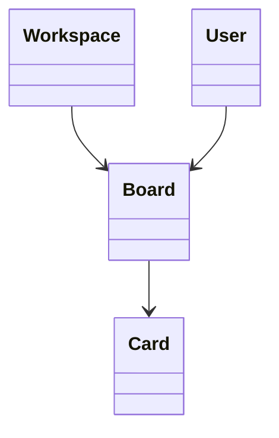

# Board

> Resource responsável por representar quadros de trabalho na Capability **Productivity**.

---

## Objetivo

O Resource **Board** representa um espaço de organização utilizado para agrupar e acompanhar unidades de trabalho.

Seu objetivo é padronizar a representação de quadros entre diferentes plataformas de produtividade, permitindo que a Dialyn utilize um único modelo canônico independentemente do Provider.

> Todo Productivity Engine deverá converter os modelos de Board do Provider para este Resource.

---

## Filosofia

| Provider | Entidade |
|----------|----------|
| ☁️ Trello | `Board` |
| 🟠 Jira | `Project` |
| 🔵 ClickUp | `Space` |
| 🟢 Monday.com | `Board` |
| 🟡 Notion | `Database (Kanban)` |
| ✅ **Dialyn** | **`Board`** |

> Apesar das diferenças de nomenclatura, todos representam um agrupador de trabalho. O Productivity Engine é responsável por converter esses modelos para o contrato definido pela Dialyn.

---

## Modelo Canônico

```typescript
Board {
    id: string
    externalId: string
    workspace: WorkspaceReference
    owner: UserReference
    name: string
    description: string
    layout: BoardLayout
    visibility: Visibility
    color: string
    isArchived: boolean
    createdAt: datetime
    updatedAt: datetime
    metadata: Metadata
}
```

---

## Campos

| Campo | Tipo | Obrigatório | Descrição |
|--------|------|:-----------:|-----------|
| id | string | ✔ | Identificador interno |
| externalId | string | | Identificador do Provider |
| workspace | WorkspaceReference | ✔ | Workspace associado |
| owner | UserReference | | Proprietário do Board |
| name | string | ✔ | Nome do Board |
| description | string | | Descrição |
| layout | BoardLayout | | Tipo de layout |
| visibility | Visibility | | Visibilidade |
| color | string | | Cor utilizada pelo Provider |
| isArchived | boolean | | Indica se o Board está arquivado |
| createdAt | datetime | ✔ | Data de criação |
| updatedAt | datetime | | Última atualização |
| metadata | Metadata | | Dados específicos do Provider |

---

## Operações

### Core (obrigatórias)

| Operação | Objetivo |
|----------|----------|
| Create | Criar Board |
| Get | Consultar Board |
| List | Listar Boards |
| Update | Atualizar Board |
| Delete | Remover Board |

### Extended (opcionais)

| Operação | Objetivo |
|----------|----------|
| Search | Pesquisar Boards |
| Exists | Verificar existência |
| Count | Contabilizar Boards |
| Archive | Arquivar Board |
| Restore | Restaurar Board |
| Duplicate | Duplicar Board |
| Share | Compartilhar Board |

---

## DTOs

Este Resource define os seguintes contratos.

| DTO | Objetivo |
|------|----------|
| CreateBoardRequest | Criar Board |
| CreateBoardResponse | Resultado da criação |
| GetBoardRequest | Consultar Board |
| GetBoardResponse | Resultado da consulta |
| ListBoardsRequest | Listagem paginada |
| ListBoardsResponse | Lista de Boards |
| UpdateBoardRequest | Atualizar Board |
| UpdateBoardResponse | Resultado da atualização |
| DeleteBoardRequest | Remover Board |
| DeleteBoardResponse | Resultado da remoção |

### DTOs Opcionais

| DTO | Objetivo |
|------|----------|
| SearchBoardsRequest | Pesquisar Boards |
| SearchBoardsResponse | Resultado da pesquisa |
| ArchiveBoardRequest | Arquivar Board |
| ArchiveBoardResponse | Resultado do arquivamento |
| RestoreBoardRequest | Restaurar Board |
| RestoreBoardResponse | Resultado da restauração |
| DuplicateBoardRequest | Duplicar Board |
| DuplicateBoardResponse | Resultado da duplicação |
| ShareBoardRequest | Compartilhar Board |
| ShareBoardResponse | Resultado do compartilhamento |

---

## Relacionamentos



---

## Regras de Negócio

| # | Regra |
|---|-------|
| 1 | Todo Board deverá possuir um identificador único |
| 2 | Um Board pertence a um único Workspace |
| 3 | Um Board poderá conter múltiplos Cards |
| 4 | Um Workspace poderá conter múltiplos Boards |
| 5 | Informações específicas do Provider deverão ser armazenadas em `Metadata` |

---

## Responsabilidade do Productivity Engine

| # | Responsabilidade |
|---|-----------------|
| 1 | Converter Boards do Provider para o modelo canônico |
| 2 | Preservar identificadores externos |
| 3 | Converter permissões e visibilidade |
| 4 | Preservar informações específicas em `Metadata` |
| 5 | Manter a relação entre Board e Card |

---

## Princípios

| # | Princípio | Descrição |
|---|-----------|-----------|
| 1 | 🔗 **Independente** | De qualquer plataforma de quadros |
| 2 | 🔄 **Rastreável** | Relação com Workspace e Cards preservada |
| 3 | 🧩 **Flexível** | Suporte a diferentes layouts e visibilidades |
| 4 | 📖 **Documentado** | De forma consistente com a arquitetura |
| 5 | 🚫 **Abstraído** | Normaliza Board, Project, Space e Database Kanban |

---

## Benefícios

| # | Benefício |
|---|-----------|
| 1 | 🔗 **Desacoplamento** completo entre quadros Dialyn e Providers |
| 2 | 🏗️ **Padronização** da representação de Boards |
| 3 | ➕ **Simplificação** da integração de novos Providers |
| 4 | 📉 **Redução da complexidade** ao unificar o modelo de quadro |
| 5 | 🚀 **Facilidade** para evolução sem impacto na IA |

---

## Compatibilidade

Este Resource foi projetado para suportar:

- Trello
- Jira
- ClickUp
- Monday.com
- Notion (Database em visualização Kanban)

> Novos Providers deverão reutilizar este contrato sempre que possível.

---

## Veja também

| Documento | Objetivo |
|-----------|----------|
| [common.md](./common.md) | Tipos compartilhados |
| [glossary.md](./glossary.md) | Conceitos da Capability |
| [relationships.md](./relationships.md) | Relacionamentos |
| [card.md](./card.md) | Cartões |
