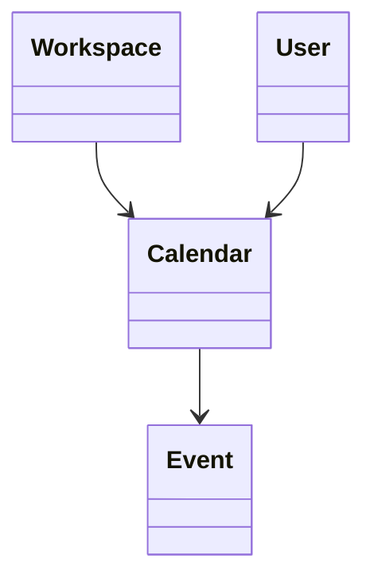

# Calendar

> Resource responsável por representar calendários na Capability **Productivity**.

---

## Objetivo

O Resource **Calendar** representa um calendário utilizado para organizar eventos, compromissos e agendas.

Seu objetivo é padronizar a representação de calendários entre diferentes plataformas de produtividade, permitindo que a Dialyn utilize um único modelo canônico independentemente do Provider.

> Todo Productivity Engine deverá converter os modelos de Calendar do Provider para este Resource.

---

## Filosofia

| Provider | Entidade |
|----------|----------|
| ☁️ Google Calendar | `Calendar` |
| 🟠 Microsoft Outlook | `Calendar` |
| 🔵 Apple Calendar | `Calendar` |
| ✅ **Dialyn** | **`Calendar`** |

> Apesar das diferenças de implementação, todos representam um agrupador de eventos. O Productivity Engine é responsável por converter esses modelos para o contrato definido pela Dialyn.

---

## Modelo Canônico

```typescript
Calendar {
    id: string
    externalId: string
    workspace: WorkspaceReference
    owner: UserReference
    name: string
    description: string
    timezone: string
    color: string
    visibility: Visibility
    isPrimary: boolean
    createdAt: datetime
    updatedAt: datetime
    metadata: Metadata
}
```

---

## Campos

| Campo | Tipo | Obrigatório | Descrição |
|--------|------|:-----------:|-----------|
| id | string | ✔ | Identificador interno |
| externalId | string | | Identificador do Provider |
| workspace | WorkspaceReference | | Workspace associado |
| owner | UserReference | | Proprietário do calendário |
| name | string | ✔ | Nome do calendário |
| description | string | | Descrição |
| timezone | string | ✔ | Fuso horário |
| color | string | | Cor utilizada pelo Provider |
| visibility | Visibility | | Visibilidade |
| isPrimary | boolean | | Indica se é o calendário principal |
| createdAt | datetime | ✔ | Data de criação |
| updatedAt | datetime | | Última atualização |
| metadata | Metadata | | Informações específicas do Provider |

---

## Operações

### Core (obrigatórias)

| Operação | Objetivo |
|----------|----------|
| Create | Criar Calendar |
| Get | Consultar Calendar |
| List | Listar Calendars |
| Update | Atualizar Calendar |
| Delete | Remover Calendar |

### Extended (opcionais)

| Operação | Objetivo |
|----------|----------|
| Search | Pesquisar calendários |
| Exists | Verificar existência |
| Count | Contabilizar calendários |
| Archive | Arquivar calendário |
| Restore | Restaurar calendário |
| Share | Compartilhar calendário |
| Duplicate | Duplicar calendário |

---

## DTOs

Este Resource define os seguintes contratos.

| DTO | Objetivo |
|------|----------|
| CreateCalendarRequest | Criar calendário |
| CreateCalendarResponse | Resultado da criação |
| GetCalendarRequest | Consultar calendário |
| GetCalendarResponse | Resultado da consulta |
| ListCalendarsRequest | Listagem paginada |
| ListCalendarsResponse | Lista de calendários |
| UpdateCalendarRequest | Atualizar calendário |
| UpdateCalendarResponse | Resultado da atualização |
| DeleteCalendarRequest | Remover calendário |
| DeleteCalendarResponse | Resultado da remoção |

### DTOs Opcionais

| DTO | Objetivo |
|------|----------|
| SearchCalendarsRequest | Pesquisar calendários |
| SearchCalendarsResponse | Resultado da pesquisa |
| ShareCalendarRequest | Compartilhar calendário |
| ShareCalendarResponse | Resultado do compartilhamento |
| DuplicateCalendarRequest | Duplicar calendário |
| DuplicateCalendarResponse | Resultado da duplicação |

---

## Relacionamentos



---

## Regras de Negócio

| # | Regra |
|---|-------|
| 1 | Todo Calendar deverá possuir um identificador único |
| 2 | Um Calendar pertence a um único Workspace |
| 3 | Um Calendar poderá conter múltiplos Events |
| 4 | Um Workspace poderá possuir múltiplos Calendars |
| 5 | Apenas um Calendar poderá ser marcado como principal quando suportado pelo Provider |
| 6 | Informações específicas do Provider deverão ser armazenadas em `Metadata` |

---

## Responsabilidade do Productivity Engine

| # | Responsabilidade |
|---|-----------------|
| 1 | Converter Calendars do Provider para o modelo canônico |
| 2 | Preservar identificadores externos |
| 3 | Converter permissões e visibilidade |
| 4 | Preservar informações específicas em `Metadata` |
| 5 | Manter a relação entre Calendar e Event |

---

## Princípios

| # | Princípio | Descrição |
|---|-----------|-----------|
| 1 | 🔗 **Independente** | De qualquer plataforma de calendário |
| 2 | 🔄 **Rastreável** | Relação com Workspace e Events preservada |
| 3 | 🧩 **Flexível** | Suporte a múltiplos fusos e visibilidades |
| 4 | 📖 **Documentado** | De forma consistente com a arquitetura |
| 5 | 🚫 **Abstraído** | Normaliza diferentes implementações de calendários |

---

## Benefícios

| # | Benefício |
|---|-----------|
| 1 | 🔗 **Desacoplamento** completo entre calendários Dialyn e Providers |
| 2 | 🏗️ **Padronização** da representação de calendários |
| 3 | ➕ **Simplificação** da integração de novos Providers |
| 4 | 📉 **Redução da complexidade** ao unificar o modelo de calendário |
| 5 | 🚀 **Facilidade** para evolução sem impacto na IA |

---

## Compatibilidade

Este Resource foi projetado para suportar:

- Google Calendar
- Microsoft Outlook Calendar
- Apple Calendar

> Novos Providers deverão reutilizar este contrato sempre que possível.

---

## Veja também

| Documento | Objetivo |
|-----------|----------|
| [common.md](./common.md) | Tipos compartilhados |
| [glossary.md](./glossary.md) | Conceitos da Capability |
| [relationships.md](./relationships.md) | Relacionamentos |
| [event.md](./event.md) | Eventos |
