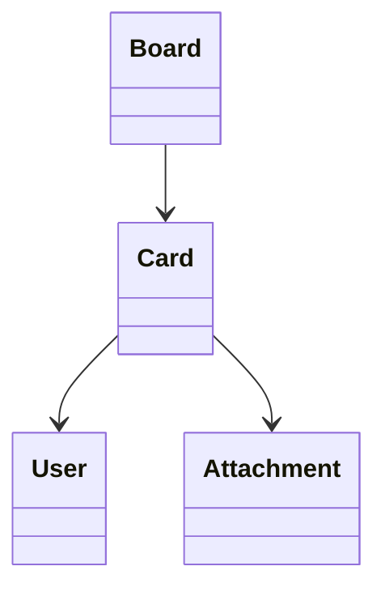

# Card

> Resource responsável por representar cartões de trabalho na Capability **Productivity**.

---

## Objetivo

O Resource **Card** representa uma unidade de trabalho organizada dentro de um **Board**.

Seu objetivo é padronizar a representação de cartões entre diferentes plataformas de gerenciamento de projetos, permitindo que a Dialyn utilize um único modelo canônico independentemente do Provider.

> Todo Productivity Engine deverá converter os modelos de Card do Provider para este Resource.

---

## Filosofia

| Provider | Entidade |
|----------|----------|
| ☁️ Trello | `Card` |
| 🟠 Monday.com | `Item` |
| 🔵 Notion (Kanban) | `Page` |
| 🟢 Jira | `Issue` (representação visual) |
| ✅ **Dialyn** | **`Card`** |

> Apesar das diferenças de nomenclatura, todos representam uma unidade de trabalho organizada dentro de uma estrutura maior. O Productivity Engine é responsável por converter esses modelos para o contrato definido pela Dialyn.

---

## Modelo Canônico

```typescript
Card {
    id: string
    externalId: string
    board: BoardReference
    owner: UserReference
    title: string
    description: string
    status: Status
    priority: Priority
    dueDate: datetime
    members: UserReference[]
    attachments: Attachment[]
    labels: string[]
    createdAt: datetime
    updatedAt: datetime
    metadata: Metadata
}
```

---

## Campos

| Campo | Tipo | Obrigatório | Descrição |
|--------|------|:-----------:|-----------|
| id | string | ✔ | Identificador interno |
| externalId | string | | Identificador do Provider |
| board | BoardReference | ✔ | Board associado |
| owner | UserReference | | Proprietário do Card |
| title | string | ✔ | Título |
| description | string | | Descrição |
| status | Status | ✔ | Estado atual |
| priority | Priority | | Prioridade |
| dueDate | datetime | | Data limite |
| members | UserReference[] | | Responsáveis |
| attachments | Attachment[] | | Arquivos anexados |
| labels | string[] | | Etiquetas |
| createdAt | datetime | ✔ | Data de criação |
| updatedAt | datetime | | Última atualização |
| metadata | Metadata | | Informações específicas do Provider |

---

## Operações

### Core (obrigatórias)

| Operação | Objetivo |
|----------|----------|
| Create | Criar Card |
| Get | Consultar Card |
| List | Listar Cards |
| Update | Atualizar Card |
| Delete | Remover Card |

### Extended (opcionais)

| Operação | Objetivo |
|----------|----------|
| Search | Pesquisar Cards |
| Exists | Verificar existência |
| Count | Contabilizar Cards |
| Archive | Arquivar Card |
| Restore | Restaurar Card |
| Move | Mover entre Boards ou colunas |
| Duplicate | Duplicar Card |
| Assign | Alterar responsáveis |

---

## DTOs

Este Resource define os seguintes contratos.

| DTO | Objetivo |
|------|----------|
| CreateCardRequest | Criar Card |
| CreateCardResponse | Resultado da criação |
| GetCardRequest | Consultar Card |
| GetCardResponse | Resultado da consulta |
| ListCardsRequest | Listagem paginada |
| ListCardsResponse | Lista de Cards |
| UpdateCardRequest | Atualizar Card |
| UpdateCardResponse | Resultado da atualização |
| DeleteCardRequest | Remover Card |
| DeleteCardResponse | Resultado da remoção |

### DTOs Opcionais

| DTO | Objetivo |
|------|----------|
| SearchCardsRequest | Pesquisar Cards |
| SearchCardsResponse | Resultado da pesquisa |
| ArchiveCardRequest | Arquivar Card |
| ArchiveCardResponse | Resultado do arquivamento |
| RestoreCardRequest | Restaurar Card |
| RestoreCardResponse | Resultado da restauração |
| MoveCardRequest | Mover Card |
| MoveCardResponse | Resultado da movimentação |
| DuplicateCardRequest | Duplicar Card |
| DuplicateCardResponse | Resultado da duplicação |
| AssignCardRequest | Alterar responsáveis |
| AssignCardResponse | Resultado da atribuição |

---

## Relacionamentos



---

## Regras de Negócio

| # | Regra |
|---|-------|
| 1 | Todo Card deverá possuir um identificador único |
| 2 | Todo Card deverá pertencer a um Board |
| 3 | Um Card poderá possuir múltiplos responsáveis |
| 4 | Um Card poderá possuir múltiplos anexos |
| 5 | Um Card poderá possuir múltiplas etiquetas |
| 6 | Informações específicas do Provider deverão ser armazenadas em `Metadata` |

---

## Responsabilidade do Productivity Engine

| # | Responsabilidade |
|---|-----------------|
| 1 | Converter Cards do Provider para o modelo canônico |
| 2 | Preservar identificadores externos |
| 3 | Converter responsáveis para `UserReference` |
| 4 | Converter estados para `Status` |
| 5 | Preservar informações específicas em `Metadata` |

---

## Princípios

| # | Princípio | Descrição |
|---|-----------|-----------|
| 1 | 🔗 **Independente** | De qualquer plataforma de gestão visual |
| 2 | 🔄 **Rastreável** | Relação com Board e membros preservada |
| 3 | 🧩 **Flexível** | Suporte a etiquetas, prioridades e anexos |
| 4 | 📖 **Documentado** | De forma consistente com a arquitetura |
| 5 | 🚫 **Abstraído** | Normaliza Card, Item e Page (Kanban) |

---

## Benefícios

| # | Benefício |
|---|-----------|
| 1 | 🔗 **Desacoplamento** completo entre Cards Dialyn e Providers |
| 2 | 🏗️ **Padronização** da representação de unidades de trabalho |
| 3 | ➕ **Simplificação** da integração de novos Providers |
| 4 | 📉 **Redução da complexidade** ao unificar o modelo de cartão |
| 5 | 🚀 **Facilidade** para evolução sem impacto na IA |

---

## Compatibilidade

Este Resource foi projetado para suportar:

- Trello
- Monday.com
- Jira
- Notion (Kanban)

> Novos Providers deverão reutilizar este contrato sempre que possível.

---

## Veja também

| Documento | Objetivo |
|-----------|----------|
| [common.md](./common.md) | Tipos compartilhados |
| [glossary.md](./glossary.md) | Conceitos da Capability |
| [relationships.md](./relationships.md) | Relacionamentos |
| [board.md](./board.md) | Quadros |
| [task.md](./task.md) | Tarefas |
