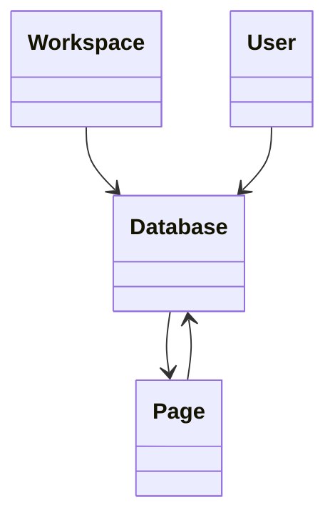

# Database

> Resource responsável por representar bases de dados estruturadas na Capability **Productivity**.

---

## Objetivo

O Resource **Database** representa uma coleção estruturada de informações utilizada para organizar documentos, registros ou conteúdos colaborativos.

Seu objetivo é padronizar a representação de bases de dados entre diferentes plataformas de produtividade, permitindo que a Dialyn utilize um único modelo canônico independentemente do Provider.

> Todo Productivity Engine deverá converter os modelos de Database do Provider para este Resource.

---

## Filosofia

| Provider | Entidade |
|----------|----------|
| ☁️ Notion | `Database` |
| 🟠 Airtable | `Base` |
| 🔵 Coda | `Table` |
| 🟢 ClickUp | `List` |
| ✅ **Dialyn** | **`Database`** |

> Apesar das diferenças de nomenclatura, todos representam uma estrutura que organiza registros relacionados. O Productivity Engine é responsável por converter esses modelos para o contrato definido pela Dialyn.

---

## Modelo Canônico

```typescript
Database {
    id: string
    externalId: string
    workspace: WorkspaceReference
    owner: UserReference
    parent: PageReference
    name: string
    description: string
    icon: string
    cover: string
    archived: boolean
    createdAt: datetime
    updatedAt: datetime
    metadata: Metadata
}
```

---

## Campos

| Campo | Tipo | Obrigatório | Descrição |
|--------|------|:-----------:|-----------|
| id | string | ✔ | Identificador interno |
| externalId | string | | Identificador do Provider |
| workspace | WorkspaceReference | ✔ | Workspace associado |
| owner | UserReference | | Proprietário da Database |
| parent | PageReference | | Página que contém a Database |
| name | string | ✔ | Nome da Database |
| description | string | | Descrição |
| icon | string | | Ícone |
| cover | string | | Imagem de capa |
| archived | boolean | | Indica se está arquivada |
| createdAt | datetime | ✔ | Data de criação |
| updatedAt | datetime | | Última atualização |
| metadata | Metadata | | Informações específicas do Provider |

---

## Operações

### Core (obrigatórias)

| Operação | Objetivo |
|----------|----------|
| Create | Criar Database |
| Get | Consultar Database |
| List | Listar Databases |
| Update | Atualizar Database |
| Delete | Remover Database |

### Extended (opcionais)

| Operação | Objetivo |
|----------|----------|
| Search | Pesquisar Databases |
| Exists | Verificar existência |
| Count | Contabilizar Databases |
| Archive | Arquivar |
| Restore | Restaurar |
| Duplicate | Duplicar |
| Export | Exportar |
| Import | Importar |

---

## DTOs

Este Resource define os seguintes contratos.

| DTO | Objetivo |
|------|----------|
| CreateDatabaseRequest | Criar Database |
| CreateDatabaseResponse | Resultado da criação |
| GetDatabaseRequest | Consultar Database |
| GetDatabaseResponse | Resultado da consulta |
| ListDatabasesRequest | Listagem paginada |
| ListDatabasesResponse | Lista de Databases |
| UpdateDatabaseRequest | Atualizar Database |
| UpdateDatabaseResponse | Resultado da atualização |
| DeleteDatabaseRequest | Remover Database |
| DeleteDatabaseResponse | Resultado da remoção |

### DTOs Opcionais

| DTO | Objetivo |
|------|----------|
| SearchDatabasesRequest | Pesquisar Databases |
| SearchDatabasesResponse | Resultado da pesquisa |
| ArchiveDatabaseRequest | Arquivar Database |
| ArchiveDatabaseResponse | Resultado |
| RestoreDatabaseRequest | Restaurar Database |
| RestoreDatabaseResponse | Resultado |
| DuplicateDatabaseRequest | Duplicar Database |
| DuplicateDatabaseResponse | Resultado |
| ExportDatabaseRequest | Exportar Database |
| ExportDatabaseResponse | Resultado |
| ImportDatabaseRequest | Importar Database |
| ImportDatabaseResponse | Resultado |

---

## Relacionamentos



---

## Regras de Negócio

| # | Regra |
|---|-------|
| 1 | Toda Database deverá possuir um identificador único |
| 2 | Uma Database pertence a um Workspace |
| 3 | Uma Database poderá estar contida em uma Page |
| 4 | Uma Database poderá conter múltiplas Pages ou registros |
| 5 | Informações específicas do Provider deverão ser armazenadas em `Metadata` |

---

## Responsabilidade do Productivity Engine

| # | Responsabilidade |
|---|-----------------|
| 1 | Converter Databases do Provider para o modelo canônico |
| 2 | Preservar identificadores externos |
| 3 | Manter a relação entre Database e Page |
| 4 | Preservar informações específicas em `Metadata` |

---

## Princípios

| # | Princípio | Descrição |
|---|-----------|-----------|
| 1 | 🔗 **Independente** | De qualquer plataforma de bases estruturadas |
| 2 | 🔄 **Rastreável** | Relação com Workspace e Pages preservada |
| 3 | 🧩 **Flexível** | Suporte a ícones, capas e organização hierárquica |
| 4 | 📖 **Documentado** | De forma consistente com a arquitetura |
| 5 | 🚫 **Abstraído** | Normaliza Database, Base e Table |

---

## Benefícios

| # | Benefício |
|---|-----------|
| 1 | 🔗 **Desacoplamento** completo entre Databases Dialyn e Providers |
| 2 | 🏗️ **Padronização** da representação de coleções estruturadas |
| 3 | ➕ **Simplificação** da integração de novos Providers |
| 4 | 📉 **Redução da complexidade** ao unificar o modelo de Database |
| 5 | 🚀 **Facilidade** para evolução sem impacto na IA |

---

## Compatibilidade

Este Resource foi projetado para suportar:

- Notion
- Airtable
- Coda

> Novos Providers deverão reutilizar este contrato sempre que possível.

---

## Veja também

| Documento | Objetivo |
|-----------|----------|
| [common.md](./common.md) | Tipos compartilhados |
| [glossary.md](./glossary.md) | Conceitos da Capability |
| [relationships.md](./relationships.md) | Relacionamentos |
| [page.md](./page.md) | Documentos |
| [block.md](./block.md) | Blocos |
