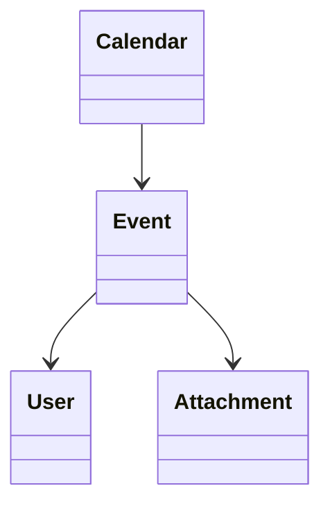

# Event

> Resource responsável por representar eventos na Capability **Productivity**.

---

## Objetivo

O Resource **Event** representa um compromisso, reunião, tarefa agendada ou qualquer ocorrência associada a um calendário.

Seu objetivo é padronizar a representação de eventos entre diferentes plataformas de produtividade, permitindo que a Dialyn utilize um único modelo canônico independentemente do Provider.

> Todo Productivity Engine deverá converter os modelos de Event do Provider para este Resource.

---

## Filosofia

| Provider | Entidade |
|----------|----------|
| ☁️ Google Calendar | `Event` |
| 🟠 Microsoft Outlook | `Event` |
| 🔵 Apple Calendar | `Event` |
| ✅ **Dialyn** | **`Event`** |

> Apesar das diferenças de implementação, todos representam um compromisso associado a um calendário. O Productivity Engine é responsável por converter esses modelos para o contrato definido pela Dialyn.

---

## Modelo Canônico

```typescript
Event {
    id: string
    externalId: string
    calendar: CalendarReference
    organizer: UserReference
    title: string
    description: string
    location: string
    schedule: DateTimeRange
    attendees: UserReference[]
    status: EventStatus
    visibility: Visibility
    attachments: Attachment[]
    createdAt: datetime
    updatedAt: datetime
    metadata: Metadata
}
```

---

## Campos

| Campo | Tipo | Obrigatório | Descrição |
|--------|------|:-----------:|-----------|
| id | string | ✔ | Identificador interno |
| externalId | string | | Identificador do Provider |
| calendar | CalendarReference | ✔ | Calendário associado |
| organizer | UserReference | | Organizador do evento |
| title | string | ✔ | Título do evento |
| description | string | | Descrição |
| location | string | | Local físico ou virtual |
| schedule | DateTimeRange | ✔ | Período do evento |
| attendees | UserReference[] | | Participantes |
| status | EventStatus | ✔ | Situação do evento |
| visibility | Visibility | | Visibilidade |
| attachments | Attachment[] | | Arquivos anexados |
| createdAt | datetime | ✔ | Data de criação |
| updatedAt | datetime | | Última atualização |
| metadata | Metadata | | Dados específicos do Provider |

---

## Operações

### Core (obrigatórias)

| Operação | Objetivo |
|----------|----------|
| Create | Criar Event |
| Get | Consultar Event |
| List | Listar Events |
| Update | Atualizar Event |
| Delete | Remover Event |

### Extended (opcionais)

| Operação | Objetivo |
|----------|----------|
| Search | Pesquisar eventos |
| Exists | Verificar existência |
| Count | Contabilizar eventos |
| Archive | Arquivar |
| Restore | Restaurar |
| Duplicate | Duplicar evento |
| Invite | Convidar participantes |
| Accept | Aceitar convite |
| Decline | Recusar convite |

---

## DTOs

Este Resource define os seguintes contratos.

| DTO | Objetivo |
|------|----------|
| CreateEventRequest | Criar evento |
| CreateEventResponse | Resultado da criação |
| GetEventRequest | Consultar evento |
| GetEventResponse | Resultado da consulta |
| ListEventsRequest | Listagem paginada |
| ListEventsResponse | Lista de eventos |
| UpdateEventRequest | Atualizar evento |
| UpdateEventResponse | Resultado da atualização |
| DeleteEventRequest | Remover evento |
| DeleteEventResponse | Resultado da remoção |

### DTOs Opcionais

| DTO | Objetivo |
|------|----------|
| SearchEventsRequest | Pesquisar eventos |
| SearchEventsResponse | Resultado da pesquisa |
| DuplicateEventRequest | Duplicar evento |
| DuplicateEventResponse | Resultado da duplicação |
| InviteParticipantsRequest | Convidar participantes |
| InviteParticipantsResponse | Resultado do convite |
| AcceptInvitationRequest | Aceitar convite |
| AcceptInvitationResponse | Resultado da confirmação |
| DeclineInvitationRequest | Recusar convite |
| DeclineInvitationResponse | Resultado da recusa |

---

## Relacionamentos



---

## Regras de Negócio

| # | Regra |
|---|-------|
| 1 | Todo Event deverá possuir um identificador único |
| 2 | Todo Event deverá pertencer a um Calendar |
| 3 | Um Event deverá possuir um intervalo de tempo válido (`DateTimeRange`) |
| 4 | O horário de início deverá ser anterior ao horário de término |
| 5 | Um Event poderá possuir zero ou mais participantes |
| 6 | Um Event poderá possuir zero ou mais anexos |
| 7 | Informações específicas do Provider deverão ser armazenadas em `Metadata` |

---

## Responsabilidade do Productivity Engine

| # | Responsabilidade |
|---|-----------------|
| 1 | Converter Events do Provider para o modelo canônico |
| 2 | Preservar identificadores externos |
| 3 | Converter participantes para `UserReference` |
| 4 | Converter datas e horários para `DateTimeRange` |
| 5 | Preservar informações específicas em `Metadata` |

---

## Princípios

| # | Princípio | Descrição |
|---|-----------|-----------|
| 1 | 🔗 **Independente** | De qualquer plataforma de calendário |
| 2 | 🔄 **Rastreável** | Relação com Calendar e participantes preservada |
| 3 | 🧩 **Flexível** | Suporte a anexos, localização e convites |
| 4 | 📖 **Documentado** | De forma consistente com a arquitetura |
| 5 | 🚫 **Abstraído** | Normaliza diferentes implementações de eventos |

---

## Benefícios

| # | Benefício |
|---|-----------|
| 1 | 🔗 **Desacoplamento** completo entre eventos Dialyn e Providers |
| 2 | 🏗️ **Padronização** da representação de compromissos |
| 3 | ➕ **Simplificação** da integração de novos Providers |
| 4 | 📉 **Redução da complexidade** ao unificar o modelo de evento |
| 5 | 🚀 **Facilidade** para evolução sem impacto na IA |

---

## Compatibilidade

Este Resource foi projetado para suportar:

- Google Calendar
- Microsoft Outlook Calendar
- Apple Calendar
- CalDAV

> Novos Providers deverão reutilizar este contrato sempre que possível.

---

## Veja também

| Documento | Objetivo |
|-----------|----------|
| [common.md](./common.md) | Tipos compartilhados |
| [glossary.md](./glossary.md) | Conceitos da Capability |
| [relationships.md](./relationships.md) | Relacionamentos |
| [calendar.md](./calendar.md) | Calendários |
