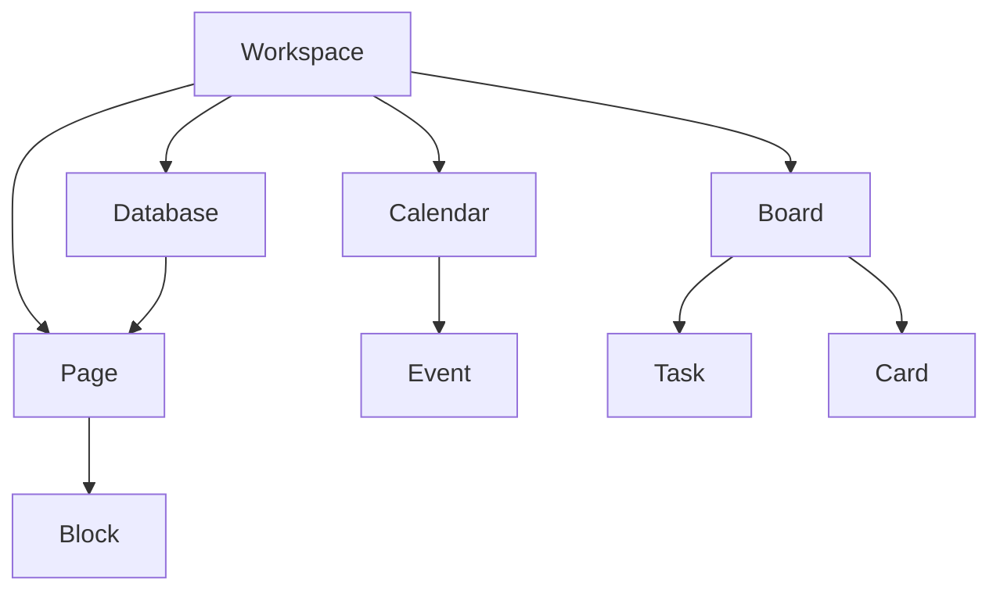

# Glossary

> Glossário de conceitos utilizados pela Capability **Productivity**.

---

## Objetivo

Este documento reúne os principais conceitos utilizados pela Capability **Productivity**.

Seu objetivo é padronizar a terminologia adotada pela Dialyn, garantindo que todos os Providers sejam interpretados sob a mesma linguagem de negócio.

> Sempre que um conceito possuir nomes diferentes entre plataformas, a Dialyn utilizará a terminologia definida neste documento.

---

## Filosofia

| Provider | Abordagem |
|----------|-----------|
| Google Calendar | Calendários e eventos |
| Trello | Boards, lists e cards |
| Notion | Workspace, páginas e blocos |
| ✅ **Dialyn** | **Modelo canônico unificado** |

> Cabe ao Productivity Engine realizar a tradução entre o Provider e os Resources definidos nesta documentação.

---

## Conceitos

### Workspace

Representa um espaço de trabalho onde recursos são organizados.

| Provider | Nomenclatura |
|----------|--------------|
| Google | Conta ou ambiente |
| Trello | Workspace |
| Notion | Workspace |

---

### Calendar

Representa um calendário utilizado para organizar eventos e compromissos.

Um Workspace poderá possuir um ou mais Calendars.

---

### Event

Representa um compromisso agendado dentro de um Calendar.

Exemplos: reunião, chamada, evento, agendamento.

---

### Task

Representa uma atividade que deverá ser executada.

Uma Task poderá possuir responsável, prazo, prioridade e status.

---

### Board

Representa um quadro utilizado para organizar tarefas.

Normalmente é dividido em listas ou colunas.

```
Backlog → Doing → Review → Done
```

---

### Card

Representa uma unidade de trabalho dentro de um Board.

Um Card normalmente possui título, descrição, responsáveis, anexos e comentários.

---

### Page

Representa um documento estruturado.

Pode conter textos, imagens, listas, tabelas e outros conteúdos.

---

### Database

Representa uma coleção estruturada de informações.

Dependendo do Provider, poderá armazenar páginas, registros, documentos ou propriedades.

---

### Block

Representa a menor unidade de conteúdo dentro de um documento.

Exemplos: parágrafo, título, lista, imagem, código, tabela.

---

### Member

Representa um usuário que participa de um Workspace ou Resource.

| Provider | Nomenclatura |
|----------|--------------|
| Google | Proprietário / editor |
| Trello | Colaborador |
| Notion | Membro |

---

### Attachment

Representa um arquivo associado a um Resource.

Exemplos: imagem, PDF, planilha, documento, vídeo.

---

### Metadata

Informações específicas do Provider que não fazem parte do modelo canônico da Dialyn.

> Seu uso deverá ser restrito à preservação de dados não padronizados.

---

## Modelo Conceitual



---

## Equivalência entre Providers

| Dialyn | Google Calendar | Trello | Notion |
|---------|-----------------|---------|---------|
| Workspace | Conta | Workspace | Workspace |
| Calendar | Calendar | — | — |
| Event | Event | — | — |
| Board | — | Board | Database (Kanban) |
| Card | — | Card | Page |
| Task | Event / Task | Card | Page |
| Page | — | — | Page |
| Database | — | — | Database |
| Block | — | Description | Block |

---

## Responsabilidade do Productivity Engine

| # | Responsabilidade |
|---|-----------------|
| 1 | Converter os conceitos do Provider para o modelo canônico |
| 2 | Preservar informações específicas em `Metadata` |
| 3 | Manter compatibilidade entre diferentes plataformas |
| 4 | Evitar expor terminologias específicas do Provider para a Dialyn |

---

## Princípios

| # | Princípio | Descrição |
|---|-----------|-----------|
| 1 | 🔗 **Independência** | De qualquer plataforma de produtividade |
| 2 | 🏗️ **Modelo único** | Um modelo canônico para todos os Providers |
| 3 | 🔄 **Baixo acoplamento** | Resources relacionados através de `Reference` |
| 4 | 📖 **Contratos estáveis** | Que não mudam com a troca de Provider |

---

## Benefícios

| # | Benefício |
|---|-----------|
| 1 | 🔗 **Desacoplamento** completo entre conceitos Dialyn e Providers |
| 2 | 🏗️ **Padronização** da terminologia de produtividade |
| 3 | ➕ **Simplificação** da integração de novos Providers |
| 4 | 📉 **Redução da complexidade** ao unificar nomenclaturas |
| 5 | 🚀 **Facilidade** para evolução sem impacto na IA |

---

## Veja também

| Documento | Objetivo |
|-----------|----------|
| [README.md](./README.md) | Visão geral da Capability |
| [common.md](./common.md) | Tipos compartilhados |
| [relationships.md](./relationships.md) | Relacionamentos entre Resources |
| [calendar.md](./calendar.md) | Calendários |
| [event.md](./event.md) | Eventos |
| [task.md](./task.md) | Tarefas |
| [board.md](./board.md) | Quadros |
| [card.md](./card.md) | Cartões |
| [page.md](./page.md) | Páginas |
| [database.md](./database.md) | Bases de dados |
| [block.md](./block.md) | Blocos |
