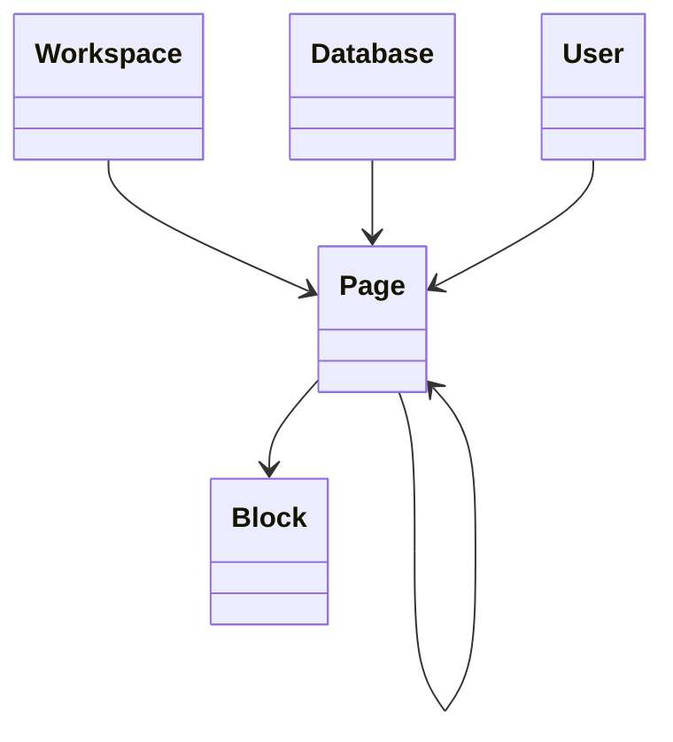

# Page

> Resource responsável por representar documentos na Capability **Productivity**.

---

## Objetivo

O Resource **Page** representa um documento estruturado utilizado para armazenar conhecimento, documentação, anotações e conteúdo colaborativo.

Seu objetivo é padronizar a representação de documentos entre diferentes plataformas de produtividade, permitindo que a Dialyn utilize um único modelo canônico independentemente do Provider.

> Todo Productivity Engine deverá converter os modelos de Page do Provider para este Resource.

---

## Filosofia

| Provider | Entidade |
|----------|----------|
| ☁️ Notion | `Page` |
| 🟠 Confluence | `Page` |
| 🔵 Coda | `Doc` |
| 🟢 Slite | `Document` |
| ✅ **Dialyn** | **`Page`** |

> Apesar das diferenças de nomenclatura, todos representam um documento composto por conteúdo estruturado. O Productivity Engine é responsável por converter esses modelos para o contrato definido pela Dialyn.

---

## Modelo Canônico

```typescript
Page {
    id: string
    externalId: string
    workspace: WorkspaceReference
    database: DatabaseReference
    owner: UserReference
    parent: PageReference
    title: string
    icon: string
    cover: string
    archived: boolean
    createdAt: datetime
    updatedAt: datetime
    metadata: Metadata
}
```

---

## Campos

| Campo | Tipo | Obrigatório | Descrição |
|--------|------|:-----------:|-----------|
| id | string | ✔ | Identificador interno |
| externalId | string | | Identificador do Provider |
| workspace | WorkspaceReference | ✔ | Workspace associado |
| database | DatabaseReference | | Database associada |
| owner | UserReference | | Proprietário da página |
| parent | PageReference | | Página pai |
| title | string | ✔ | Título |
| icon | string | | Ícone |
| cover | string | | Imagem de capa |
| archived | boolean | | Indica se está arquivada |
| createdAt | datetime | ✔ | Data de criação |
| updatedAt | datetime | | Última atualização |
| metadata | Metadata | | Informações específicas do Provider |

---

## Operações

### Core (obrigatórias)

| Operação | Objetivo |
|----------|----------|
| Create | Criar Page |
| Get | Consultar Page |
| List | Listar Pages |
| Update | Atualizar Page |
| Delete | Remover Page |

### Extended (opcionais)

| Operação | Objetivo |
|----------|----------|
| Search | Pesquisar Pages |
| Exists | Verificar existência |
| Count | Contabilizar Pages |
| Archive | Arquivar |
| Restore | Restaurar |
| Duplicate | Duplicar |
| Move | Mover |
| Export | Exportar |

---

## DTOs

Este Resource define os seguintes contratos.

| DTO | Objetivo |
|------|----------|
| CreatePageRequest | Criar página |
| CreatePageResponse | Resultado da criação |
| GetPageRequest | Consultar página |
| GetPageResponse | Resultado da consulta |
| ListPagesRequest | Listagem paginada |
| ListPagesResponse | Lista de páginas |
| UpdatePageRequest | Atualizar página |
| UpdatePageResponse | Resultado da atualização |
| DeletePageRequest | Remover página |
| DeletePageResponse | Resultado da remoção |

### DTOs Opcionais

| DTO | Objetivo |
|------|----------|
| SearchPagesRequest | Pesquisar páginas |
| SearchPagesResponse | Resultado da pesquisa |
| ArchivePageRequest | Arquivar página |
| ArchivePageResponse | Resultado |
| RestorePageRequest | Restaurar página |
| RestorePageResponse | Resultado |
| DuplicatePageRequest | Duplicar página |
| DuplicatePageResponse | Resultado |
| MovePageRequest | Mover página |
| MovePageResponse | Resultado |
| ExportPageRequest | Exportar página |
| ExportPageResponse | Resultado |

---

## Relacionamentos



---

## Regras de Negócio

| # | Regra |
|---|-------|
| 1 | Toda Page deverá possuir um identificador único |
| 2 | Uma Page pertence a um Workspace |
| 3 | Uma Page poderá pertencer a uma Database |
| 4 | Uma Page poderá possuir uma Page pai |
| 5 | Uma Page poderá conter múltiplos Blocks |
| 6 | Informações específicas do Provider deverão ser armazenadas em `Metadata` |

---

## Responsabilidade do Productivity Engine

| # | Responsabilidade |
|---|-----------------|
| 1 | Converter Pages do Provider para o modelo canônico |
| 2 | Preservar identificadores externos |
| 3 | Preservar a hierarquia entre páginas |
| 4 | Manter o relacionamento entre Page e Block |
| 5 | Preservar informações específicas em `Metadata` |

---

## Princípios

| # | Princípio | Descrição |
|---|-----------|-----------|
| 1 | 🔗 **Independente** | De qualquer plataforma de documentos |
| 2 | 🔄 **Rastreável** | Hierarquia entre páginas preservada |
| 3 | 🧩 **Flexível** | Suporte a ícones, capas e organização em Database |
| 4 | 📖 **Documentado** | De forma consistente com a arquitetura |
| 5 | 🚫 **Abstraído** | Normaliza Page, Doc e Document |

---

## Benefícios

| # | Benefício |
|---|-----------|
| 1 | 🔗 **Desacoplamento** completo entre documentos Dialyn e Providers |
| 2 | 🏗️ **Padronização** da representação de documentos |
| 3 | ➕ **Simplificação** da integração de novos Providers |
| 4 | 📉 **Redução da complexidade** ao unificar o modelo de página |
| 5 | 🚀 **Facilidade** para evolução sem impacto na IA |

---

## Compatibilidade

Este Resource foi projetado para suportar:

- Notion
- Confluence
- Coda
- Slite

> Novos Providers deverão reutilizar este contrato sempre que possível.

---

## Veja também

| Documento | Objetivo |
|-----------|----------|
| [common.md](./common.md) | Tipos compartilhados |
| [glossary.md](./glossary.md) | Conceitos |
| [relationships.md](./relationships.md) | Relacionamentos |
| [database.md](./database.md) | Bases de dados |
| [block.md](./block.md) | Blocos |
