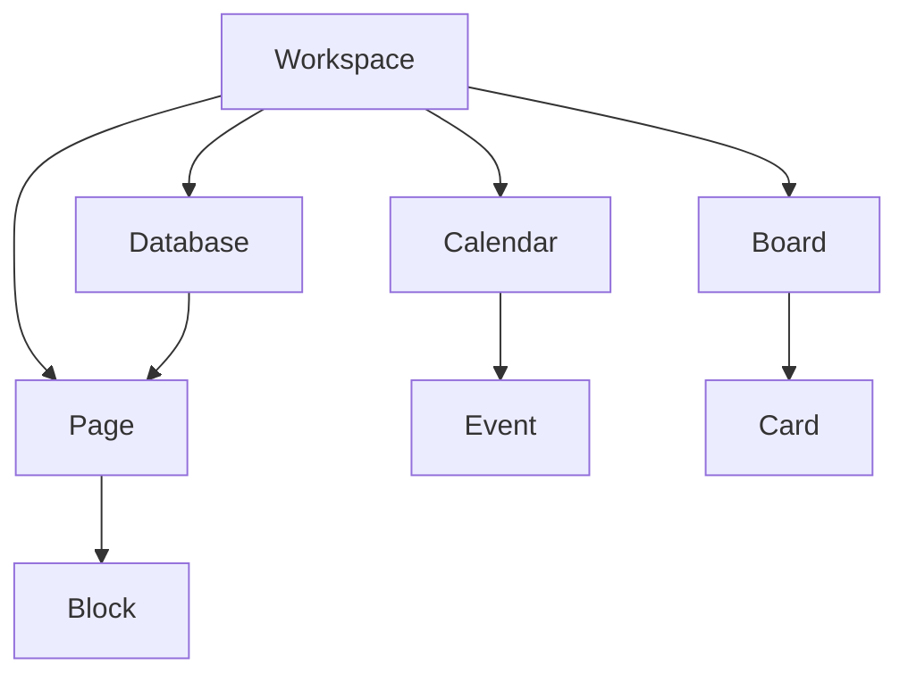
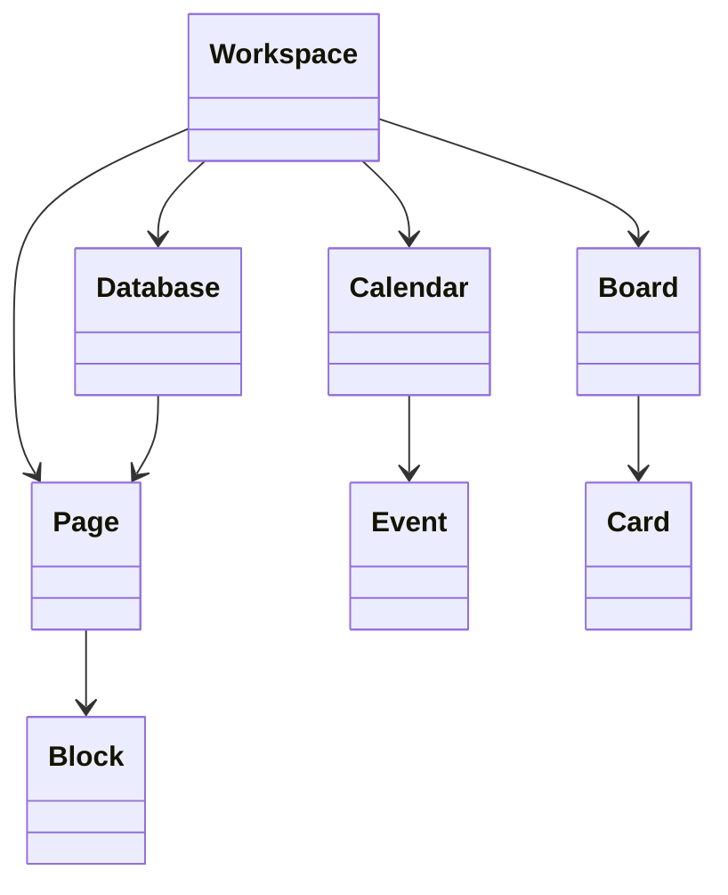

# Relationships

> Relacionamentos entre os Resources da Capability **Productivity**.

---

## Objetivo

Este documento descreve como os Resources da Capability **Productivity** se relacionam dentro do modelo canônico da Dialyn.

Seu objetivo é definir as dependências e associações entre os principais conceitos do domínio, independentemente do Provider utilizado.

> Todos os Productivity Engines deverão preservar essas relações durante o processo de conversão entre o modelo do Provider e o modelo canônico da Dialyn.

---

## Filosofia

| Provider | Estrutura |
|----------|-----------|
| Google Calendar | Calendário hierárquico |
| Trello | Board com listas e cards |
| Notion | Páginas, databases e blocos |
| ✅ **Dialyn** | **Modelo relacional unificado** |

> Embora cada plataforma implemente esses conceitos de forma diferente, todas podem ser representadas através de um conjunto comum de Resources e relacionamentos.

---

## Modelo Conceitual



---

## Modelo de Classes



---

## Relacionamentos

### Workspace → Calendar

| Relação | Cardinalidade |
|---------|:------------:|
| Workspace possui Calendar | 1 → 0..* |

> Um Workspace poderá possuir diversos Calendars.

---

### Calendar → Event

| Relação | Cardinalidade |
|---------|:------------:|
| Calendar possui Event | 1 → 0..* |

> Um Calendar poderá possuir diversos Events.

---

### Workspace → Board

| Relação | Cardinalidade |
|---------|:------------:|
| Workspace possui Board | 1 → 0..* |

> Um Workspace poderá possuir diversos Boards.

---

### Board → Card

| Relação | Cardinalidade |
|---------|:------------:|
| Board possui Card | 1 → 0..* |

> Um Board poderá possuir diversos Cards.

---

### Workspace → Page

| Relação | Cardinalidade |
|---------|:------------:|
| Workspace possui Page | 1 → 0..* |

> Um Workspace poderá possuir diversas Pages.

---

### Page → Block

| Relação | Cardinalidade |
|---------|:------------:|
| Page possui Block | 1 → 0..* |

> Uma Page poderá possuir diversos Blocks.

---

### Workspace → Database

| Relação | Cardinalidade |
|---------|:------------:|
| Workspace possui Database | 1 → 0..* |

> Um Workspace poderá possuir diversas Databases.

---

### Database → Page

| Relação | Cardinalidade |
|---------|:------------:|
| Database possui Page | 1 → 0..* |

> Uma Database poderá conter diversas Pages.

---

## Referências entre Resources

Para evitar acoplamento entre contratos, os Resources deverão utilizar apenas tipos de referência.

```typescript
WorkspaceReference
CalendarReference
BoardReference
PageReference
DatabaseReference
UserReference
```

> Nenhum Resource deverá conter outro Resource completo.

---

## Regras de Relacionamento

| # | Regra |
|---|-------|
| 1 | Um Workspace poderá conter múltiplos Calendars |
| 2 | Um Workspace poderá conter múltiplos Boards |
| 3 | Um Workspace poderá conter múltiplas Databases |
| 4 | Um Workspace poderá conter múltiplas Pages |
| 5 | Um Calendar poderá conter múltiplos Events |
| 6 | Um Board poderá conter múltiplos Cards |
| 7 | Uma Database poderá conter múltiplas Pages |
| 8 | Uma Page poderá conter múltiplos Blocks |
| 9 | Todo relacionamento deverá ser representado através de tipos `Reference` |

---

## Responsabilidade do Productivity Engine

| # | Responsabilidade |
|---|-----------------|
| 1 | Preservar os relacionamentos definidos neste documento |
| 2 | Converter estruturas específicas do Provider para o modelo canônico |
| 3 | Utilizar tipos `Reference` para representar associações |
| 4 | Manter consistência entre Resources relacionados |

---

## Compatibilidade

Este modelo foi projetado para suportar:

- Google Calendar
- Trello
- Notion

> Novos Providers deverão respeitar estes relacionamentos sempre que possível.

---

## Princípios

| # | Princípio | Descrição |
|---|-----------|-----------|
| 1 | 🔗 **Desacoplamento** | Resources se conhecem apenas por referência |
| 2 | 🏗️ **Consistência** | Mesmo padrão relacional para todos os Providers |
| 3 | 🔄 **Rastreabilidade** | Hierarquia Workspace → Resource preservada |
| 4 | 📖 **Documentado** | Cardinalidades e regras explicitamente definidas |

---

## Benefícios

| # | Benefício |
|---|-----------|
| 1 | 🔗 **Desacoplamento** entre Resources através de `Reference` |
| 2 | 🏗️ **Padronização** dos relacionamentos independentemente do Provider |
| 3 | ➕ **Simplificação** da integração de novos Providers |
| 4 | 📉 **Redução da complexidade** ao centralizar as regras de associação |
| 5 | 🚀 **Facilidade** para evolução sem impacto na IA |

---

## Veja também

| Documento | Objetivo |
|-----------|----------|
| [README.md](./README.md) | Visão geral da Capability |
| [common.md](./common.md) | Tipos compartilhados |
| [glossary.md](./glossary.md) | Conceitos da Capability |
| [calendar.md](./calendar.md) | Calendários |
| [event.md](./event.md) | Eventos |
| [task.md](./task.md) | Tarefas |
| [board.md](./board.md) | Quadros |
| [card.md](./card.md) | Cartões |
| [page.md](./page.md) | Páginas |
| [database.md](./database.md) | Bases de dados |
| [block.md](./block.md) | Blocos |
