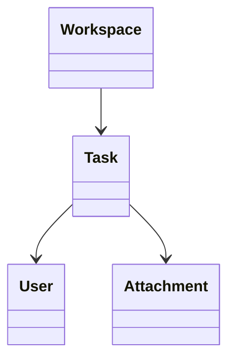

# Task

> Resource responsável por representar tarefas na Capability **Productivity**.

---

## Objetivo

O Resource **Task** representa uma unidade de trabalho que deverá ser executada por um ou mais responsáveis.

Seu objetivo é padronizar a representação de tarefas entre diferentes plataformas de produtividade, permitindo que a Dialyn utilize um único modelo canônico independentemente do Provider.

> Todo Productivity Engine deverá converter os modelos de Task do Provider para este Resource.

---

## Filosofia

| Provider | Entidade |
|----------|----------|
| ☁️ Google Tasks | `Task` |
| 🟠 Microsoft To Do | `Task` |
| 🔵 Asana | `Task` |
| 🟢 ClickUp | `Task` |
| 🟡 Jira | `Issue` |
| 🟣 Monday.com | `Item` |
| ✅ **Dialyn** | **`Task`** |

> Apesar das diferenças de nomenclatura, todas representam uma atividade que deverá ser realizada. O Productivity Engine é responsável por converter esses modelos para o contrato definido pela Dialyn.

---

## Modelo Canônico

```typescript
Task {
    id: string
    externalId: string
    workspace: WorkspaceReference
    title: string
    description: string
    assignees: UserReference[]
    status: TaskStatus
    priority: Priority
    dueDate: datetime
    completedAt: datetime
    attachments: Attachment[]
    createdAt: datetime
    updatedAt: datetime
    metadata: Metadata
}
```

---

## Campos

| Campo | Tipo | Obrigatório | Descrição |
|--------|------|:-----------:|-----------|
| id | string | ✔ | Identificador interno |
| externalId | string | | Identificador do Provider |
| workspace | WorkspaceReference | | Workspace associado |
| title | string | ✔ | Título da tarefa |
| description | string | | Descrição |
| assignees | UserReference[] | | Responsáveis |
| status | TaskStatus | ✔ | Situação da tarefa |
| priority | Priority | | Prioridade |
| dueDate | datetime | | Prazo |
| completedAt | datetime | | Data de conclusão |
| attachments | Attachment[] | | Arquivos anexados |
| createdAt | datetime | ✔ | Data de criação |
| updatedAt | datetime | | Última atualização |
| metadata | Metadata | | Dados específicos do Provider |

---

## Operações

### Core (obrigatórias)

| Operação | Objetivo |
|----------|----------|
| Create | Criar Task |
| Get | Consultar Task |
| List | Listar Tasks |
| Update | Atualizar Task |
| Delete | Remover Task |

### Extended (opcionais)

| Operação | Objetivo |
|----------|----------|
| Search | Pesquisar tarefas |
| Exists | Verificar existência |
| Count | Contabilizar tarefas |
| Archive | Arquivar |
| Restore | Restaurar |
| Complete | Marcar como concluída |
| Reopen | Reabrir |
| Assign | Alterar responsável |
| Duplicate | Duplicar tarefa |

---

## DTOs

Este Resource define os seguintes contratos.

| DTO | Objetivo |
|------|----------|
| CreateTaskRequest | Criar tarefa |
| CreateTaskResponse | Resultado da criação |
| GetTaskRequest | Consultar tarefa |
| GetTaskResponse | Resultado da consulta |
| ListTasksRequest | Listagem paginada |
| ListTasksResponse | Lista de tarefas |
| UpdateTaskRequest | Atualizar tarefa |
| UpdateTaskResponse | Resultado da atualização |
| DeleteTaskRequest | Remover tarefa |
| DeleteTaskResponse | Resultado da remoção |

### DTOs Opcionais

| DTO | Objetivo |
|------|----------|
| SearchTasksRequest | Pesquisar tarefas |
| SearchTasksResponse | Resultado da pesquisa |
| CompleteTaskRequest | Concluir tarefa |
| CompleteTaskResponse | Resultado da conclusão |
| ReopenTaskRequest | Reabrir tarefa |
| ReopenTaskResponse | Resultado da reabertura |
| AssignTaskRequest | Alterar responsável |
| AssignTaskResponse | Resultado da atribuição |
| DuplicateTaskRequest | Duplicar tarefa |
| DuplicateTaskResponse | Resultado da duplicação |

---

## Relacionamentos



---

## Regras de Negócio

| # | Regra |
|---|-------|
| 1 | Toda Task deverá possuir um identificador único |
| 2 | Uma Task pertence a um Workspace |
| 3 | Uma Task poderá possuir zero ou mais responsáveis |
| 4 | Uma Task poderá possuir um prazo (`dueDate`) |
| 5 | Uma Task poderá possuir zero ou mais anexos |
| 6 | A data de conclusão (`completedAt`) somente deverá existir quando a Task estiver concluída |
| 7 | Informações específicas do Provider deverão ser armazenadas em `Metadata` |

---

## Responsabilidade do Productivity Engine

| # | Responsabilidade |
|---|-----------------|
| 1 | Converter Tasks do Provider para o modelo canônico |
| 2 | Preservar identificadores externos |
| 3 | Converter responsáveis para `UserReference` |
| 4 | Converter estados da tarefa para `TaskStatus` |
| 5 | Preservar informações específicas em `Metadata` |

---

## Princípios

| # | Princípio | Descrição |
|---|-----------|-----------|
| 1 | 🔗 **Independente** | De qualquer plataforma de tarefas |
| 2 | 🔄 **Rastreável** | Status, prioridade e prazos preservados |
| 3 | 🧩 **Flexível** | Suporte a múltiplos responsáveis e anexos |
| 4 | 📖 **Documentado** | De forma consistente com a arquitetura |
| 5 | 🚫 **Abstraído** | Normaliza Task, Issue e Item |

---

## Benefícios

| # | Benefício |
|---|-----------|
| 1 | 🔗 **Desacoplamento** completo entre tarefas Dialyn e Providers |
| 2 | 🏗️ **Padronização** da representação de atividades |
| 3 | ➕ **Simplificação** da integração de novos Providers |
| 4 | 📉 **Redução da complexidade** ao unificar o modelo de tarefa |
| 5 | 🚀 **Facilidade** para evolução sem impacto na IA |

---

## Compatibilidade

Este Resource foi projetado para suportar:

- Google Tasks
- Microsoft To Do
- Asana
- ClickUp
- Jira
- Monday.com

> Providers que representem unidades de trabalho deverão reutilizar este contrato.

---

## Veja também

| Documento | Objetivo |
|-----------|----------|
| [common.md](./common.md) | Tipos compartilhados |
| [glossary.md](./glossary.md) | Conceitos da Capability |
| [relationships.md](./relationships.md) | Relacionamentos |
| [board.md](./board.md) | Quadros |
| [card.md](./card.md) | Cartões |
