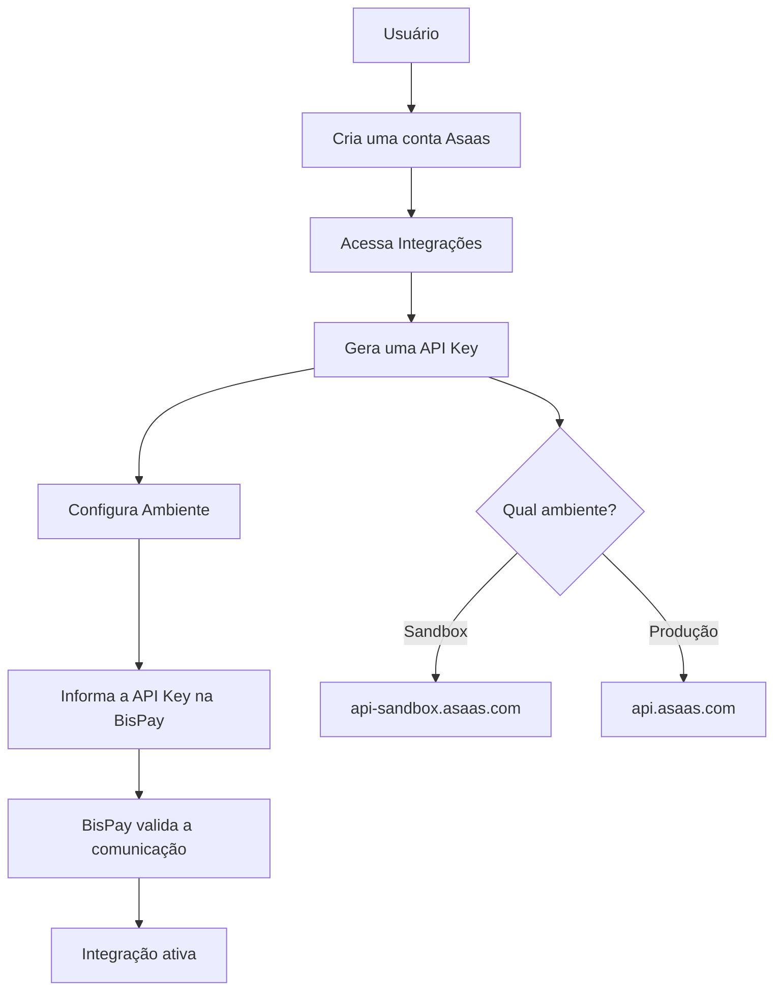

# Asaas

## Autenticação

### Objetivo

Esta documentação descreve os requisitos mínimos para que a **BisPay** consiga estabelecer comunicação com a API do **Asaas**.

> **Nota:** Neste momento, o objetivo não é criar cobranças, boletos ou PIX, mas apenas preparar a autenticação da integração.

---

## Como funciona o Asaas?

O Asaas disponibiliza uma **API REST** para que aplicações externas possam gerenciar cobranças, clientes, assinaturas, PIX, boletos e cartões.

Toda comunicação com a API é autenticada através de uma **API Key**, que identifica a conta responsável pelas operações.

🔗 [Documentação de autenticação](https://docs.asaas.com/docs/autentica%C3%A7%C3%A3o-1)

---

## Primeiro passo

Antes de qualquer integração, o usuário deverá possuir:

| Requisito | Descrição |
|-----------|-----------|
| ✅ Conta Asaas | Possuir uma conta ativa |
| ✅ Conta verificada | Conta com dados verificados |
| ✅ Acesso à interface Web do Asaas | Necessário para gerar API Key |
| ✅ Perfil de Administrador | Apenas administradores podem criar chaves |

> ⚠️ **Importante:** Não é possível gerar uma API Key pelo aplicativo mobile — apenas pela **interface Web**, e somente **administradores** possuem permissão para criar novas chaves.

🔗 [Documentação de chaves de API](https://docs.asaas.com/docs/chaves-de-api)

---

## O que representa uma conta Asaas?

Uma **conta Asaas** representa a identidade financeira utilizada para realizar operações através da API.

| Capacidade | Descrição |
|------------|-----------|
| 💰 Receber pagamentos | Processar transações financeiras |
| 📄 Emitir boletos | Gerar cobranças bancárias |
| ⚡ Gerar PIX | Pagamentos instantâneos |
| 📋 Criar cobranças | Faturas e recibos |
| 👥 Gerenciar clientes | Administrar base de clientes |
| 🔄 Criar assinaturas | Pagamentos recorrentes |
| ↩️ Realizar estornos | Reembolsos (quando suportado) |

> A **BisPay** apenas utilizará essa conta para executar operações autorizadas pelo proprietário.

---

## Credenciais

O Asaas utiliza autenticação baseada **exclusivamente em API Key**.

Cada chave identifica uma conta específica e deve ser enviada em todas as requisições realizadas à API.

🔗 [Documentação de autenticação](https://docs.asaas.com/docs/autentica%C3%A7%C3%A3o-1)

### 🧪 Ambiente Sandbox

Utilizado durante o desenvolvimento.

| Propriedade | Valor |
|-------------|-------|
| **Base URL** | `https://api-sandbox.asaas.com/v3` |
| **Prefixo da chave** | `$aact_hmlg_` |

🔗 [Documentação Sandbox](https://docs.asaas.com/docs/authentication)

### 🚀 Ambiente Produção

Utilizado para operações financeiras reais.

| Propriedade | Valor |
|-------------|-------|
| **Base URL** | `https://api.asaas.com/v3` |
| **Prefixo da chave** | `$aact_prod_` |

🔗 [Documentação Produção](https://docs.asaas.com/docs/authentication)

---

## Informações fornecidas

O Asaas utiliza os seguintes cabeçalhos para autenticação:

| Cabeçalho | Valor | Obrigatório |
|-----------|-------|-------------|
| `Content-Type` | `application/json` | Sim |
| `User-Agent` | `NomeDaAplicacao` | Sim |
| `access_token` | `SUA_API_KEY` | Sim |

> ⚠️ **Atenção:** O Asaas **não** utiliza o padrão `Authorization: Bearer`. A chave deve ser enviada no cabeçalho **`access_token`**.

🔗 [Documentação de autenticação](https://docs.asaas.com/docs/authentication)

---

## Qual credencial a BisPay utilizará?

Para a integração padrão, a BisPay solicitará apenas:

| Campo | Descrição |
|-------|-----------|
| 🌍 **Ambiente** | Sandbox ou Produção |
| 🔑 **API Key** | Chave de acesso gerada no Asaas |

> ✅ Não será necessário configurar **OAuth**, **Refresh Token** ou **Client Secret**.

---

## Dados que a BisPay deve armazenar

Para cada integração recomenda-se armazenar:

| Campo | Tipo | Descrição |
|-------|------|-----------|
| `Provider` | `string` | Identificador do provedor |
| `Environment` | `enum` | Sandbox \| Production |
| `API Key` | `string` | Chave de acesso |
| `Status` | `enum` | Status da integração |
| `Created At` | `datetime` | Data de criação |
| `Updated At` | `datetime` | Data de atualização |

> Opcionalmente, a plataforma poderá armazenar informações adicionais para **auditoria**, como nome da chave e data de expiração.

---

## Regras de Negócio

A BisPay deverá seguir algumas regras fundamentais:

| # | Regra |
|---|-------|
| 1 | ❌ **Nunca** expor a `API Key` ao frontend |
| 2 | ❌ **Nunca** armazenar a `API Key` em texto simples no código-fonte |
| 3 | 🔒 Utilizar **variáveis de ambiente** ou um **cofre de segredos** para armazenamento seguro |
| 4 | 🔐 Utilizar **HTTPS** em todas as chamadas |
| 5 | 🔗 Separar completamente as credenciais de **Sandbox** e **Produção** |
| 6 | ✅ Garantir que a **Base URL** corresponda ao ambiente da chave utilizada |
| 7 | 📱 Enviar obrigatoriamente o cabeçalho **`User-Agent`** identificando a aplicação |

> ⚠️ Para novas contas raiz criadas **após 13/06/2024**, o cabeçalho `User-Agent` é **obrigatório**.

---

## Gerenciamento das API Keys

Segundo a documentação oficial:

| Regra | Detalhe |
|-------|---------|
| 📊 Limite | Até **10 API Keys** por conta |
| 🏷️ Nome | Cada chave pode possuir um nome |
| ⏰ Expiração | É possível definir data de expiração |
| ⏸️ Desabilitação | Uma chave pode ser desabilitada temporariamente |
| 🗑️ Exclusão | Uma chave excluída **não** pode ser recuperada |
| 👀 Visibilidade | A chave é exibida **apenas no momento da criação** |

> 💡 Caso a chave seja perdida, será necessário **gerar uma nova**.

---

## Ciclo de Vida da API Key

O Asaas possui regras automáticas para chaves inativas:

| Período | Ação |
|---------|------|
| ⏳ **3 meses** sem uso | Chave é **desabilitada** automaticamente |
| 🚫 **6 meses** sem uso | Chave **expira permanentemente** e não pode ser reativada |

> Caso isso aconteça, será necessário **gerar uma nova chave** e atualizar a integração na BisPay.

---

## Fluxo de Autenticação

| Etapa | Descrição |
|-------|-----------|
| 1 | Usuário cria uma **conta Asaas** |
| 2 | Acessa a seção **Integrações** |
| 3 | **Gera uma API Key** (apenas pelo Web, perfil Admin) |
| 4 | **Configura o Ambiente** (Sandbox ou Produção) |
| 5 | **Informa a API Key** na BisPay |
| 6 | BisPay **valida a comunicação** com o Asaas |
| 7 | Integração é **ativada** e pronta para uso |

---

## Próximo Documento

Após compreender esta documentação, iniciar:

📄 [`/docs/apps/architeture/dtos/payments/README.md`](/docs/apps/architeture/dtos/payments/README.md)

---

### Conteúdo previsto

| Ação | Descrição |
|------|-----------|
| 👤 Criar Cliente | Criação de cliente |
| 💰 Criar Cobrança | Criação de cobrança |
| ⚡ Gerar PIX | Geração de PIX |
| 📄 Gerar Boleto | Geração de boleto |
| 💳 Criar Link de Pagamento | Criação de link de pagamento |
| 🔄 Criar Assinaturas | Assinaturas recorrentes |
| 📋 Consultar Cobranças | Acompanhar status de cobranças |
| ❌ Cancelar Cobranças | Cancelar cobranças |
| 🔔 Receber Webhooks | Notificações em tempo real |
| 👥 Consultar Clientes | Buscar dados de clientes |
