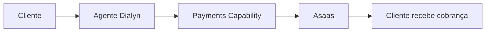
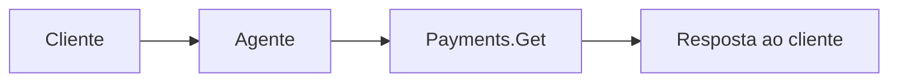
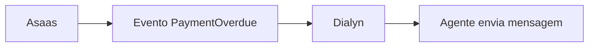
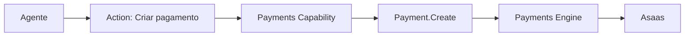

# Asaas

> Integração financeira utilizada pela Dialyn para automatizar cobranças, pagamentos e operações financeiras através de agentes de IA.

---

## Objetivo

O Asaas é utilizado pela Dialyn para permitir que agentes inteligentes executem operações financeiras diretamente dentro das conversas — sem que o time precise acessar um sistema financeiro separado.

> O agente se transforma em um assistente capaz de atuar não apenas na comunicação, mas também em processos financeiros reais.

---

## Resumo

| Característica | Descrição |
|---------------|-----------|
| 🎯 **Foco** | Pequenas e médias empresas brasileiras |
| 💳 **Recursos** | PIX, boleto, cartão, link de pagamento |
| 🔁 **Recorrência** | Cobranças recorrentes e assinaturas |
| 🌎 **Alcance** | Brasil |
| 🤖 **Integração** | Payments Capability da Dialyn |

---

## Problemas que resolve

### Cobranças manuais

| Sem Dialyn | Com Dialyn |
|------------|-----------|
| Cliente solicita pagamento | Cliente solicita pagamento |
| Atendente acessa sistema financeiro | Agente identifica intenção |
| Cria cobrança manualmente | Payments Action |
| Envia para o cliente | Cobrança criada e enviada |

**Antes:** demora no atendimento, dependência humana, risco de erro, baixa escalabilidade.

**Depois:** o agente cria e envia a cobrança em segundos, direto na conversa.

---

## Casos de uso

### Geração de cobrança

Cliente: *"Quero pagar minha mensalidade."*

O agente identifica o cliente, cria a cobrança, gera PIX ou boleto e envia o pagamento — tudo automaticamente.

---

### Consulta de pagamento

Cliente: *"Meu pagamento já caiu?"*

O agente consulta status, data, valor e identificação da cobrança em tempo real.

---

### Cobrança automática

Quando um pagamento vence, o Asaas dispara um evento e o agente pode:

- lembrar o vencimento
- enviar segunda via
- negociar pagamento

---

### Confirmação automática

Quando o cliente paga, o webhook avisa a Dialyn e o agente:

- confirma o pagamento
- libera o acesso
- envia agradecimento
- inicia a próxima etapa

---

## Público recomendado

| Perfil | Exemplos |
|--------|----------|
| 🏢 **Pequenas e médias empresas** | SaaS, escolas, clínicas, consultorias |
| 🔁 **Cobrança recorrente** | Mensalidades, assinaturas, contratos, planos |
| 💬 **Vendas pelo atendimento** | Cliente conversa, agente apresenta, venda fechada |

> A venda acontece sem sair da conversa.

---

## Capacidades utilizadas

| Capability | Resources |
|-----------|-----------|
| **Payments** | `Payment` · `Customer` · `Invoice` · `Refund` |

---

## Actions disponibilizadas

| Categoria | Ações |
|-----------|-------|
| Pagamentos | Criar, consultar, listar, cancelar |
| Clientes | Criar, consultar, atualizar |
| Cobranças | Criar, consultar, acompanhar vencimentos |

---

## Princípios

| # | Princípio | Descrição |
|---|-----------|-----------|
| 1 | 🔗 **Independência** | A Dialyn não depende do Asaas — ele é apenas um Provider |
| 2 | 🔄 **Automação** | Cobranças criadas sem intervenção manual |
| 3 | 🧩 **Simplicidade** | Foco no mercado brasileiro com as formas de pagamento mais usadas |
| 4 | 📖 **Transparência** | Cliente e agente acompanham o status em tempo real |

---

## Benefícios

| # | Benefício |
|---|-----------|
| 1 | ⚡ **Agilidade** no atendimento financeiro |
| 2 | 🤖 **Redução** de tarefas operacionais da equipe |
| 3 | 💰 **Aumento** da taxa de conversão com pagamento na hora |
| 4 | 🔁 **Automação** de cobranças recorrentes |
| 5 | 📉 **Menos inadimplência** com lembretes automáticos |

---

## Quando não usar

O Asaas não é ideal quando o objetivo é:

- processamento global de pagamentos
- operações financeiras complexas
- marketplace com divisão avançada
- grandes operações internacionais

> Para esses casos, o Payments Engine oferece outros Providers como Stripe e Mercado Pago.

---

## Papel na arquitetura

O Asaas não é uma Action — é um **Provider** que implementa a Capability **Payments**.

> A Dialyn continua independente do Provider utilizado.

---

## Veja também

| Documento | Objetivo |
|-----------|----------|
| [README.md](./README.md) | Visão geral da integração |
| [Stripe](../stripe/provider.md) | Provider global |
| [Mercado Pago](../mercado-pago/provider.md) | Provider América Latina |
