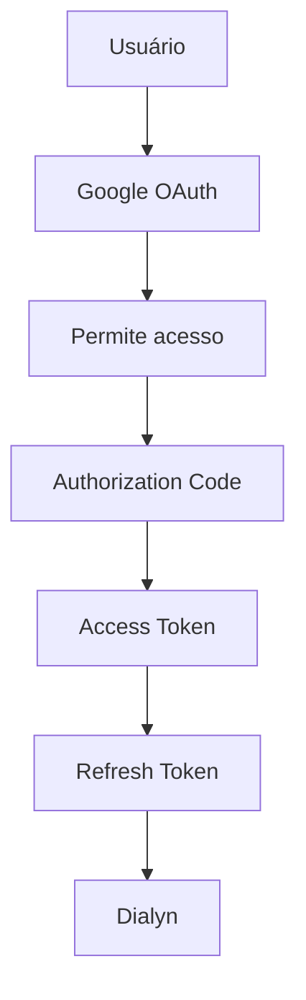

# Google Calendar API

> Referências oficiais utilizadas para a integração do Google Calendar na Dialyn.

---

## Visão Geral

Antes de implementar qualquer funcionalidade, é recomendado compreender como funciona a arquitetura do Google Calendar API.

| Recurso | Descrição |
|---------|-----------|
| **Google Calendar API** | API REST para gerenciamento de calendários e eventos |
| **OAuth 2.0** | Protocolo de autenticação utilizado pelo Google |
| **Google Cloud Console** | Plataforma para gerenciar projetos e credenciais |

🔗 [Visão geral da Google Calendar API](https://developers.google.com/workspace/calendar)

---

## Autenticação

O Google Calendar utiliza **OAuth 2.0** para autenticação de usuários.

> 📖 **Leitura obrigatória:** Documentação oficial explicando como o Google realiza autenticação e autorização.

🔗 [Entendendo OAuth e Authorization](https://developers.google.com/workspace/calendar/api/auth)

---

## Google Cloud Console

Toda integração começa pela criação de um **projeto**. Através dele será possível:

| Ação | Descrição |
|------|-----------|
| ✅ Habilitar APIs | Ativar os serviços necessários |
| 🔐 Configurar OAuth | Definir telas de consentimento e escopos |
| 🔑 Criar credenciais | Gerar Client ID e Client Secret |
| 📋 Configurar telas de consentimento | Personalizar permissões solicitadas |

🔗 [Google Cloud Console](https://console.cloud.google.com/)

---

## Habilitando a Google Calendar API

Antes de consumir qualquer endpoint é necessário **habilitar a API** dentro do projeto.

🔗 [Quickstart - Habilitar API](https://developers.google.com/workspace/calendar/api/quickstart)

---

## OAuth Consent Screen

Todo usuário deverá **autorizar a Dialyn** a acessar seu calendário.

A documentação oficial explica:

| Tópico | Descrição |
|--------|-----------|
| ⚙️ Configuração | Parâmetros iniciais da tela de consentimento |
| 🎨 Branding | Personalização visual da solicitação |
| 👥 Usuários de teste | Contas para validação |
| 🌍 Publicação | Disponibilizar para todos os usuários |
| 🔒 Permissões | Escopos solicitados |

🔗 [Configurar OAuth Consent Screen](https://developers.google.com/workspace/guides/configure-oauth-consent)

---

## Credenciais OAuth

Após configurar a tela de consentimento é necessário criar um **OAuth Client**.

| Credencial | Descrição |
|------------|-----------|
| `Client ID` | Identificador público da aplicação |
| `Client Secret` | Chave privada da aplicação |

🔗 [Criar OAuth Client](https://developers.google.com/workspace/calendar/api/quickstart)

---

## Scopes

Os **Scopes** definem quais permissões serão solicitadas ao usuário.

| Permissão | Descrição |
|-----------|-----------|
| 👁️ Ler calendários | Visualizar eventos e agendas |
| ➕ Criar eventos | Adicionar novos compromissos |
| ✏️ Atualizar eventos | Editar compromissos existentes |
| 🗑️ Excluir eventos | Remover compromissos |

🔗 [Documentação de Scopes](https://developers.google.com/workspace/calendar/api/auth)

---

## Fluxo OAuth

| Etapa | Descrição |
|-------|-----------|
| 1 | Usuário inicia o fluxo de autorização |
| 2 | Google OAuth solicita permissões ao usuário |
| 3 | Usuário **permite o acesso** |
| 4 | Google gera um **Authorization Code** |
| 5 | Código é trocado por um **Access Token** |
| 6 | **Refresh Token** é gerado para renovação |
| 7 | Dialyn armazena os tokens de forma segura |

🔗 [Fluxo OAuth 2.0](https://developers.google.com/identity/protocols/oauth2)

---

## Access Token

| Propriedade | Descrição |
|-------------|-----------|
| Uso | Consumir a API Google Calendar |
| Duração | Temporário (possui tempo de expiração) |
| Renovação | Utiliza o **Refresh Token** para obter um novo |

---

## Refresh Token

| Propriedade | Descrição |
|-------------|-----------|
| Uso | Obter um novo **Access Token** automaticamente |
| Armazenamento | Deve ser armazenado **de forma segura** pela Dialyn |

🔗 [OAuth 2.0 - Refresh Token](https://developers.google.com/identity/protocols/oauth2)

---

## API Reference

Documentação completa dos endpoints disponíveis.

🔗 [Google Calendar API v3 Reference](https://developers.google.com/workspace/calendar/api/v3/reference)

---

## Criando Eventos

Documentação oficial para criação de eventos no calendário.

🔗 [Criar Eventos](https://developers.google.com/workspace/calendar/api/guides/create-events)

---

## Gerenciando Eventos

| Operação | Descrição |
|----------|-----------|
| ✏️ Atualizar | Editar evento existente |
| 🗑️ Excluir | Remover evento |
| 📦 Mover | Transferir entre calendários |
| 🔍 Consultar | Buscar detalhes do evento |

🔗 [Referência de Events](https://developers.google.com/workspace/calendar/api/v3/reference/events)

---

## Calendários

Operações relacionadas aos calendários do usuário.

🔗 [Referência de Calendars](https://developers.google.com/workspace/calendar/api/v3/reference/calendars)

---

## Lista de Calendários

Consultar todos os calendários disponíveis para o usuário.

🔗 [Referência de CalendarList](https://developers.google.com/workspace/calendar/api/v3/reference/calendarList)

---

## Push Notifications

Receber alterações nos calendários em **tempo real**.

🔗 [Push Notifications](https://developers.google.com/workspace/calendar/api/guides/push)

---

## Boas práticas

| # | Prática | Descrição |
|---|---------|-----------|
| 1 | 🔐 Utilizar **OAuth 2.0** | Padrão seguro de autenticação |
| 2 | 🎯 Solicitar apenas os **Scopes necessários** | Menos permissões = mais segurança |
| 3 | ❌ **Nunca** expor `Client Secret` | Mantenha no backend |
| 4 | ❌ **Nunca** expor `Refresh Token` | Armazene de forma segura |
| 5 | 🔄 Renovar `Access Token` automaticamente | Use o Refresh Token |
| 6 | 🔒 Armazenar credenciais de forma segura | Use cofre de segredos |
| 7 | 🚫 Revogar acesso quando solicitado pelo usuário | Respeite a privacidade |

---

## Próximo Documento

Após compreender esta documentação, iniciar:

📄 [`/docs/apps/architeture/dtos/productivity/README.md`](/docs/apps/architeture/dtos/productivity/README.md)

---

### Conteúdo previsto

| Ação | Descrição |
|------|-----------|
| 📄 Listar calendários | Listar calendários |
| 📅 Listar eventos | Listar eventos |
| ⏰ Consultar disponibilidade | Consultar disponibilidade |
| ✏️ Criar evento | Criar evento |
| ✏️ Atualizar evento | Atualizar evento |
| ❌ Cancelar evento | Cancelar evento |
| 👥 Convidar participantes | Convidar participantes |
| 📋 Buscar eventos por período | Buscar eventos por período |
| 🔄 Criar reuniões recorrentes | Criar reuniões recorrentes |
| 🔔 Receber notificações de alterações | Notificações em tempo real |