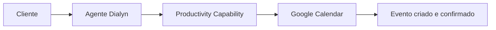
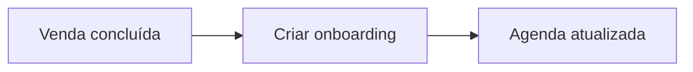
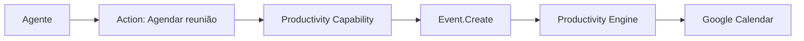

# Google Calendar

> Integração de produtividade utilizada pela Dialyn para permitir que agentes de IA gerenciem calendários, eventos e agendas de forma inteligente.

---

## Objetivo

O Google Calendar é utilizado pela Dialyn para permitir que agentes inteligentes consultem agendas, criem compromissos e automatizem o gerenciamento de eventos — organizando a disponibilidade de pessoas e equipes sem conflitos.

> O agente se torna um assistente capaz de gerenciar o tempo da empresa, reduzindo conflitos de agenda e automatizando agendamentos.

---

## Resumo

| Característica | Descrição |
|---------------|-----------|
| 🎯 **Foco** | Gestão de agendas e eventos |
| 📅 **Recursos** | Calendários, eventos, lembretes |
| 🔁 **Automação** | Agendamento, reagendamento, confirmação |
| 👥 **Público** | Equipes comerciais, clínicas, consultorias, RH |
| 🤖 **Integração** | Productivity Capability da Dialyn |

---

## Problemas que resolve

### Agendamento manual

| Sem Dialyn | Com Dialyn |
|------------|-----------|
| Cliente solicita reunião | Cliente conversa com agente |
| Funcionário verifica agenda | Agente consulta disponibilidade |
| Procura horário disponível | Productivity Capability processa |
| Cria evento manualmente | Evento criado automaticamente |
| Confirma manualmente | Confirmação enviada ao cliente |

> O agente encontra horários disponíveis e cria compromissos sem intervenção humana.

### Conflitos de agenda

Antes de criar um compromisso, o agente consulta a disponibilidade para evitar sobreposição.

| Antes | Depois |
|-------|--------|
| Conflitos de horários | Agendamento inteligente |
| Reuniões duplicadas | Verificação automática |
| Erros de agendamento | Prevenção nativa |
| Retrabalho | Zero retrabalho |

---

## Casos de uso

### Agendamento de reuniões

Cliente: *"Gostaria de agendar uma demonstração na próxima semana."*

O agente consulta disponibilidade, sugere horários, cria o evento e envia a confirmação.

---

### Consulta de agenda

O agente responde perguntas como:

- *"Tenho algum compromisso amanhã?"*
- *"Qual o próximo evento?"*
- *"Estou disponível às 15h?"*

---

### Cancelamento e reagendamento

O agente pode cancelar eventos, reagendar reuniões, atualizar participantes e modificar horários.

---

### Automação de processos

Eventos externos geram compromissos automaticamente:

| Evento | Ação do agente |
|--------|---------------|
| Venda concluída | Criar reunião de onboarding |
| Entrevista aprovada | Agendar com RH |
| Novo cliente | Marcar implantação |

---

### Organização da agenda

O agente bloqueia horários, cria lembretes, adiciona participantes e inclui links de videoconferência.

---

## Público recomendado

| Perfil | Exemplos |
|--------|----------|
| 💼 **Comercial** | Demonstrações e follow-ups |
| 🏥 **Clínicas** | Agendamento de consultas |
| 📊 **Consultorias** | Sessões e reuniões |
| 👥 **RH** | Entrevistas e onboarding |
| 🛠️ **Atendimento** | Suporte agendado |

---

## Capacidades utilizadas

| Capability | Resources |
|-----------|-----------|
| **Productivity** | `Calendar` · `Event` |

---

## Actions disponibilizadas

| Categoria | Ações |
|-----------|-------|
| Calendários | Consultar, listar, atualizar |
| Eventos | Criar, consultar, atualizar, cancelar, listar |

---

## Princípios

| # | Princípio | Descrição |
|---|-----------|-----------|
| 1 | 🔗 **Independência** | Agentes não dependem do Google Calendar — ele é um Provider |
| 2 | 🔄 **Automação** | Compromissos criados sem intervenção manual |
| 3 | 🧩 **Prevenção** | Conflitos de agenda evitados automaticamente |
| 4 | 📖 **Sincronia** | Agenda sempre refletida nas respostas do agente |

---

## Benefícios

| # | Benefício |
|---|-----------|
| 1 | ⚡ **Agilidade** no agendamento de compromissos |
| 2 | 🤖 **Redução** de trabalho operacional da equipe |
| 3 | 🚫 **Eliminação** de conflitos de horário |
| 4 | 🔁 **Automação** de confirmações e reagendamentos |
| 5 | 📅 **Sincronia** entre atendimento e agenda corporativa |

---

## Quando não usar

Embora excelente para gestão de agendas, outros Providers da Capability **Productivity** são mais adequados para:

- documentação e bases de conhecimento
- gerenciamento de tarefas
- organização de projetos

---

## Papel na arquitetura

O Google Calendar não define as capacidades da plataforma — ele **implementa** a Capability **Productivity**.

> Operações como consultar disponibilidade, atualizar eventos ou cancelar compromissos seguem o mesmo fluxo, mantendo os agentes desacoplados do Provider.

---

## Veja também

| Documento | Objetivo |
|-----------|----------|
| [README.md](./README.md) | Visão geral da integração |
| [Trello](../trello/provider.md) | Provider de gestão de tarefas |
| [Notion](../notion/provider.md) | Provider de documentação |
