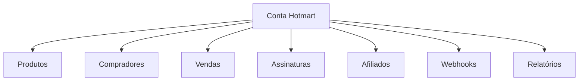
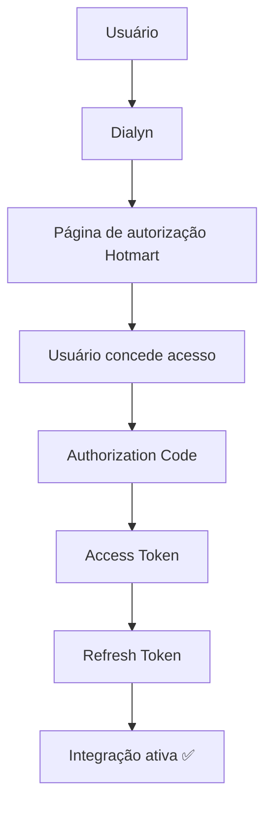
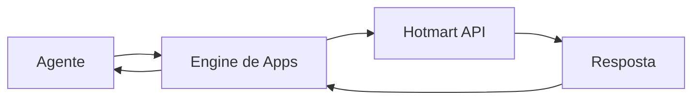

# Hotmart API

> Referências oficiais utilizadas para a integração da Hotmart na Dialyn.

---

## Objetivo

Este documento reúne os principais conceitos necessários para compreender como a Dialyn irá integrar-se à **Hotmart**.

> **Nota:** Neste momento, o objetivo não é implementar funcionalidades, mas entender como a autenticação, permissões e arquitetura da API funcionam.

🔗 [Portal de Desenvolvedores Hotmart](https://developers.hotmart.com/)

---

## O que é a Hotmart?

A **Hotmart** é uma plataforma para comercialização de produtos digitais, assinaturas, cursos online, eventos, clubes de assinatura e programas de afiliados.

Através da API é possível integrar aplicações externas para automatizar operações relacionadas aos produtos e às vendas.

| Operação | Descrição |
|----------|-----------|
| 🔍 Consultar vendas | Obter dados de transações realizadas |
| 🔍 Consultar assinaturas | Acompanhar assinaturas ativas e status |
| 👥 Consultar compradores | Buscar informações de clientes |
| 📦 Consultar produtos | Listar produtos cadastrados |
| ↩️ Acompanhar reembolsos | Monitorar estornos |
| 🚫 Acompanhar cancelamentos | Registrar cancelamentos |
| 🤝 Consultar afiliados | Gerenciar parceiros de divulgação |
| 🔔 Receber Webhooks | Notificações em tempo real |

---

## Arquitetura da Hotmart

A estrutura da Hotmart é baseada em recursos relacionados ao ecossistema de vendas.

> Antes de implementar qualquer integração é recomendado compreender essa organização.

---

## Primeiro passo

Antes de qualquer integração o usuário deverá possuir:

| Requisito | Descrição |
|-----------|-----------|
| ✅ Conta Hotmart | Possuir uma conta ativa |
| 📦 Produto cadastrado | Quando aplicável |
| 🔧 Acesso ao Portal de Desenvolvedores | Habilitar acesso de desenvolvedor |
| 📝 Aplicação registrada | Criar uma aplicação no portal |

> Toda integração inicia pela criação de uma **aplicação**.

🔗 [Documentação Hotmart](https://developers.hotmart.com/docs)

---

## O que é uma Aplicação?

Uma **aplicação** representa um sistema autorizado a consumir as APIs da Hotmart.

No contexto da Dialyn, a aplicação representa a **própria plataforma**. Após criada, ela fornecerá as credenciais necessárias para autenticação.

---

## Credenciais

Após registrar uma aplicação, a Hotmart disponibiliza:

| Credencial | Descrição |
|------------|-----------|
| `Client ID` | Identificador público da aplicação |
| `Client Secret` | Chave privada da aplicação |

Essas credenciais identificam a aplicação perante os serviços da Hotmart.

---

## Método de Autenticação

A Hotmart utiliza **OAuth 2.0**.

| Etapa | Descrição |
|-------|-----------|
| 1 | Usuário inicia o fluxo através da **Dialyn** |
| 2 | Dialyn redireciona para **autorização Hotmart** |
| 3 | Usuário **concede acesso** |
| 4 | Hotmart gera um **Authorization Code** |
| 5 | Código é trocado por um **Access Token** |
| 6 | **Refresh Token** é gerado para renovação |
| 7 | Integração é **ativada** |

🔗 [Documentação de autenticação](https://developers.hotmart.com/docs/pt-BR/authentication)

---

## Access Token

| Propriedade | Descrição |
|-------------|-----------|
| Uso | Acompanha todas as chamadas da API |
| Duração | Temporário (possui tempo de expiração) |
| Renovação | Utiliza o **Refresh Token** para obter um novo |

---

## Refresh Token

| Propriedade | Descrição |
|-------------|-----------|
| Uso | Renovar automaticamente o **Access Token** |
| Armazenamento | Deve ser armazenado **de forma segura** pela Dialyn |

---

## Permissões (Scopes)

As permissões determinam quais recursos poderão ser acessados.

| Recurso | Descrição |
|---------|-----------|
| 📦 Produtos | Consultar catálogo de produtos |
| 💰 Vendas | Acessar transações realizadas |
| 👥 Compradores | Dados dos clientes |
| 🔄 Assinaturas | Gerenciar assinaturas recorrentes |
| 🤝 Afiliados | Informações de parceiros |
| 🎟️ Eventos | Dados de eventos |

> A Dialyn deverá solicitar **apenas os escopos necessários**.

---

## Dados que a Dialyn deve armazenar

| Campo | Tipo | Descrição |
|-------|------|-----------|
| `Provider` | `string` | Identificador do provedor |
| `Client ID` | `string` | Identificador da aplicação |
| `Client Secret` | `string` | Chave privada da aplicação |
| `Access Token` | `string` | Token de acesso à API |
| `Refresh Token` | `string` | Token para renovação de acesso |
| `Scopes` | `array` | Escopos de permissão concedidos |
| `User ID` | `string` | Identificador do usuário |
| `Status` | `enum` | Status da integração |
| `Created At` | `datetime` | Data de criação |
| `Updated At` | `datetime` | Data de atualização |

---

## Recursos principais

| Recurso | Descrição |
|---------|-----------|
| 📦 Produtos | Catálogo de produtos digitais |
| 💰 Vendas | Transações realizadas |
| 👥 Compradores | Clientes que adquiriram produtos |
| 🔄 Assinaturas | Produtos recorrentes |
| 🤝 Afiliados | Parceiros de divulgação |
| 💵 Comissões | Valores pagos a produtores e afiliados |
| 🎟️ Eventos | Informações de eventos |
| 🔔 Webhooks | Notificações em tempo real |

🔗 [Documentação oficial](https://developers.hotmart.com/docs)

---

## Fluxo Geral

> O agente **nunca** comunica-se diretamente com a Hotmart. Toda comunicação deverá ocorrer através do **Engine de Apps** da Dialyn.

---

## Regras de Negócio

| # | Regra |
|---|-------|
| 1 | ❌ **Nunca** expor o `Client Secret` |
| 2 | ❌ **Nunca** expor o `Refresh Token` |
| 3 | ❌ **Nunca** armazenar credenciais diretamente no código-fonte |
| 4 | 🔐 Utilizar **HTTPS** em todas as chamadas |
| 5 | 🔄 Renovar automaticamente o `Access Token` |
| 6 | 🎯 Solicitar apenas os **Scopes** necessários |
| 7 | 🚫 Permitir ao usuário **revogar a integração** quando desejar |
| 8 | ✅ Validar periodicamente se a autorização permanece ativa |

---

## Conceitos importantes

### Produto

Representa um curso, assinatura, evento ou conteúdo digital comercializado na Hotmart.

### Venda

Representa uma transação realizada por um comprador.

### Comprador

Cliente responsável pela aquisição de um produto.

### Assinatura

Relaciona-se a produtos recorrentes.

| Status | Descrição |
|--------|-----------|
| ✅ Ativa | Assinatura em andamento |
| ❌ Cancelada | Assinatura encerrada |
| ⚠️ Inadimplente | Pagamento pendente |
| 🔒 Encerrada | Ciclo completo finalizado |

### Afiliado

Usuário autorizado a divulgar produtos em troca de comissão.

### Comissão

Valor pago ao produtor ou afiliado após uma venda.

### Webhooks

Eventos enviados automaticamente pela Hotmart para aplicações externas.

| Evento | Descrição |
|--------|-----------|
| ✅ Venda aprovada | Transação confirmada |
| ❌ Venda cancelada | Transação cancelada |
| ↩️ Reembolso | Estorno realizado |
| ➕ Assinatura criada | Novo ciclo de assinatura iniciado |
| 🚫 Assinatura cancelada | Assinatura encerrada |
| ⚠️ Chargeback | Contestação de pagamento |

---

## API Reference

🔗 [Documentação completa da API](https://developers.hotmart.com/docs)

---

## Webhooks

A Hotmart recomenda a utilização de **Webhooks** para receber alterações em tempo real. Isso evita consultas constantes à API.

| Evento | Constante |
|--------|-----------|
| `PURCHASE_APPROVED` | `"purchase_approved"` |
| `PURCHASE_CANCELED` | `"purchase_canceled"` |
| `PURCHASE_REFUNDED` | `"purchase_refunded"` |
| `SUBSCRIPTION_STARTED` | `"subscription_started"` |
| `SUBSCRIPTION_CANCELED` | `"subscription_canceled"` |
| `CHARGEBACK` | `"chargeback"` |

🔗 [Documentação de Webhooks](https://developers.hotmart.com/docs/pt-BR/webhooks)

---

## Limites da API

A API poderá aplicar limites de utilização conforme o recurso acessado.

| Requisito | Descrição |
|-----------|-----------|
| ⏱️ Rate Limit | Limite de requisições por período |
| 🔄 Retry | Implementar mecanismos de repetição |
| ⚠️ Tratamento | Responder adequadamente a códigos de limite excedido |

🔗 [Documentação da API](https://developers.hotmart.com/docs)

---

## Boas práticas

| # | Prática |
|---|---------|
| 1 | 🔐 Utilizar **OAuth 2.0** |
| 2 | ❌ **Nunca** expor `Client Secret` |
| 3 | ❌ **Nunca** expor `Refresh Token` |
| 4 | 🔒 Armazenar credenciais de forma segura |
| 5 | 🔄 Renovar automaticamente o `Access Token` |
| 6 | 🎯 Solicitar apenas os **Scopes** necessários |
| 7 | 🔔 Utilizar **Webhooks** sempre que possível |
| 8 | 🏗️ Centralizar toda comunicação através do **Engine de Apps** da Dialyn |

---

## Próximo Documento

Após compreender esta documentação, iniciar:

📄 [`/docs/apps/architeture/dtos/commerce/README.md`](/docs/apps/architeture/dtos/commerce/README.md)

---

### Conteúdo previsto

| Ação | Descrição |
|------|-----------|
| 📦 Consultar Produtos | Listar produtos cadastrados |
| 💰 Consultar Vendas | Obter transações realizadas |
| 👥 Consultar Compradores | Buscar dados de clientes |
| 🔄 Consultar Assinaturas | Acompanhar status de assinaturas |
| 🤝 Consultar Afiliados | Gerenciar parceiros |
| 💵 Buscar Comissões | Valores de comissões |
| 🎟️ Buscar Eventos | Informações de eventos |
| 🔔 Receber Webhooks | Notificações em tempo real |
| ✅ Consultar Status de Venda | Status individual de venda |
| 📋 Consultar Histórico de Assinaturas | Histórico completo |
