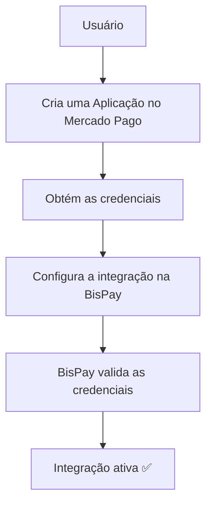

# Mercado Pago

## Autenticação

### Objetivo

Esta documentação descreve os requisitos mínimos para que a **BisPay** consiga estabelecer comunicação com a API do **Mercado Pago**.

> **Nota:** Neste momento, o objetivo não é realizar pagamentos, mas apenas preparar a autenticação da integração.

---

## Como funciona o Mercado Pago?

O Mercado Pago permite que aplicações externas realizem operações em nome de uma conta.

Para isso, toda integração precisa ser identificada através de uma **Aplicação** criada no painel de desenvolvedores do Mercado Pago. Essa aplicação gera as credenciais que autorizam chamadas à API.

🔗 [Documentação oficial de credenciais](https://www.mercadopago.com.br/developers/pt/docs/credentials)

---

## Primeiro passo

Antes de qualquer integração, o usuário deverá possuir:

| Requisito | Descrição |
|-----------|-----------|
| ✅ Conta Mercado Pago | Possuir uma conta ativa |
| ✅ Conta validada | Conta com dados verificados |
| ✅ Acesso ao Portal de Desenvolvedores | Habilitar acesso de desenvolvedor |
| ✅ Aplicação criada | Criar uma aplicação no portal |

> Toda integração nasce dessa aplicação.

---

## O que é uma Aplicação?

Uma **aplicação** representa um sistema autorizado a utilizar a API do Mercado Pago.

| Exemplos | Descrição |
|----------|-----------|
| Dialyn | Plataforma de agentes de IA |
| BisPay | Engine de pagamentos |
| ERP | Sistema de gestão empresarial |
| Loja Virtual | E-commerce integrado |
| Marketplace | Plataforma multi-vendedor |

Cada aplicação possui suas próprias **credenciais**.

---

## Credenciais

Ao criar uma aplicação, o Mercado Pago disponibiliza **dois conjuntos** de credenciais:

### 🧪 Ambiente de Testes (Sandbox)

Utilizado durante o desenvolvimento. Permite criar cobranças simuladas sem movimentação financeira real.

🔗 [Documentação de credenciais](https://www.mercadopago.com.br/developers/pt/docs/credentials)

### 🚀 Ambiente de Produção

Utilizado quando a integração estiver pronta para receber pagamentos reais.

🔗 [Documentação de credenciais](https://www.mercadopago.com.br/developers/pt/docs/credentials)

---

## Informações fornecidas

Dependendo do tipo de integração, o Mercado Pago disponibiliza:

| Informação | Obrigatório | Utilização |
|------------|-------------|------------|
| `Public Key` | Sim | Frontend (cartões, métodos de pagamento etc.) |
| `Access Token` | Sim | Backend. Autoriza chamadas protegidas da API. |
| `Client ID` | OAuth | Identificador da aplicação |
| `Client Secret` | OAuth | Chave privada da aplicação |
| `Redirect URL` | OAuth | URL para retorno da autorização do usuário |

> ⚠️ **Recomendação do Mercado Pago:** Manter `Access Token` e `Client Secret` apenas no backend, **nunca expostos ao cliente**.

🔗 [Documentação de credenciais](https://www.mercadopago.com.br/developers/pt/docs/credentials)

---

## Qual credencial a BisPay utilizará?

Existem **dois modelos** possíveis.

### Modelo 1: Access Token Direto

O usuário informa apenas um **Access Token**.

| Característica | Detalhe |
|----------------|---------|
| Indicado para | Integrações simples |
| Operação | BisPay opera em nome da própria conta do usuário |
| Vantagens | Implementação simples, poucas etapas, configuração rápida |

### Modelo 2: OAuth

Nesse modelo, o usuário apenas **autoriza a BisPay**. O Mercado Pago gera:

| Token | Descrição |
|-------|-----------|
| `Access Token` | Token de acesso temporário |
| `Refresh Token` | Token para renovar acesso expirado |

> 🔄 Sempre que o `Access Token` expirar, a BisPay utiliza o `Refresh Token` para obter um novo, **sem exigir uma nova autorização do usuário**.

🔗 [Documentação OAuth](https://www.mercadopago.com.br/developers/pt/docs/security/oauth)

---

## Fluxos OAuth

O Mercado Pago suporta **três fluxos** principais:

| Fluxo | Descrição | Quando usar |
|-------|-----------|-------------|
| **Authorization Code** | Usuário autoriza explicitamente a aplicação | ✅ **Ideal para SaaS como a Dialyn** |
| **Refresh Token** | Renova automaticamente um `Access Token` expirado | Quando o token atual expira |
| **Client Credentials** | Aplicação acessa recursos em nome próprio, sem interação do usuário | Integrações servidor-a-servidor |

🔗 [Referência OAuth](https://www.mercadopago.com.br/developers/pt/reference/authentication/oauth/overview)

---

## Dados que a BisPay deve armazenar

Para cada integração do usuário, recomenda-se armazenar:

| Campo | Tipo | Descrição |
|-------|------|-----------|
| `Provider` | `string` | Identificador do provedor |
| `Environment` | `enum` | Sandbox \| Production |
| `Public Key` | `string` | Chave pública para frontend |
| `Access Token` | `string` | Token de acesso à API |
| `Client ID` | `string` | Identificador da aplicação |
| `Client Secret` | `string` | Chave privada da aplicação |
| `Refresh Token` | `string` | Token para renovação de acesso |
| `Redirect URI` | `string` | URL de retorno OAuth |
| `Status` | `enum` | Status da integração |
| `Expires At` | `datetime` | Data de expiração do token |
| `Created At` | `datetime` | Data de criação |
| `Updated At` | `datetime` | Data de atualização |

> Nem todos os campos serão utilizados em todas as integrações, mas esse modelo atende aos diferentes fluxos suportados pelo Mercado Pago.

---

## Regras de Negócio

A BisPay deverá seguir algumas regras fundamentais:

| # | Regra |
|---|-------|
| 1 | ❌ **Nunca** expor o `Access Token` ao frontend |
| 2 | ❌ **Nunca** expor o `Client Secret` |
| 3 | 🧪 Utilizar ambiente **Sandbox** durante o desenvolvimento |
| 4 | 🔒 Separar completamente credenciais de **Sandbox** e **Produção** |
| 5 | 🔄 Renovar `Access Tokens` expirados utilizando o `Refresh Token` quando aplicável |
| 6 | ✅ Validar se a integração permanece autorizada antes de executar qualquer operação |

🔗 [Documentação de credenciais](https://www.mercadopago.com.br/developers/pt/docs/credentials)

---

## Fluxo de Autenticação

| Etapa | Descrição |
|-------|-----------|
| 1 | Usuário cria uma **Aplicação** no Mercado Pago |
| 2 | Obtém as **credenciais** (Access Token ou configura OAuth) |
| 3 | **Configura a integração** na BisPay |
| 4 | BisPay **valida as credenciais** com o Mercado Pago |
| 5 | Integração é **ativada** e pronta para uso |

---

## Próximo Documento

Após compreender esta documentação, iniciar:

📄 [`/docs/apps/architeture/dtos/payments/README.md`](/docs/apps/architeture/dtos/payments/README.md)

---

### Conteúdo previsto

| Ação | Descrição |
|------|-----------|
| 📦 Criar PIX | Criação de PIX |
| 💰 Criar boleto | Criação de boleto |
| 👥 Consultar clientes | Buscar dados de clientes |
| 💰 Criar Assinaturas | Assinaturas recorrentes |
| 🤝 Consultar Assinaturas | Acompanhar status de assinaturas |
| 💵 Consultar Comissões | Valores de comissões |
| 🎟️ Buscar Eventos | Informações de eventos |
| 🔔 Receber Webhooks | Notificações em tempo real |
| 📋 Consultar Histórico de Assinaturas | Histórico completo |