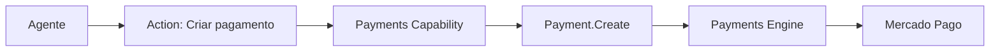

# Mercado Pago

> Integração financeira utilizada pela Dialyn para automatizar cobranças, pagamentos e operações financeiras através de agentes de IA.

---

## Objetivo

O Mercado Pago é utilizado pela Dialyn para permitir que agentes inteligentes realizem operações financeiras utilizando uma das maiores plataformas de pagamentos da América Latina.

> O agente se torna um participante ativo do processo de venda e recebimento — sem que a equipe precise acessar o painel financeiro.

---

## Resumo

| Característica | Descrição |
|---------------|-----------|
| 🎯 **Foco** | América Latina |
| 💳 **Recursos** | PIX, boleto, cartão, link de pagamento |
| 🌎 **Alcance** | Brasil, Argentina, México, Chile, Colômbia, Uruguai |
| 🔁 **Recorrência** | Cobranças e assinaturas |
| 🔄 **Reembolso** | Suporte completo |
| 🤖 **Integração** | Payments Capability da Dialyn |

---

## Problemas que resolve

### Cobranças durante o atendimento

| Sem Dialyn | Com Dialyn |
|------------|-----------|
| Cliente solicita pagamento | Cliente solicita pagamento |
| Atendente acessa Mercado Pago | Agente identifica intenção |
| Cria cobrança manualmente | Payments Capability processa |
| Envia manualmente | Cobrança criada e enviada |

> Reduz tempo de atendimento e elimina tarefas repetitivas.

---

## Casos de uso

### Gerar cobrança

Cliente: *"Quero finalizar minha compra."*

O agente cria a cobrança, gera PIX, link de pagamento e envia as instruções imediatamente.

---

### Consultar pagamento

O agente responde perguntas como:

- *"Meu pagamento foi aprovado?"*
- *"O PIX já foi compensado?"*
- *"Ainda está pendente?"*

> Sem necessidade de acesso manual ao painel financeiro.

---

### Confirmação automática

Após a aprovação, o agente pode automaticamente:

- confirmar o pagamento
- liberar acesso
- atualizar pedidos
- iniciar o próximo fluxo da conversa

---

### Recuperação de pagamentos

Se uma cobrança ficar pendente ou expirar, o agente pode:

- lembrar o cliente
- gerar uma nova cobrança
- enviar um novo link
- oferecer novas formas de pagamento

---

### Automação do pós-venda

Após a confirmação, a Dialyn inicia automaticamente:

- criação de pedidos
- atualização do CRM
- envio de nota fiscal
- abertura de onboarding
- mensagens de agradecimento

---

## Público recomendado

| Perfil | Exemplos |
|--------|----------|
| 🛒 **Lojas virtuais** | E-commerce que aceita PIX e boleto |
| 💬 **Vendas por WhatsApp** | Atendimento que gera pagamento na hora |
| 📚 **Infoprodutores** | Cursos e conteúdos digitais |
| 🏢 **Prestadores de serviço** | Cobrança recorrente de clientes |

---

## Capacidades utilizadas

| Capability | Resources |
|-----------|-----------|
| **Payments** | `Payment` · `Customer` · `Invoice` · `Refund` |

---

## Actions disponibilizadas

| Categoria | Ações |
|-----------|-------|
| Pagamentos | Criar, consultar, atualizar, cancelar |
| Clientes | Criar, consultar, atualizar |
| Cobranças | Criar, consultar, listar |
| Reembolsos | Solicitar, consultar |

---

## Princípios

| # | Princípio | Descrição |
|---|-----------|-----------|
| 1 | 🌎 **Foco regional** | Otimizado para América Latina |
| 2 | 🔗 **Independência** | A Dialyn não depende do Mercado Pago — ele é um Provider |
| 3 | 🔄 **Automação** | Cobranças, confirmações e recuperação sem intervenção |
| 4 | 💳 **PIX nativo** | Suporte direto ao principal meio de pagamento do Brasil |

---

## Benefícios

| # | Benefício |
|---|-----------|
| 1 | ⚡ **Agilidade** em cobranças durante o atendimento |
| 2 | 🤖 **Redução** de tarefas operacionais da equipe |
| 3 | 💰 **Aumento da conversão** com pagamento na hora |
| 4 | 🔁 **Automação** de recuperação de pagamentos |
| 5 | 📉 **Menos inadimplência** com lembretes automáticos |

---

## Quando não usar

Embora excelente para América Latina, alguns cenários podem exigir outros Providers:

- operações internacionais com múltiplas moedas
- plataformas globais de assinatura
- modelos avançados de marketplace

> Para esses casos, o Payments Engine oferece Providers como Stripe e Asaas.

---

## Papel na arquitetura

O Mercado Pago não define as capacidades da plataforma — ele **implementa** a Capability **Payments**.

> O agente nunca precisa conhecer o Provider utilizado. Toda a comunicação ocorre através da arquitetura padronizada da Dialyn.

---

## Veja também

| Documento | Objetivo |
|-----------|----------|
| [README.md](./README.md) | Visão geral da integração |
| [Asaas](../asaas/provider.md) | Provider Brasil |
| [Stripe](../stripe/provider.md) | Provider global |
