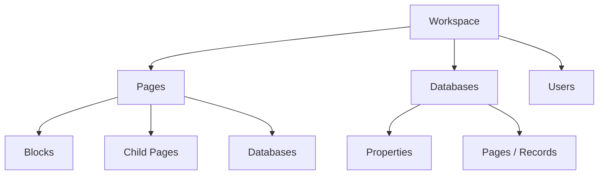
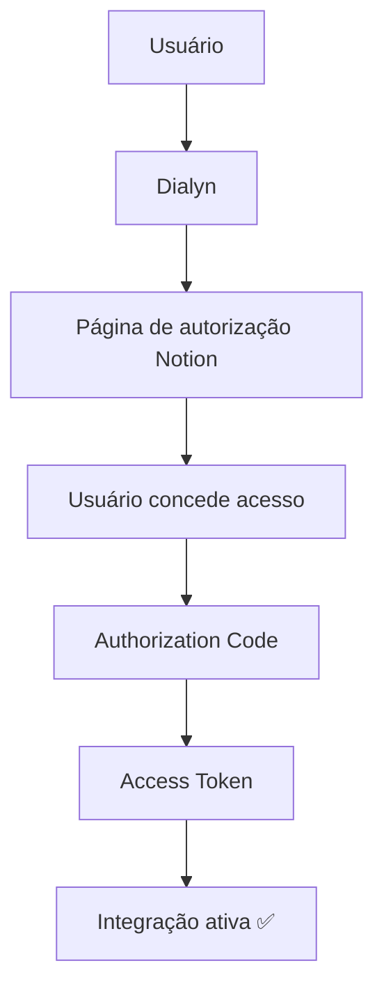
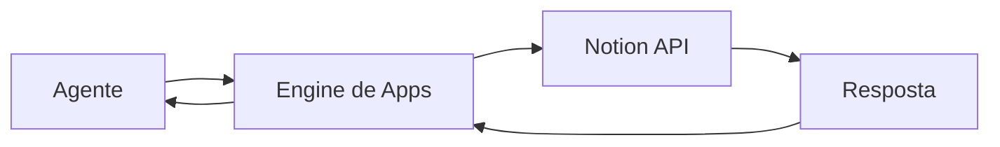

# Notion API

> Referências oficiais utilizadas para a integração do **Notion** na Dialyn.

---

## Objetivo

Este documento reúne os principais conceitos necessários para compreender como a Dialyn irá integrar-se ao **Notion**.

> **Nota:** Neste momento, o objetivo não é implementar funcionalidades, mas entender como a autenticação, permissões e arquitetura da API funcionam.

🔗 [Portal de Desenvolvedores Notion](https://developers.notion.com/)

---

## O que é o Notion?

O **Notion** é uma plataforma de produtividade utilizada para gerenciamento de documentos, páginas, bancos de dados, tarefas, projetos e wikis.

Através da API é possível que aplicações externas consultem, criem e atualizem conteúdos pertencentes ao workspace de um usuário.

| Operação | Descrição |
|----------|-----------|
| 🔍 Consultar páginas | Obter conteúdo de páginas |
| ➕ Criar páginas | Adicionar novas páginas |
| ✏️ Atualizar páginas | Editar páginas existentes |
| 📊 Consultar bancos de dados | Acessar estrutura de databases |
| 📝 Inserir registros | Adicionar linhas em databases |
| 🔄 Atualizar registros | Editar registros existentes |
| 🔎 Pesquisar conteúdos | Buscar páginas e databases |
| 👥 Consultar usuários | Listar membros do workspace |
| 💬 Criar comentários | Adicionar comentários (quando suportado) |
| ⚡ Automatizar fluxos | Integrações e automações |

---

## Arquitetura do Notion

O Notion organiza seus conteúdos em uma estrutura hierárquica.

> Antes de implementar qualquer integração é recomendado compreender essa organização.

🔗 [Trabalhando com conteúdo de páginas](https://developers.notion.com/docs/working-with-page-content)

---

## Primeiro passo

Antes de qualquer integração o usuário deverá possuir:

| Requisito | Descrição |
|-----------|-----------|
| ✅ Conta Notion | Possuir uma conta ativa |
| 📁 Workspace ativo | Ambiente com conteúdos disponíveis |
| 🔧 Permissão para criar integrações | Acesso ao painel de desenvolvedor |
| 🔑 Integration criada | Registrar uma Integration no painel do Notion |

> Toda integração inicia pela criação de uma **Integration**.

🔗 [Criar uma Integration](https://developers.notion.com/docs/create-a-notion-integration)

---

## O que é uma Integration?

Uma **Integration** representa uma aplicação autorizada a acessar recursos do Notion.

| Componente | Descrição |
|------------|-----------|
| 🔐 Credenciais | Chaves de autenticação |
| ✅ Permissões | Escopos de acesso definidos |
| 🔑 Autenticação | Mecanismo de login |
| 📦 Recursos acessíveis | Páginas e databases liberados |

> No contexto da Dialyn, cada usuário autorizará a Integration para acessar páginas ou bancos de dados específicos.

---

## Credenciais

Ao criar uma Integration, o Notion disponibiliza:

| Tipo | Credencial | Descrição |
|------|------------|-----------|
| 🔑 Internal Integration | `Integration Secret` | Chave secreta da integração privada |
| 🌐 OAuth (pública) | `Client ID` | Identificador público da aplicação |
| 🌐 OAuth (pública) | `Client Secret` | Chave privada da aplicação |

🔗 [Autorização Notion](https://developers.notion.com/docs/authorization)

---

## Métodos de Autenticação

O Notion suporta **dois modelos** principais.

### 🔒 Internal Integration

| Característica | Detalhe |
|----------------|---------|
| Autenticação | Via **Integration Secret** |
| Recomendado para | Integrações privadas ou do próprio workspace |

### 🌐 OAuth 2.0

Utilizado quando uma aplicação precisa conectar workspaces de **diferentes usuários**.

| Etapa | Descrição |
|-------|-----------|
| 1 | Usuário inicia fluxo pela **Dialyn** |
| 2 | Dialyn redireciona para **autorização Notion** |
| 3 | Usuário **concede acesso** |
| 4 | Notion gera um **Authorization Code** |
| 5 | Código é trocado por um **Access Token** |
| 6 | Integração é **ativada** |

🔗 [Autorização Notion](https://developers.notion.com/docs/authorization)

---

## Compartilhamento de Recursos

> ⚠️ **Conceito crítico:** Uma Integration **não** possui acesso automático ao conteúdo do Workspace.

O usuário deverá **compartilhar explicitamente**:

| Recurso | Ação necessária |
|---------|-----------------|
| 📄 Páginas | Compartilhar com a Integration |
| 🗄️ Bancos de dados | Compartilhar com a Integration |

Sem esse compartilhamento, a API **não conseguirá acessar os recursos**.

🔗 [Permissões de página](https://developers.notion.com/docs/create-a-notion-integration#give-your-integration-page-permissions)

---

## Permissões

As permissões são definidas durante a criação da Integration.

| Permissão | Descrição |
|-----------|-----------|
| 👁️ Leitura de conteúdo | Visualizar páginas e databases |
| ✏️ Atualização de conteúdo | Editar páginas e registros |
| ➕ Inserção de páginas | Criar novas páginas |
| 🗄️ Acesso a bancos de dados | Ler e escrever em databases |

> A Dialyn deverá solicitar **apenas as permissões necessárias**.

---

## Dados que a Dialyn deve armazenar

| Campo | Tipo | Descrição |
|-------|------|-----------|
| `Provider` | `string` | Identificador do provedor |
| `Workspace ID` | `string` | ID do workspace conectado |
| `Integration Secret` | `string` | Chave secreta da integração |
| `Client ID` | `string` | Identificador (OAuth) |
| `Client Secret` | `string` | Chave privada (OAuth) |
| `Access Token` | `string` | Token de acesso (OAuth) |
| `Bot ID` | `string` | ID do bot do Notion |
| `Workspace Name` | `string` | Nome do workspace |
| `Status` | `enum` | Status da integração |
| `Created At` | `datetime` | Data de criação |
| `Updated At` | `datetime` | Data de atualização |

---

## Recursos principais

| Recurso | Descrição |
|---------|-----------|
| 📄 Pages | Elemento principal do Notion |
| 🧱 Blocks | Conteúdo dentro de páginas |
| 🗄️ Databases | Coleções estruturadas de páginas |
| 🏷️ Properties | Campos dos registros |
| 👥 Users | Membros do workspace |
| 🔎 Search | Busca por páginas e databases |
| 💬 Comments | Comentários em páginas |
| 📎 Files | Arquivos anexados |

🔗 [Referência da API](https://developers.notion.com/reference/intro)

---

## Conceitos importantes

### Workspace

Ambiente onde estão armazenadas todas as informações do usuário.

### Page

Elemento principal do Notion. Toda informação pertence a uma página.

### Block

Cada conteúdo dentro de uma página é um **Block**.

| Tipo de Block | Exemplos |
|---------------|----------|
| 📝 Texto | Parágrafos, headings |
| 🖼️ Imagem | Imagens e figuras |
| 📊 Tabela | Dados tabulares |
| ✅ Checklist | Listas de tarefas |
| 💻 Código | Blocos de código |
| 🎬 Vídeo | Incorporação de vídeos |

### Database

Coleção estruturada de páginas. Funciona como uma **tabela**. Cada linha é uma **Page**.

### Properties

Campos pertencentes aos registros de um Database.

| Tipo de Property | Exemplo |
|------------------|---------|
| `Texto` | Nome, descrição |
| `Número` | Preço, quantidade |
| `Seleção` | Status, categoria |
| `Multi-seleção` | Tags |
| `Data` | Prazo, agendamento |
| `Usuário` | Responsável |
| `Checkbox` | Sim/Não |

### Search

Permite localizar páginas e bancos de dados disponíveis para a Integration.

### Users

Representa usuários pertencentes ao Workspace.

---

## Fluxo Geral

> O agente **nunca** comunica-se diretamente com o Notion. Toda comunicação deverá ocorrer através do **Engine de Apps** da Dialyn.

---

## Regras de Negócio

| # | Regra |
|---|-------|
| 1 | ❌ **Nunca** expor `Integration Secret` |
| 2 | ❌ **Nunca** expor `Client Secret` |
| 3 | ❌ **Nunca** armazenar credenciais diretamente no código-fonte |
| 4 | 🔐 Utilizar **HTTPS** em todas as chamadas |
| 5 | 🎯 Solicitar apenas permissões necessárias |
| 6 | 🔗 Usuário deve **compartilhar** páginas ou databases com a Integration |
| 7 | ✅ Validar periodicamente se a autorização permanece ativa |

---

## API Reference

🔗 [Documentação completa da API](https://developers.notion.com/reference)

---

## Versionamento

O Notion exige que todas as requisições informem a versão da API através do cabeçalho:

| Cabeçalho | Descrição |
|-----------|-----------|
| `Notion-Version` | Versão da API utilizada na requisição |

> A Dialyn deverá controlar a versão utilizada para facilitar futuras atualizações da API.

🔗 [Versionamento](https://developers.notion.com/reference/versioning)

---

## Limites da API

A API do Notion possui limites de utilização (**Rate Limits**).

| Requisito | Descrição |
|-----------|-----------|
| ⏱️ Rate Limit | Limite de requisições por período |
| ⚠️ Tratamento | Responder adequadamente a códigos de limite excedido |

🔗 [Limites de requisição](https://developers.notion.com/reference/request-limits)

---

## Webhooks

Atualmente, o Notion oferece suporte a **Webhooks** para que integrações sejam notificadas sobre determinados eventos, permitindo sincronização sem necessidade de consultas constantes.

🔗 [Webhooks Notion](https://developers.notion.com/reference/webhooks)

---

## Boas práticas

| # | Prática |
|---|---------|
| 1 | 🔐 Utilizar **OAuth 2.0** para integrações públicas |
| 2 | 🔒 Utilizar **Internal Integration** para integrações privadas |
| 3 | ❌ **Nunca** expor credenciais |
| 4 | 🎯 Solicitar apenas as permissões necessárias |
| 5 | 🔗 Compartilhar explicitamente páginas e databases com a Integration |
| 6 | 📋 Informar sempre o cabeçalho `Notion-Version` |
| 7 | 🔔 Utilizar **Webhooks** quando disponíveis |
| 8 | 🏗️ Centralizar toda comunicação através do **Engine de Apps** da Dialyn |

---

## Próximo Documento

Após compreender esta documentação, iniciar:

📄 [`/docs/apps/architeture/dtos/productivity/README.md`](/docs/apps/architeture/dtos/productivity/README.md)

---

### Conteúdo previsto

| Ação | Descrição |
|------|-----------|
| 🔍 Buscar Páginas | Consultar páginas do workspace |
| 🗄️ Buscar Databases | Listar bancos de dados disponíveis |
| ➕ Criar Página | Adicionar nova página |
| ✏️ Atualizar Página | Editar página existente |
| 🧱 Consultar Blocks | Ler blocos de uma página |
| ✏️ Atualizar Blocks | Editar blocos existentes |
| 📝 Inserir Blocos | Adicionar blocos em páginas |
| 👥 Consultar Usuários | Listar membros do workspace |
| 🔎 Pesquisar Conteúdo | Buscar páginas e databases |
| 📊 Criar Registros em Databases | Adicionar linhas em databases |
| 🔄 Atualizar Registros | Editar registros existentes |
| 🔔 Receber Webhooks | Notificações em tempo real |
